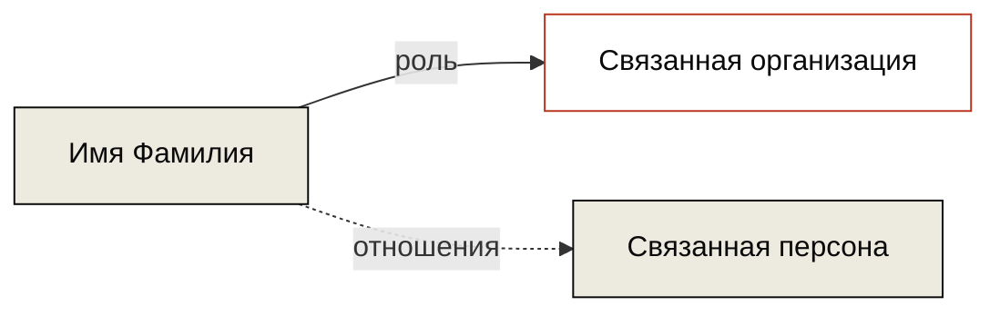

# Belarus Transparency — Руководство по контенту

*Версия 1.0 · май 2026*

Этот файл — твоя рабочая шпаргалка. Он не публикуется на сайте.

---

## 1. Архитектура

### Файлы и URL

| Что | Где лежит | Какой URL получает |
|---|---|---|
| Главная | `docs/index.md` | `belarus-transparency.org/` |
| Раздел расследований | `docs/investigations/index.md` | `/investigations/` |
| Раздел персоналий | `docs/persons/index.md` | `/persons/` |
| Раздел организаций | `docs/organizations/index.md` | `/organizations/` |
| Раздел событий | `docs/events/index.md` | `/events/` |
| Карточка персоны | `docs/persons/ivan-ivanov.md` | `/persons/ivan-ivanov/` |
| Английская версия | `docs/en/...` | `/en/...` (зеркало) |

### Стили

Все CSS-правила живут в одном файле — `docs/stylesheets/extra.css`. Если что-то на сайте смотрится не так, как ты ожидаешь — лезь сюда. Файл разделён комментариями на секции:

- `/* === Лендинг главной === */` — для главной.
- `/* === Карточка персоналии === */` — для страниц `/persons/имя/`.
- `/* === Витрина раздела === */` — для индексных страниц разделов.
- `/* === Теги === */` — для тегов.

### Правила, которые я узнал болезненным путём

1. **HTML-сетки оборачивай в `<div markdown="0">`.** Когда у тебя HTML с пустыми строками между элементами (как сетка карточек) — без этого атрибута markdown-парсер разваливает структуру. Атрибут говорит "не парси содержимое как markdown".

2. **Не используй `<figure>` для обложек.** Material применяет к этому тегу свои стили (центрирование, ограничение ширины), что ломает наши макеты. Вместо `<figure>` используй `<div>` с явным классом.

3. **После каждого изменения CSS — `Ctrl+Shift+R` для жёсткого обновления.** Material кэширует стили агрессивно.

---

## 2. Стандартный workflow добавления карточки

Допустим, добавляешь новую персоналию — Пётр Петров.

1. **В Obsidian** создаёшь файл `docs/persons/petr-petrov.md`.
2. **Копи-пастишь** туда шаблон из раздела 4 ниже.
3. **Меняешь** имя, роль, фото, тексты, теги.
4. **Открываешь** `docs/persons/index.md` (витрину раздела).
5. **Добавляешь** превью-блок (шаблон в разделе 5).
6. **VS Code → Source Control → Commit → Push.**
7. Через 1-2 минуты проверяешь на сайте.

---

## 3. Главная страница (лендинг)

Файл: `docs/index.md`.

Главная состоит из 4 секций: **hero**, **о проекте**, **сетка четырёх разделов**, **контакты**.

Для повседневной работы тебе нужно править только:

### Hero — заголовок и подзаголовок

````html
<div class="bt-hero">
  <div class="bt-kicker">Исследовательский проект</div>
  <h1>СЮДА НОВЫЙ ЗАГОЛОВОК</h1>
  <p class="bt-lede">СЮДА НОВОЕ ОПИСАНИЕ В ОДНУ-ДВЕ СТРОКИ</p>
</div>
````

### Счётчики в карточках разделов

В каждой из четырёх карточек разделов есть `<div class="bt-card-count">1</div>`. **Это число обновляешь руками**, когда добавляешь материал. Можно поставить любое число. Когда подключим автогенерацию — будет считаться само.

---

## 4. Шаблон карточки персоналии

Полный шаблон с **всеми** блоками. Удаляй те, что не нужны для конкретного человека — карточка должна быть гибкой.

````markdown
---
hide:
  - navigation
  - toc
title: Имя Фамилия
role: Краткая роль одной строкой
date_added: 2026-05-13
date_updated: 2026-05-13
thumbnail: https://placehold.co/400x400/3a3530/ffffff?text=ИФ
cover: https://placehold.co/1200x500/3a3530/ffffff?text=Photo
cover_caption: Место, дата · Фотограф / Источник
tags:
  - персоналия
  - категория-1
  - категория-2
status: active
---

<div class="bt-person">

<div class="bt-cover">
  <div class="bt-cover-img" style="background-image: url('ПУТЬ-К-ФОТО');"></div>
  <div class="bt-cover-cap">Место, дата · Фотограф / Источник</div>
</div>

<header class="bt-person-head">
  <div class="bt-kicker">Персоналия</div>
  <h1>Имя Фамилия</h1>
  <p class="bt-lede">Одно предложение про роль и значение этого человека.</p>
</header>

<aside class="bt-pull">
«Цитата самого человека.»
<cite>Источник, дата</cite>
</aside>

<div class="bt-prose" markdown>

Первый абзац прозы. Атрибут `markdown` на родительском `<div>` обязателен — иначе абзацы не отрисуются.

Второй абзац. Можно вставлять [ссылки](https://example.com), **жирность**, *курсив*.

Третий абзац.

</div>

<section class="bt-structures">
  <div class="bt-block-label">Контролируемые структуры</div>
  <div class="bt-struct-grid">

    <div class="bt-struct">
      <div class="bt-struct-name">Название структуры</div>
      <div class="bt-struct-role">Роль · с какого года</div>
      <div class="bt-struct-metrics">
        <div><div class="bt-struct-mlabel">Годовой оборот</div><div class="bt-struct-mvalue">€X млн</div></div>
        <div><div class="bt-struct-mlabel">Сотрудники</div><div class="bt-struct-mvalue">~XX</div></div>
      </div>
    </div>

  </div>
</section>

<section class="bt-ties">
<div class="bt-block-label">Связи</div>



</section>

<footer class="bt-tags">
  <div class="bt-block-label">Теги</div>
  <div class="bt-tag-list">
    <span class="bt-tag">тег-1</span>
    <span class="bt-tag">тег-2</span>
  </div>
</footer>

</div>
````

### Какие блоки можно удалять

- **Цитата** (`<aside class="bt-pull">`) — если нет известной фразы человека.
- **Контролируемые структуры** (`<section class="bt-structures">`) — если человек не возглавляет ничего значимого.
- **Связи** (`<section class="bt-ties">`) — если связей мало и они уже понятны из прозы.
- **Теги** (`<footer class="bt-tags">`) — обязательны для будущего поиска по тегам, не удаляй.

### Какие нельзя

- Frontmatter (между двумя `---`) — обязателен.
- `<div class="bt-person">` ... `</div>` — корневая обёртка.
- Шапка (`<header class="bt-person-head">`) — заголовок страницы.

---

## 5. Витрина раздела (индексная страница)

Файл: `docs/persons/index.md`.

Чтобы новая персоналия появилась в витрине, в файл `docs/persons/index.md` внутри блока `<div class="bt-cards-grid" markdown="0">` добавь:

````html
<a class="bt-card-person" href="petr-petrov/">
<div class="bt-card-photo" style="background-image: url('https://placehold.co/400x400/3a3530/ffffff?text=ПП');"></div>
<div class="bt-card-info">
<div class="bt-card-name">Пётр Петров</div>
<div class="bt-card-role">Краткая роль одной строкой</div>
</div>
</a>
````

**Что менять:**
- В `href="..."` — слаг (имя файла без `.md`).
- В `url('...')` — путь к фото-превью.
- В `bt-card-name` — имя.
- В `bt-card-role` — краткая роль.

**Что нельзя:**
- Менять классы (`bt-card-person`, `bt-card-photo` и т.д.) — без них стили не применятся.

---

## 6. Frontmatter — стандартные поля

### Персоналия

````yaml
---
hide:
  - navigation
  - toc
title: Имя Фамилия
role: Краткая роль
date_added: 2026-05-13
date_updated: 2026-05-13
thumbnail: путь-к-квадратному-фото
cover: путь-к-горизонтальному-фото
cover_caption: подпись
tags:
  - персоналия
  - категория-1
status: active
---
````

### Расследование

(Шаблон ещё не сделан, добавим когда придёт время.)

### Организация

(Шаблон ещё не сделан.)

### Событие

(Шаблон ещё не сделан.)

### Что значит каждое поле

- **title** — отображаемое имя страницы. Используется в табах браузера, в шапке, в поиске.
- **hide** — что не показывать на странице. `navigation` — боковая навигация, `toc` — оглавление.
- **role** — короткая роль одной строкой. Идёт в превью и в шапке карточки.
- **date_added** — когда карточка появилась. Формат YYYY-MM-DD. Используется для сортировки.
- **date_updated** — последнее существенное обновление.
- **thumbnail** — путь к фото-квадрату для витрины (рекомендуемый размер 400×400).
- **cover** — путь к горизонтальному фото для шапки карточки (рекомендуемый размер 1200×500).
- **cover_caption** — подпись под фото-обложкой.
- **tags** — теги для группировки. Пиши в нижнем регистре.
- **status** — `active` / `archived` / `draft`. Сейчас не используется, на будущее.

---

## 7. Палитра классов

Запоминать не нужно, но если забудешь — здесь.

### Карточка персоналии

| Класс | Что |
|---|---|
| `.bt-person` | Корневая обёртка. |
| `.bt-cover` | Контейнер обложки-фото. |
| `.bt-cover-img` | Само фото (через background-image). |
| `.bt-cover-cap` | Подпись под фото. |
| `.bt-person-head` | Шапка с именем и лидом. |
| `.bt-kicker` | Кирпичный капс над именем. |
| `.bt-lede` | Серый подзаголовок-роль. |
| `.bt-pull` | Цитата-врезка. |
| `.bt-prose` | Контейнер прозы. **Требует атрибут `markdown`!** |
| `.bt-structures` | Блок контролируемых структур. |
| `.bt-struct-grid` | Сетка структур. |
| `.bt-struct` | Одна карточка структуры. |
| `.bt-struct-name` | Название. |
| `.bt-struct-role` | Роль в структуре. |
| `.bt-struct-metrics` | Сетка из двух метрик. |
| `.bt-struct-mlabel` | Подпись метрики. |
| `.bt-struct-mvalue` | Значение метрики. |
| `.bt-ties` | Блок связей. |
| `.bt-tags` | Блок тегов. |
| `.bt-tag` | Один тег. |
| `.bt-block-label` | Серый капс перед каждым блоком. |

### Витрина раздела

| Класс | Что |
|---|---|
| `.bt-index` | Корневая обёртка витрины. |
| `.bt-index-head` | Шапка раздела. |
| `.bt-cards-grid` | Сетка превью-карточек. **Требует `markdown="0"`!** |
| `.bt-card-person` | Превью-карточка персоны. |
| `.bt-card-photo` | Квадратное фото в превью. |
| `.bt-card-info` | Текстовая часть превью. |
| `.bt-card-name` | Имя в превью. |
| `.bt-card-role` | Роль в превью. |

### Главная

| Класс | Что |
|---|---|
| `.bt-landing` | Корневая обёртка лендинга. |
| `.bt-hero` | Hero-блок наверху. |
| `.bt-kicker` | Кирпичный капс. |
| `.bt-lede` | Подзаголовок. |
| `.bt-row` | Строка с левой колонкой-меткой. |
| `.bt-label` | Метка слева. |
| `.bt-body` | Контент справа. |
| `.bt-grid` | Сетка четырёх разделов. |
| `.bt-card` | Карточка раздела. |

---

## 8. Палитра цветов

Все цвета задаются через CSS-переменные Material — менять их нужно только в `extra.css`, в секциях для светлой и тёмной темы. Не трогай эти секции без необходимости.

| Роль | Светлая | Тёмная |
|---|---|---|
| Основной текст | `#1F1F1F` | `#E8E6E0` |
| Заголовки | `#0A0A0A` | `#FFFFFF` |
| Мета (даты, авторы) | `#6B6B6B` | `#9A9893` |
| Линии, рамки | `#E5E5E0` | `#2A2A28` |
| Фон страницы | `#F7F5F0` | `#141413` |
| Фон карточек | `#EDEAE0` | `#1A1A19` |
| Акцент | `#B8341E` | `#D85A30` |

---

## 9. Технический долг

Задачи на потом:

- [ ] Английский лендинг (`docs/en/index.md`).
- [ ] Шаблоны карточек: расследование, организация, событие.
- [ ] Витрины разделов: расследования, организации, события.
- [ ] Удалить папку `.obsidian` из репозитория через `.gitignore`.
- [ ] Настроить папку `_drafts` (она уже есть, но нужно добавить в `.gitignore`).
- [ ] Подключить плагин `tags` — теги станут живыми ссылками на индексы.
- [ ] Решить проблему с `www.belarus-transparency.org`.
- [ ] Когда персоналий станет 10+ — переход на автогенерацию витрины через плагин `blog`.

---

## 10. Шпаргалка по git

````bash
cd ~/belarus-transparency
git status        # что изменилось
git add .         # подготовить все изменения
git commit -m "Описание"
git push          # на GitHub, через минуту обновится сайт
````

Или через VS Code: левая панель → Source Control → ввести описание → Commit → Sync (Push).