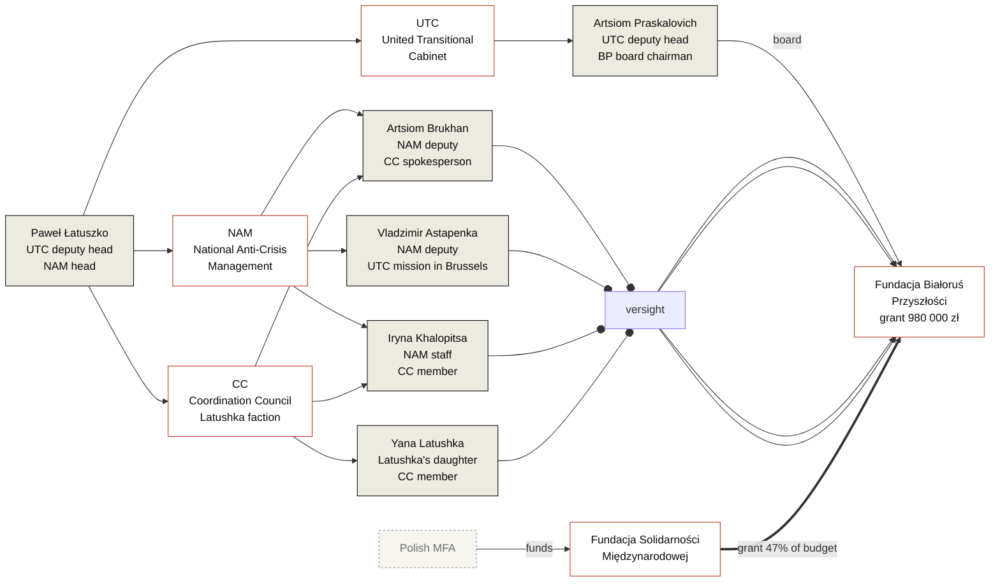

---
hide:
  - navigation
title: "Belarus of the Future and Polish taxpayers' money"
investigation_id: inv-0001
date_published: 2026-05-16
date_updated: 2026-05-16
lede: "Just one small grant from 2023 and the system in which it became possible"
authors: "Belarus Transparency editorial team"
related_orgs:
  - bialorus-przyszlosci
  - fundacja-solidarnosci-miedzynarodowej
related_persons:
  - artsiom-praskalovich
  - artsiom-brukhan
  - vladzimir-astapenka
  - yana-latushka
  - iryna-khalopitsa
  - anna-panov
related_docs:
  - doc-fsm-2023-results
  - doc-fsm-2024-results
  - doc-fsm-2025-results
  - doc-nik-kap-430-7-2024
  - doc-krs-bp
  - doc-krs-fsm
status: active
tags:
  - investigation
  - fsm
  - belarus-of-the-future
  - latushka
  - polish-public-money
---

<header class="bt-investigation-hero">
  
Investigation · inv-0001 · published 16 May 2026

  # Belarus of the Future and Polish public money

  
One grant from 2023 and the system in which it became possible

</header>

## Preamble

The transparency of public-money disposition is the condition under which democratic institutions work as intended. When information about the spending of taxpayer and foreign-donor funds is unavailable — and especially when it is deliberately hidden — an environment forms that, at best, favours unprofessionalism and inefficient use of money, and at worst, corruption. The same environment arms populists and opponents of democratic values: those who can point to the absence of accountability as proof that democracy is mere decoration.

This is particularly true when the money was intended to counter a dictatorship.

For Belarusian political emigration, this question came to a head by 2025. After five years during which hundreds of millions of euros from the EU, the United States, and national donors passed through structures in Poland, Lithuania, and the Czech Republic, the diaspora is increasingly asking: where does this money go, who distributes it, who receives it, and how do the declared priorities relate to the actual allocation.

By coincidence, the trend towards opacity in the competitions of the Polish donor featured in this investigation has been growing in parallel with that demand: since 2024 between 81% and 89% of the programme budget has remained hidden — about **10.9 million zł (~2.5 million euros) over two years**, distributed in a regime that excludes independent verification. And this is only within one programme of one donor.

This investigation is the first in a series. It is built on a principle that frames every publication of the Belarus Transparency project: **the burden of proof of the contrary rests on the side that disposes of public money**. If an organization receives a grant and does not publish a report, that is a direct signal that the managers of this structure are not ready to share their successes with Belarusians. If a foundation operates with public money and has no public contact details, that is not a technical detail. If 88.75% of grants are hidden on the donor's page, that is no longer "security considerations" but a direct threat of a corruption-prone environment.

Here we document one specific story — one grant, one organization, one donor. All facts are confirmed by primary sources and assigned to one of the four levels of evidence adopted by the project. Open questions are addressed to each party.

What to do with these questions next is up to civic activists, journalists, democratic politicians, and donors.

---

## Summary of facts

* **May 2023.** The Polish [Fundacja Solidarności Międzynarodowej](../organizations/fundacja-solidarnosci-miedzynarodowej.md) (FSM) — a state foundation acting on behalf of the Polish Ministry of Foreign Affairs — awards [Fundacja Białoruś Przyszłości](../organizations/bialorus-przyszlosci.md) (BP) a grant of 980 000 zł — **47.3% of the entire visible competition budget**. The amount is 6.9 times the grant of the organization with the highest evaluation score.
* **BP governance.** The board chairman is [Artsiom Praskalovich](../persons/artsiom-praskalovich.md), the acting deputy head of the United Transitional Cabinet (UTC) of Paweł Łatuszko. The oversight body across different periods — [Brukhan](../persons/artsiom-brukhan.md), [Astapenka](../persons/vladzimir-astapenka.md), [Yana Latushka](../persons/yana-latushka.md), [Khalopitsa](../persons/iryna-khalopitsa.md), [Panov](../persons/anna-panov.md) — all of them tied to Łatuszko by employment or family.
* **Reporting.** BP's financial reports for 2023–2025 are absent from the KRS. The roadmap for which the grant was received has not been publicly presented.
* **5 September 2025.** A package of changes is entered in the KRS: Yana Latushka and Iryna Khalopitsa are introduced, and PKD code 68.20.Z — "renting and management of real estate" — is added as the principal activity. On 26 January 2026 Anna Panov is removed from the oversight body.
* **FSM transparency trend.** From 2023 to 2025 the competition budget grew fourfold (from 2.07 to 8 million zł); the transparency of distribution fell from 100% to 11.25%. In 2024, 81.3% of the budget was hidden; in 2025, 88.75%.

---

## 1. The 2023 grant: a chronology

### The application

On 31 March 2023 FSM announced the open ["Konkurs Grantowy na rzecz Białorusi 2023"](https://old.solidarityfund.pl/2023/03/31/konkurs-grantowy-na-rzecz-bialorusi-2/) — under the "Wsparcie Demokracji 2023" programme, which is part of the Polish development cooperation programme (Polska współpraca rozwojowa) of the Polish MFA.

Parameters of the 2023 competition:

* three priorities: human rights and democratic institutions; free media; civil-society organizations and diaspora;
* two grant formats: small — from 50 to 250 thousand zł; large — from 251 thousand to 1.5 million zł.

BP submitted an application for the project "Opracowanie mapy drogowej dla ochrony praw podstawowych ofiar zbrodni przeciwko ludzkości na Białorusi od 2020 roku, a także zbrodni agresji wobec Ukrainy" ("Development of a roadmap for protecting the fundamental rights of victims of crimes against humanity in Belarus since 2020, as well as crimes of aggression against Ukraine"). The application was assigned to priority I — human rights and democratic institutions.

At the time of the application BP's board was chaired by Artsiom Praskalovich (in this office since 26 August 2022); the second board member was Valery Matskevich. The oversight body comprised Mikhail Kiryliuk (from the foundation's establishment), Vladimir Astapenko, and Anna Panov (both from 26 August 2022).

### Decision and allocation of amounts

On 18 May 2023 FSM [published the competition results](https://old.solidarityfund.pl/2023/05/18/wyniki-konkursu-grantowego-na-rzecz-bialorusi-2/) ([full ranked list](https://old.solidarityfund.pl/wp-content/uploads/2023/05/Wyniki-Konkursu-Grantowego-na-rzecz-Bialorusi-2023.pdf)):

| Place | Organization | Project | Priority | Score | Amount (zł) |
|---|---|---|---|---|---|
| 1 | Kolegium Europy Wschodniej im. J. Nowaka-Jeziorańskiego | Wspieramy Białoruskie Przebudzenie | II, III | **19.5** | 142 000 |
| 2 | Fundacja Strefa Solidarności (TV Biełsat) | Support for the TV Belsat platform | II, III | 16.5 | 300 000 |
| 2 | **Fundacja Białoruś Przyszłości** | **Roadmap for the protection of victims' rights** | **I** | **16.5** | **980 000** |
| 4 | Fundacja Informacyjne Biuro Białoruś w Fokusie | Development of journalism in emigration | II | 16.0 | 400 000 |
| 5 | Fundacja BYPOL | Development of democracy in Belarus | II | 15.5 | 251 460 |

BP, with 16.5 points (a shared 2nd–3rd place), received 980 000 zł — **47.3% of the entire visible competition budget**. The other four winners shared the remaining 52.7%. The methodology for distributing amounts among applicants with equal or close scores is not described in any public materials — the regulations set criteria for evaluating applications but not a principle for distributing the overall budget.

### Profile of winners and losers

The competition had three priorities: **I — human rights and democratic institutions**, **II — free media**, **III — civil-society organizations and the Belarusian diaspora**.

BP declared a single priority — I. All the other winners are media (priority II). Kolegium and Strefa Solidarności formally indicated priorities II+III, but in substance — Kolegium's "roadmap of awakening" and the Belsat TV platform — these are strategic and media projects, not work with a specific diaspora community. **Not a single project specifically directed at substantive work with the diaspora received funding.**

Among the rejected applications of 2023 were support for repressed teachers, culture in emigration, support for existing Belarusian communities, professional care and direct help for the repressed, employment and retraining of refugees. The discrepancy between the declared priority III and the actual distribution is not explained.

### Implementation and the public result

The deadline for project implementation under the regulations was 30 November 2023.

The "roadmap for the protection of the rights of victims of crimes against humanity in Belarus" has not been presented publicly as a standalone document.

BP has no public website; the KRS records list neither a web address nor an email. No presentation of the project at any public venue or any international human-rights organization has been recorded. Searches by the project's name in open sources produce no result other than the grant announcement itself.

Among the seven jurisdictions in which, according to the application, activities were to take place — Poland, Lithuania, Germany, the Czech Republic, Norway, Switzerland, Ukraine — no public traces of work on the topic in 2023 have been found.

BP's financial report for 2023 is absent from the KRS. This means that the foundation's annual report (required by Polish law on foundations) has either not been submitted or has been submitted with a delay of more than two years.

</section>

---

## 2. Actors of the foundation during the period under study

### Active figures of the foundation

[**Artsiom Praskalovich**](../persons/artsiom-praskalovich.md) — BP board chairman since 26 August 2022. At the same time, the deputy of Paweł Łatuszko in the United Transitional Cabinet. Signatory of the 2023 grant agreement with FSM for 980 000 zł.

[**Artsiom Brukhan**](../persons/artsiom-brukhan.md) — member of BP's oversight body since 29 May 2023. Łatuszko's deputy at the National Anti-Crisis Management (NAM). Spokesperson of the Coordination Council; represents the Łatuszko faction in the CC.

[**Vladzimir Astapenka**](../persons/vladzimir-astapenka.md) — member of BP's oversight body since 26 August 2022. Łatuszko's deputy at the National Anti-Crisis Management. Head of the UTC democratic mission in Brussels.

[**Yana Latushka**](../persons/yana-latushka.md) — member of BP's oversight body since 5 September 2025. Daughter of Paweł Łatuszko. Represents the Łatuszko faction in the Coordination Council.

[**Iryna Khalopitsa**](../persons/iryna-khalopitsa.md) — member of BP's oversight body since 5 September 2025. Since 2023, a staff member of Łatuszko's NAM, responsible for his social media (according to the official UTC letter of 29 May 2023, published by the SOTA Telegram channel). Member of the Coordination Council, Łatuszko faction.

[**Anna Panov**](../persons/anna-panov.md) — member of BP's oversight body since 26 August 2022, removed on 26 January 2026.

### Witnesses

BP founders who did not join the current governance or who left it before the FSM 2023 grant was received:

* **Anatol Kotau** — founder and first board chairman of BP, departed on 12 January 2022. At Łatuszko's NAM he was responsible for foreign policy and trade. Since 2021 a public civil case has been ongoing between Łatuszko and Kotau over BP's money — see section 5;
* **Vadim Prokopiev** — founder; member of the oversight body since the foundation's establishment, struck off on 12 January 2022;
* **Mikhail Kiryliuk** — founder; member of the oversight body since the foundation's establishment, struck off on 29 May 2023. Publicly known as Łatuszko's adviser at the NAM;
* **Valery Matskevich** — BP board member since 26 August 2022, struck off on 29 May 2023; since late 2023, head of the apparatus of the United Transitional Cabinet (the structure of which Tsikhanouskaya is head and Łatuszko is deputy);
* **Elena Zhilochkina (Zhyvahlod)** — founder; board member from the foundation's establishment, then board chairman from 12 January 2022 to 26 August 2022. Linked to the NGO "Honest People".

The coincidence of May 2023 across several trajectories — the publication of the FSM competition results on 18 May, the single KRS entry of 29 May 2023 in which Valery Matskevich (board) and Mikhail Kiryliuk (oversight) are simultaneously struck off BP's governing bodies while Artsiom Brukhan, Łatuszko's deputy at the NAM, is added to the oversight body. The substantive connection between these events is not explained.

### The foundation's address

Since 12 January 2022, BP has been located at **ul. Mazowiecka 12 in Warsaw — at the office of Paweł Łatuszko's National Anti-Crisis Management**. The address was changed on the same day Anatol Kotau was struck off as board chairman and Vadim Prokopiev was struck off the oversight body. Before 12 January 2022 the foundation's address was ul. Wincentego Rzymowskiego 28 in the Mokotów district.

That is, from the moment the actual initiator of the foundation departed from the founders' group, the physical location of the organization coincides with the office of Łatuszko's political structure.

### Connections among the actors

---

## 3. Systemic context: FSM 2020–2025

Suppose that BP's 2023 grant is the only documented case in FSM publications on the Belarusian track that requires substantive explanation. To understand how unique this case is, we have traced all six competitions from 2020 to 2025.

### Transparency dynamics

| Year | Visible budget | Total grants | Recipients disclosed | Budget transparency |
|---|---|---|---|---|
| 2020 | not stated | 7 | 7 (no amounts) | names yes, amounts no |
| 2021 | not stated | 5 | 5 (no amounts) | names yes, amounts no |
| 2022 | results not published | — | — | page absent |
| 2023 | ≈ 2.07 million zł | 5 | **5 (with amounts and scores)** | **100% open** |
| 2024 | 4.7 million zł | 11 | 4 (with amounts and scores) | **18.7% open** |
| 2025 | 8 million zł | 11 | 2 (with amounts and scores) | **11.25% open** |

From 2023 to 2025 the competition budget grew almost fourfold — from 2.07 to 8 million zł. At the same time, the transparency of distribution fell from 100% to 11.25%. Two oppositely directed trends.

Since for 2020–2022 FSM published neither amounts nor a total budget, the exact total sum that has passed through FSM on the Belarusian track over 2020–2025 cannot be established. From what is publicly confirmed, one can state: between 2023 and 2025 **at least 14.77 million zł** were awarded, and BP alone in 2023 accounted for **almost 7% of this sum** — more than some annual competition budgets in their entirety.

In 2024, 7 of 11 grants were hidden, totalling 3.82 million zł (81.3% of the budget). The average amount of a hidden grant is 546 thousand zł, of an open one — 220 thousand zł; the hidden ones are on average 2.48 times larger. Small grants enter the public list; the bulk of large allocations remain beyond public scrutiny. In 2025, 9 of 11 grants were hidden; openly named are only Karta '97 (Charter97, 550 thousand zł) and Informacyjne Biuro Białoruś w Fokusie (350 thousand zł) — both operating in the public media space.

The formal basis for non-disclosure is regulatory provisions that allow, at applicants' request, withholding information about selected projects on account of the special political conditions of the project's country. The provision is justified on security grounds. The question is how it is applied: in 2023 all five recipients judged publication compatible with safety; in 2025, only two out of eleven did so. What has changed — the security situation or the publication regime — is not explained.

### Closing the recipient circle

The 2025 competition regulations introduced a formal application-eligibility criterion: the applicant must document the implementation of at least three projects on the Belarusian track of more than 200 thousand zł each, with a combined value of more than 600 thousand zł. An organization applying for the first time formally cannot receive a grant. To meet the criterion, one must have already been receiving large Polish grants for several years — primarily from this same FSM. In essence, this is a structural mechanism for self-reproduction of the recipient circle: to enter it, one must already be in it.

The criterion was introduced under the new president of FSM's board — Justyna Janiszewska, appointed on 21 November 2024. Before joining FSM, Janiszewska headed Fundacja Edukacja dla Demokracji (FED) from 2010 to 2016 — the very organization that in the 2023 FSM competition submitted an application to support repressed teachers under priorities I and III, received 14 points, and did not receive funding. That is: the head of FSM, who in 2025 introduces a criterion that closes the competition to new applicants with projects in the area of diaspora support, is personally connected to an organization that two years earlier was among the rejected applicants with a project of precisely this type. This fact does not explain the substantive nature of the criterion but documents a structural regularity: the new FSM leadership cements a distribution logic that in 2023 had excluded its own former organization.

In parallel, the scores of historical winners who have parted ways with the office and the cabinet are sharply falling. Kolegium Europy Wschodniej — the 2023 competition winner with 19.5 points — received 18 points and a grant of 230 thousand zł in 2024, and 11 points and 0 zł in 2025. Fundacja BYPOL — the 2023 winner (15.5 points, 251 460 zł) — received 4.5 points and 0 zł in 2025. By 2025 BYPOL had lost the patronage of the UTC and of Tsikhanouskaya's office: the organization-linked coordinator of the "Peramoga" plan, Aliaksandr Azarau, [was dismissed from the Transitional Cabinet in 2024](https://ru.belsat.eu/80847271/azarova-uvolili-iz-perehodnogo-kabineta-no-on-prodolzhit-rabotat-s-podpolem).

[A detailed map of FSM competitions 2020–2025 with a year-by-year breakdown](../organizations/fundacja-solidarnosci-miedzynarodowej.md#konkursy) — on the organization's card page.

---

## 4. The 2024 external audit by NIK

In 2024, the Najwyższa Izba Kontroli (Supreme Audit Office of Poland, NIK) audited the implementation of the Polish MFA's multi-year development cooperation programme for 2021–2024. The audit covered the MFA, FSM, MNiSW, and 15 implementing organizations across 10 priority countries, including Belarus. The report [KAP.430.7.2024](../archive/doc-nik-kap-430-7-2024.md) records a number of substantial irregularities at the level of the entire Polish development aid system. Separately, NIK referred to the prosecutor's office a notice of possible abuse of authority for more than 7 million zł — concerning a decision by a deputy minister of foreign affairs in the "Polska pomoc rozwojowa 2023" competition to fund projects in Palestine, Cameroon, Kenya, and Tanzania bypassing the recommendations of the competition committee. This referral does not concern FSM or the Belarusian track.

### Systemic remarks on FSM's financial discipline

Within the framework of Wsparcie Demokracji 2022 (a total grant of 40.55 million zł covering Belarus, Ukraine, Moldova, Georgia, and humanitarian actions), NIK conducted a detailed inspection of a sample of 30 contracts; in 7 of them, irregularities were recorded, and in two cases this led to wasteful expenditure of grant funds amounting to 187.6 thousand zł, of which 129.9 thousand zł was a payment for the "Gra dla demokracji – Etap II" project despite failure to meet the contract's goals and indicators. All the specific irregularities in the inspected sample where partners are named in the report concern media contracts for the purchase of airtime (Radio Wnet Sp. z o.o. — a 2.6 million zł contract with an imprecisely defined subject; Białoruskie Centrum Informacyjne Sp. z o.o. — a retroactive increase in the daily rate for production and broadcast of radio programmes) and one Ukrainian project (on the topic of medical assistance for trauma disorders — payment of funds exceeding the contract amount and before the final report was approved). The names of Belarusian grantees are not given in the list of irregularities in the inspected sample.

In parallel, NIK recorded irregularities in the financial-operations discipline of FSM itself. From a sample of 21 invoices of administrative expenses of the head office in Warsaw (total sample value — 432.7 thousand zł, 15.1% of administrative expenses): 7 invoices were paid late, from 3 to 55 days; on 3 invoices the substantive description was prepared by the person who issued the invoice (i.e., a person performing work for FSM on a service contract); on all 21 invoices there is no confirmation of who carried out the formal accounting check. NIK also recorded that in seven cases FSM paid the final tranches to partners who had failed to submit a final report by the deadline or before the report had been approved by the Foundation; in one project funds were paid in an amount greater than provided for in the grant agreement (per saldo by 28.8 thousand zł).

NIK's general assessment of FSM: "The scale and significance of the irregularities identified within the contract examined for the implementation of the Wsparcie demokracji programme in 2022 attest to a failure on the part of the Foundation to exercise due care in the proper management of public funds and their proper use, and to insufficient supervision by the President of this Foundation over the tasks performed."

### The 2022 Belarus–Ukraine grant competition

In a separate section of the act (point 4.5) NIK states directly: "Fundacja prawidłowo przeprowadziła Konkurs grantowy na rzecz Białorusi i Ukrainy oraz dopełniła obowiązków związanych z przekazaniem grantów podmiotom wybranym w konkursie" — that is, the 2022 grant competition for Belarus and Ukraine was conducted correctly. This statement should be read in light of its factual basis. The 2022 competition recommended for funding 17 projects — 11 Belarusian for a total of 7,026.3 thousand zł and 6 Ukrainian for 1,000.0 thousand zł. Of these 17 projects, NIK examined in detail **three**, that is less than 18% by number of projects; the names of the three selected projects are not given in the public part of the report. No irregularities in the spending of grant funds were detected in these three projects. Thus the statement "the competition was conducted correctly" in the act rests on a check of the committee procedure itself and three randomly chosen grant agreements, not on a full examination of all 17 funded projects.

At the same time, the only NIK remark directly relating to the Belarus–Ukraine competition: the then Chair of the FSM Board did not submit a declaration of the absence of a conflict of interest when approving the competition results, in breach of point 7 of part II of the Competition Rules. This fact is particularly important in the context of the present investigation. At the time of the approval of the 2023 competition results, in which BP received 980 000 zł, the Chair of the FSM Board was the same Rafał Dzięciołowski (in office from 19 September 2019 to 30 July 2024). The formal-procedural deficiency that NIK fixed for the 2022 competition — the absence of a conflict-of-interest declaration from the person approving the results — is structural rather than incidental: the question of whether the Chair filed an analogous declaration for the 2023 competition remains open.

### Chronology of the FSM Chair's departure

On 11 June 2024 the Polish Minister of Foreign Affairs Radosław Sikorski appointed Henryk Litwin as the new Chair of the FSM Board; in the official communique Rafał Dzięciołowski is characterised as "having completed his mission", his contribution is described positively, and the public communication contains no signs of a resignation linked to the audit. The formal registration of the change in the KRS took place on 30 July 2024.

Chronologically, Dzięciołowski's departure occurred against the background of the ongoing NIK audit: the audit covered the period from 1 January 2021 to 30 September 2024; the last formal post-audit address (wystąpienie pokontrolne) under audit P/24/003 was signed by NIK on 18 October 2024; the final report was published in April 2025. At the time of the successor's appointment, NIK's remarks had not yet been formulated as a formal document. Henryk Litwin, who remained Chair for less than five months — until 21 November 2024, when Minister Sikorski appointed Justyna Janiszewska to the post — also formally received the NIK post-audit address on behalf of FSM. Dzięciołowski's departure coincided in time with a general turnover of leadership at state foundations following the change of government in Poland in December 2023 — a standard political rotation. Whether Dzięciołowski was aware of NIK's preliminary remarks before tendering his resignation cannot be established from open documents: NIK's on-site audit actions were carried out in parallel with the leadership transition, but formal communication with the audit subject is conducted via the wystąpienie pokontrolne, which in this case was signed later.

The specific BP grant of 980 000 zł is not separately singled out in the audit — the detailed inspection concerned the 2022 contract sample. NIK's systemic remarks on FSM's management discipline and on the competition procedure (the absence of a conflict-of-interest declaration from the Chair) make a query about the methodology for distributing amounts in the 2023 competition legitimate — all the more so because the Chair who approved the 2023 competition results was the same person against whom NIK had recorded the same procedural deficiency a year earlier.

---

## 5. A parallel storyline: Łatuszko's court conflict with the foundation's first board chairman

In May 2025, in an interview with "Euroradio", Paweł Łatuszko publicly acknowledged that since 2021 a civil case has been ongoing with Anatol Kotau — the first BP board chairman ([Nasha Niva, 14 May 2025](https://nashaniva.com/ru/367893)). According to Łatuszko, in 2021 BP's partners raised a question about an insufficient number of documents supporting expenditures. Kotau left, BP filed a complaint with the police; the police and the court refused to open criminal proceedings, recommending a civil case, which is still ongoing.

What follows from this:

**First.** BP, in litigation with its own former board chairman over missing documents on expenditures, does not at the same time publish its own financial reports for 2023–2025. The parties are litigating among themselves; the public has no means of assessing the foundation's movement of funds from primary sources.

**Second.** In the interview, Łatuszko draws a parallel with the case of Anzhelika Melnikava and the Białoruś Liberty foundation, presenting the Kotau situation as a model of legally correct response. The reciprocal question remains: if there was a case of documentary deficit inside BP that required a police complaint, why are the foundation's financial reports for subsequent years not publicly accessible?

**Third.** The legal nature of the case is unclear. Formally Łatuszko is not connected with BP in any official capacity — he is not a founder, not a board member, not a member of the oversight body. In the interview he says interchangeably "the foundation filed", "we appealed", "we are taking the legal route". Who formally is the claimant — the legal person BP or Paweł Łatuszko as a natural person — cannot be established from public materials. That question determines whose money the parties consider to be the subject of the dispute.

---

<aside class="bt-level-4" markdown>

## 6. Reconstruction · level 4

Hypotheses received from sources, not supported by open documents but with explanatory force. Separated from the documentary part of the investigation.

### Hypothesis: the foundation as an infrastructure asset

According to sources in the Belarusian diaspora, BP may function as an infrastructural holder of real estate acquired or rented for the needs of Łatuszko's political structure or for Łatuszko's family personally. Indirect indicators:

* **since 12 January 2022 BP has been located at the address of Paweł Łatuszko's NAM office** (ul. Mazowiecka 12, central Warsaw) — the relocation occurred on the same day Anatol Kotau, the first board chairman, was struck off;
* on 5 September 2025, the KRS simultaneously added PKD code 68.20.Z (real-estate management) as the **principal activity** and introduced Yana Latushka into the oversight body;
* BP's financial reports for 2023–2024 are absent;
* what the 2023 grant of 980 000 zł was spent on has not been publicly shown.

In itself, activity code 68.20.Z is generally registered for an organization when it has revenue-producing real estate at its disposal. The FSM 2023 grant of 980 000 zł, in the context of BP's overall activity, is only an episode; from everything described above it follows that BP is essentially a foundation of a political structure (NAM, UTC, Łatuszko personally), and the scale of its operations may significantly exceed the single publicly known grant.

There are no documentary grounds to assert that the 2023 grant was directly or indirectly used for real estate. There is also no public explanation from BP.

</aside>

---

## 7. Open questions

### To Fundacja Białoruś Przyszłości

1. Where is the published "roadmap for the protection of fundamental rights of victims of crimes against humanity in Belarus", for the development of which 980 000 zł were received?
2. Where are BP's published financial reports for 2023, 2024, and 2025?
3. Did BP submit applications to FSM in the 2024 and 2025 competitions; if so, with what outcome?
4. What is the substantive connection between entering PKD code 68.20.Z and introducing Yana Latushka into the oversight body on the same day, 5 September 2025?
5. Why does BP, which operates with public money, have no public contact details — neither a web address nor an email is listed in its KRS records?

### To Fundacja Solidarności Międzynarodowej

1. Does there exist a described methodology for distributing the overall competition budget among funded applications when scores are equal or close?
2. On what basis did no project under priority III (diaspora support) receive funding in the 2023 competition, even though among the rejected were organizations with a confirmed history of work with the diaspora (HumanDoc, Willa Decjusza)?
3. What is the justification for introducing into the 2025 regulations the formal criterion of three prior projects of 200+ thousand zł each — a requirement that excludes any new applicant and entrenches funding within an already established narrow circle of recipients?
4. Why are the results of the Belarusian component of the joint 2022 competition ("Białoruś i Ukraina") not published on the FSM website in the way the results of all other years are published?
5. How is the drop in Kolegium Europy Wschodniej's score from 18 (2024) to 11 (2025) explained, given comparable projects from the same applicant?

### To the Polish Ministry of Foreign Affairs

1. At what stage does the MFA agree on the parameters of FSM's competition regulations on the Belarusian track, including formal criteria and ranges of amounts?
2. Did the MFA agree to the introduction in the 2025 regulations of the criterion of three prior projects of 200+ thousand zł, which in effect closes the competition to new participants and entrenches funding within a narrow established circle of recipients?
3. Does the MFA consider correct the practice of publishing results with 11.25% of the budget disclosed (the 2025 competition)?
4. What steps has the MFA taken after the publication of the NIK report KAP.430.7.2024 with regard to the transparency of FSM's competition mechanism?

---

## 8. Sources and archive documents

### Primary sources on the 2023 grant

* [Competition announcement on the FSM website](https://old.solidarityfund.pl/2023/03/31/konkurs-grantowy-na-rzecz-bialorusi-2/) (31 March 2023)
* [Rescheduling of the results announcement](https://old.solidarityfund.pl/2023/05/17/zmiana-terminu-ogloszenia-wynikow-konkursu-grantowego-na-rzecz-bialorusi/) (17 May 2023)
* [Announcement of the competition results](https://old.solidarityfund.pl/2023/05/18/wyniki-konkursu-grantowego-na-rzecz-bialorusi-2/) (18 May 2023)
* [Full ranked list of the 2023 competition (PDF on the FSM website)](https://old.solidarityfund.pl/wp-content/uploads/2023/05/Wyniki-Konkursu-Grantowego-na-rzecz-Bialorusi-2023.pdf) → [archive copy](../archive/doc-fsm-2023-results.md)

### Results of the 2024 and 2025 competitions

* 2024 competition: [results announcement on the FSM website](https://old.solidarityfund.pl/2024/08/07/wyniki-konkursu-grantowego-na-rzecz-spoleczenstwa-bialoruskiego/), [full list (DOCX)](https://old.solidarityfund.pl/wp-content/uploads/2024/08/Wyniki-Konkursu-na-rzecz-spoleczenstwa-bialoruskiego-2024.docx) → [archive copy](../archive/doc-fsm-2024-results.md)
* 2025 competition: [results announcement on the FSM website](https://old.solidarityfund.pl/2025/07/29/wyniki-konkursu-grantowego-na-rzecz-spoleczenstwa-bialoruskiego-2/), [full list (PDF)](https://old.solidarityfund.pl/wp-content/uploads/2025/07/Wyniki-Konkursu-na-rzecz-spoleczenstwa-bialoruskiego-2025.pdf) → [archive copy](../archive/doc-fsm-2025-results.md)

### Transparency of FSM as an institution

* [FSM annual reports 2012–2024](https://solidarityfund.pl/raporty-roczne/)
* [Statute and law on the foundation](https://solidarityfund.pl/statut-i-ustawa/)
* [Composition of the foundation's authorities](https://solidarityfund.pl/wladze-fsm/)
* [The sygnalisci (whistleblower) channel on the FSM website](https://solidarityfund.pl/sygnalisci/)

### Registration data

* KRS of Fundacja Białoruś Przyszłości: 0000877364 → [archive copy of the extract](../archive/doc-krs-bp.md)
* KRS of Fundacja Solidarności Międzynarodowej: 0000024453 → [archive copy of the extract](../archive/doc-krs-fsm.md)

### Audit and oversight

* NIK report KAP.430.7.2024 on the implementation of the Polish development aid programme → [archive copy](../archive/doc-nik-kap-430-7-2024.md)

### Parallel storyline: the litigation with Kotau

* ["Łatuszko admitted that he has been in litigation with his former associate Anatol Kotau for several years" — Nasha Niva, 14 May 2025](https://nashaniva.com/ru/367893)
* [Paweł Łatuszko's interview with "Euroradio" on YouTube (source of the quotes)](https://youtu.be/fhM8FrQHzKc?t=2881)

---

