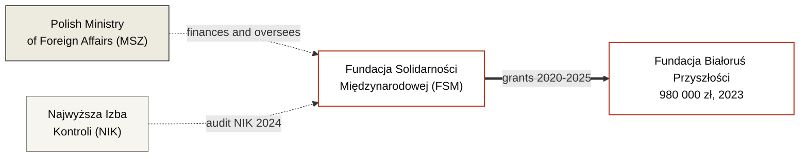

---
hide:
  - navigation
  - toc
title: Fundacja Solidarności Międzynarodowej
org_type: foundation
status: active
single_person:
date_founded: 2001-07-12
date_dissolved:
date_added: 2026-05-16
date_updated: 2026-05-16
charter_public: true
reports_public: true
audit_public: true
oversight: formal
cover_caption:
related_persons:
related_orgs:
  - bialorus-przyszlosci
related_events:
  - fsm-grant-competition-2023
related_docs:
  - doc-fsm-2023-results
  - doc-fsm-2024-results
  - doc-fsm-2025-results
  - doc-nik-kap-430-7-2024
tags:
  - foundation
  - poland
  - state foundation
  - msz
status_note:
---

<header class="bt-org-head">
  
Organization · State Foundation

  <h1>Fundacja Solidarności Międzynarodowej</h1>
  
Polish state foundation (Skarbu Państwa) under the supervision of the Minister of Foreign Affairs. Main operator of Polish development aid under the "Wsparcie Demokracji" programme — including the Belarusian direction.

  

    active
  

</header>

<section class="bt-org-transparency">
  
Transparency

  

    
    
    
    
  

  

    charter
    reports
    audit
    oversight
  

  

    

      
Charter public

      
Yes · charter and Ustawa o współpracy rozwojowej published at <a href="https://solidarityfund.pl/statut-i-ustawa/">solidarityfund.pl/statut-i-ustawa</a>

    

    

      
Financial reporting

      
Yes · annual reports from 2012 to 2024 published at <a href="https://solidarityfund.pl/raporty-roczne/">solidarityfund.pl/raporty-roczne</a>

    

    

      
External audit

      
Yes · NIK KAP.430.7.2024 report, published 28 April 2025

    

    

      
Oversight body

      
Exists formally · Rada FSM operates permanently, its composition is published. The board president and Rada members are appointed by the Polish Minister of Foreign Affairs — the same body that is the donor of FSM programmes. This provides formal but not independent oversight.

    

  

</section>

<section class="bt-org-meta">
  

    

      
Type

      
State Foundation (Skarbu Państwa)

    

    

      
Jurisdiction

      
Poland

    

    

      
Registered

      
12 July 2001 <em>(charter from 07.01.1997)</em>

    

    

      
KRS / NIP / REGON

      
0000024453 / 5262264292 / 012345095

    

    

      
Address

      
ul. Tadeusza Czackiego 7/9/11, 00-043 Warszawa

    

    

      
Board President

      
Justyna Janiszewska (from 21 November 2024)

    

  

</section>

FSM is a Polish state treasury foundation under the supervision of the Minister of Foreign Affairs, operating on behalf of the MFA. Established 7 January 1997 under the name Polska Fundacja Transformacji Rynkowej "Wiedzieć Jak" and registered in KRS on 12 July 2001. In August 2002 renamed to Polska Fundacja Międzynarodowej Współpracy na rzecz Rozwoju "Wiedzieć Jak". In February 2013 received its current name — Fundacja Solidarności Międzynarodowej. Until 2002 the supervisory body was the Minister of the State Treasury, from 2002 — the Minister of Foreign Affairs.

Main directions — Ukraine, Belarus, Georgia, Moldova. Programmes include "Wsparcie Demokracji" (democracy support) and "Polska pomoc rozwojowa" (Polish development aid). The Belarusian direction is implemented through the annual "Konkurs Grantowy na rzecz społeczeństwa białoruskiego" (until 2024 — "na rzecz Białorusi").

By formal transparency indicators, FSM is an institution meeting openness standards: charter published, annual reports from 2012 to 2024 available, external NIK 2024 audit completed and published. See below the **systemic anomaly on the Belarusian direction**.

Current board president Justyna Janiszewska, appointed 21 November 2024, previously headed Fundacja Edukacja dla Demokracji (FED) from 2010 to 2016. FED was among the applicants in the FSM 2023 competition for Belarus with a project supporting repressed teachers (14 points, did not receive funding) and among those whose focus diverges from how FSM actually distributed grants under priority III.

<section class="bt-org-money bt-org-money-fragments">
  
Finances — Belarusian direction

  
General FSM reporting is at <a href="https://solidarityfund.pl/raporty-roczne/">solidarityfund.pl/raporty-roczne</a>. Below only the distribution for the Belarusian direction — the focus of our project. Since 2024, the main part of the competition budget for this direction has been hidden from publication.

  <table class="bt-mf-table">
    <thead>
      <tr>
        <th>Year</th>
        <th>Amount</th>
        <th>Transparency</th>
        <th>Note</th>
        <th>Document</th>
      </tr>
    </thead>
    <tbody>
      <tr>
        <td class="bt-mf-year">2020</td>
        <td class="bt-mf-amount bt-mf-amount--na">not stated</td>
        <td class="bt-mf-transp">

0%</td>
        <td class="bt-mf-note">7 grants, recipients published, amounts not stated.</td>
        <td class="bt-mf-doc">doc-fsm-2020-results</td>
      </tr>
      <tr>
        <td class="bt-mf-year">2021</td>
        <td class="bt-mf-amount bt-mf-amount--na">not stated</td>
        <td class="bt-mf-transp">

0%</td>
        <td class="bt-mf-note">5 grants, recipients published, amounts not stated.</td>
        <td class="bt-mf-doc">doc-fsm-2021-results</td>
      </tr>
      <tr>
        <td class="bt-mf-year">2022</td>
        <td class="bt-mf-amount bt-mf-amount--na">not published</td>
        <td class="bt-mf-transp">

0%</td>
        <td class="bt-mf-note">Results not found in the FSM website archive.</td>
        <td class="bt-mf-doc">—</td>
      </tr>
      <tr>
        <td class="bt-mf-year">2023</td>
        <td class="bt-mf-amount">2 073 460 zł</td>
        <td class="bt-mf-transp">

100%</td>
        <td class="bt-mf-note">5 grants, all recipients published, transparency 100%. Largest grant — 980,000 zł (47% of competition budget).</td>
        <td class="bt-mf-doc">doc-fsm-2023-results</td>
      </tr>
      <tr>
        <td class="bt-mf-year">2024</td>
        <td class="bt-mf-amount">4 700 000 zł</td>
        <td class="bt-mf-transp">

18,7%</td>
        <td class="bt-mf-note">11 grants; 4 names disclosed for 880,000 zł, 7 names hidden for 3,820,000 zł.</td>
        <td class="bt-mf-doc">doc-fsm-2024-results</td>
      </tr>
      <tr>
        <td class="bt-mf-year">2025</td>
        <td class="bt-mf-amount">8 000 000 zł</td>
        <td class="bt-mf-transp">

11,25%</td>
        <td class="bt-mf-note">11 grants; 2 names disclosed for 900,000 zł, 9 names hidden for 7,100,000 zł. A criterion was introduced closing the competition to new applicants.</td>
        <td class="bt-mf-doc">doc-fsm-2025-results</td>
      </tr>
    </tbody>
  </table>

  

    
Systemic anomaly of one direction

    
In 2023–2025, at least <strong>14.77 million zł</strong> passed through FSM for the Belarusian direction. The competition budget grew almost fourfold (from 2.07 to 8 million zł); transparency fell from 100% to 11.25%. In total for 2024–2025, 10.92 million zł was hidden from publication — two thirds of the entire Belarusian direction volume over three years.

    
The formal basis for concealment is a regulatory provision allowing applicants to request non-publication of selected project data due to the special political conditions of the project country. This practice has not been observed in other directions (Ukraine, Georgia, Moldova). Against the background of formally functioning transparency indicators for the institution as a whole — this is a structural anomaly of one direction requiring explanation.

  

  
Last verification of competition publications: 16 May 2026.

</section>

<section class="bt-org-structure">
  
Connections

</section>

<section class="bt-org-people">
  
Leadership during key periods of the Belarusian direction

  <ul class="bt-org-people-list">
    <li><strong>2023 competition (BP grant — 980k zł, 100% transparency)</strong> · board president — Rafał Dzięciołowski (from 19 September 2019)</li>
    <li><strong>2024 competition (81% budget concealment)</strong> · board president — Rafał Dzięciołowski. Results published August 2024, weeks after Dzięciołowski left on 30 July 2024</li>
    <li><strong>2025 competition (89% budget concealment, restrictive criterion introduced)</strong> · board president — Justyna Janiszewska (from 21 November 2024)</li>
  </ul>
</section>

<section class="bt-org-people">
  
Current leadership (board)

  <ul class="bt-org-people-list">
    <li>Justyna Janiszewska — Board President, from 21 November 2024</li>
    <li>Teresa Zagrodzka — Board member, from 13 May 2025</li>
  </ul>
  
<em>Действующий состав Rady Fundacji указан в полной выписке KRS — <a href="../archive/doc-krs-fsm/">doc-krs-fsm</a>.</em>

</section>

<section class="bt-org-people">
  
Former board presidents (per KRS)

  <ul class="bt-org-people-list">
    <li>Jacek Kluczkowski — 2001–2004</li>
    <li>Waldemar Dubaniowski — 2004–2011</li>
    <li>Klaudia Wojciechowska — 2011–2012</li>
    <li>Krzysztof Stanowski — 2012–2017</li>
    <li>Maciej Falkowski — 2017–2019</li>
    <li>Rafał Dzięciołowski — 19 September 2019 — 30 July 2024 (left during NIK 2024 audit, before report publication)</li>
    <li>Henryk Litwin — 30 July — 14 November 2024 (3.5 months)</li>
  </ul>
</section>

<section class="bt-org-events">
  
Related events

  <ul class="bt-org-events-list">
    <li><a href="../events/fsm-grant-competition-2023/">FSM grant competition for Belarus, 2023</a></li>
  </ul>
</section>

<section class="bt-org-cases">
  
Mentioned in cases

  <ul class="bt-org-cases-list">
    <li><a href="../investigations/bialorus-przyszlosci-fsm/">Belarus of the Future and Polish public money</a> · inv-0001</li>
  </ul>
</section>

<section class="bt-org-sources">
  
Source documents

  <ul class="bt-sources-list">
    <li><a href="../archive/doc-fsm-2023-results/">doc-fsm-2023-results</a> · Wyniki Konkursu Grantowego na rzecz Białorusi 2023</li>
    <li><a href="../archive/doc-fsm-2024-results/">doc-fsm-2024-results</a> · Wyniki Konkursu Grantowego na rzecz społeczeństwa białoruskiego 2024</li>
    <li><a href="../archive/doc-fsm-2025-results/">doc-fsm-2025-results</a> · Wyniki Konkursu Grantowego na rzecz społeczeństwa białoruskiego 2025</li>
    <li><a href="../archive/doc-nik-kap-430-7-2024/">doc-nik-kap-430-7-2024</a> · Отчёт NIK о проверке реализации программы «Współpraca rozwojowa» 2021–2024</li>
  </ul>
</section>

<footer class="bt-tags">
  
Tags

  

    foundation
    poland
    state foundation
    msz
  

</footer>

