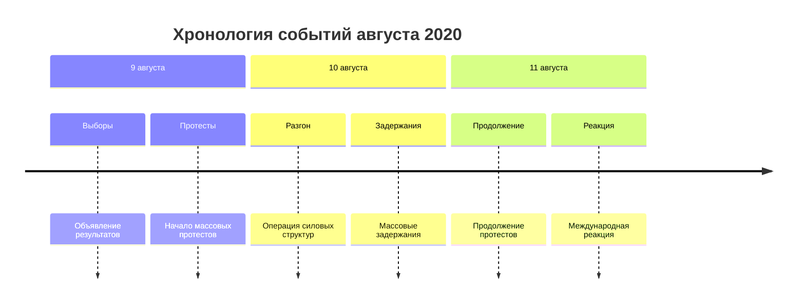
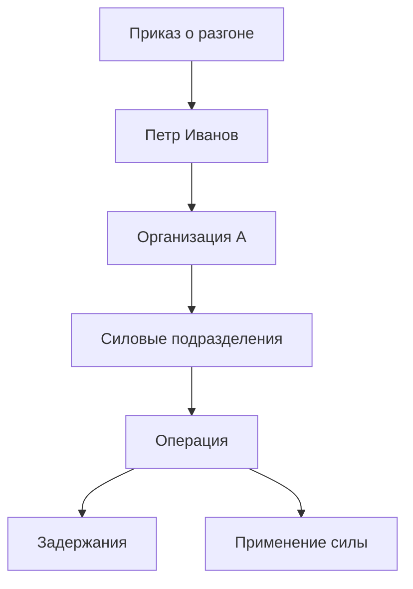

---
hide:
  - navigation
  - toc
---

# Событие 1: Операция по разгону протестов

*Последнее обновление: май 2026*

---

## Основные данные

| | |
|---|---|
| **Дата** | Август 2020 |
| **Место** | Минск, Беларусь |
| **Тип** | Силовая операция |
| **Организатор** | [Организация А](../organizations/org-a.md) |
| **Ответственный** | [Петр Иванов](../persons/ivan-ivanov.md) |

---

## Описание

Lorem ipsum dolor sit amet, consectetur adipiscing elit. Ut enim ad minim 
veniam, quis nostrud exercitation ullamco laboris nisi ut aliquip ex ea 
commodo consequat.

Duis aute irure dolor in reprehenderit in voluptate velit esse cillum dolore 
eu fugiat nulla pariatur. Excepteur sint occaecat cupidatat non proident.

---

## Хронология

---

## Цепочка ответственности

---

## Последствия

- Задержано более 6000 человек
- Зафиксированы случаи пыток
- Возбуждены уголовные дела против организаторов в ЕС

---

## Упоминается в расследованиях

- [Расследование 1](../investigations/investigation-1.md)

---

## Связанные персоналии

- [Петр Иванов](../persons/ivan-ivanov.md)

---

## Связанные организации

- [Организация А](../organizations/org-a.md)

---

[← Все события](index.md)