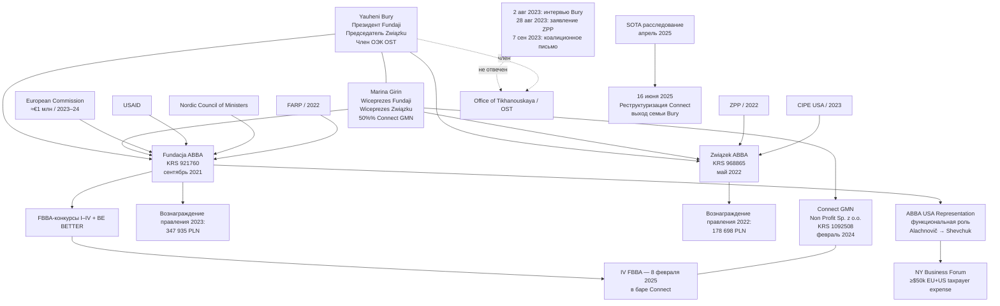

---
hide:
  - navigation
title: Association of Belarusian Business Abroad — структурно-финансовый анализ, 2021–2025
date_published: 2026-05-18
date_updated: 2026-05-18
authors:
  - Редакция Belarus Transparency
related_persons:
  - yauheni-bury
  - marina-girin
  - ales-alachnovic
  - iryna-sazanovich
  - victor-shevchuk
related_orgs:
  - fundacja-abba
  - zwiazek-abba
  - connect-gmn
  - abba-usa-representation
  - opk-economic-team
related_events:
  - bury-interview-aug-2023
  - zpp-statement-aug-2023
  - coalition-letter-sep-2023
  - fbba-iv-feb-2025
  - sota-investigation-apr-2025
tags:
  - расследование
  - abba
  - финансирование
  - opk
status: active
---

# Association of Belarusian Business Abroad: структурно-финансовый анализ, 2021–2025

*Опубликовано: 18 мая 2026 · Редакция Belarus Transparency*

---

## Преамбула

В сентябре 2021 года в Варшаве была зарегистрирована [Fundacja Association of Belarusian Business Abroad](../organizations/fundacja-abba.md) — частный фонд, созданный супружеской парой [Yauheni Bury](../persons/yauheni-bury.md) (президент) и [Marina Girin](../persons/marina-girin.md) (вице-президент). В мае 2022 года к ней добавилось второе юрлицо — [Związek Białoruskiego Biznesu za Granicą](../organizations/zwiazek-abba.md), формально членская организация-объединение работодателей с тем же адресом, той же электронной почтой и тем же руководством. Эта двойная структура — собирательно «ABBA» — позиционирует себя как «единственное международное национально-ориентированное объединение бизнесменов с белорусскими корнями в мире».

С момента создания обе структуры были взяты под опеку [Объединённого переходного кабинета](../organizations/opk-economic-team.md) (OST) Светланы Тихановской. Bury и Girin вошли в [экономическую команду OST](../organizations/opk-economic-team.md). Параллельно при Координационном совете оказались структуры Татьяны Маринич — Imaguru / ASOCIACIJA BELBIZ. Оба образования получили статус привилегированных представителей белорусского бизнеса перед международными донорами — статус, который по факту лоббировался политической инфраструктурой эмиграционной оппозиции в ущерб остальному гражданскому полю организаций, поддерживающих белорусский бизнес за рубежом.

Конфликт с этим полем стал публичным [2 августа 2023 года](../events/bury-interview-aug-2023.md), когда Bury в публичном интервью атаковал четырёх известных представителей экосистемы и четыре поддерживающих бизнес организации. [28 августа 2023 года](../events/zpp-statement-aug-2023.md) Польский союз предпринимателей и работодателей (ZPP) — тот самый ZPP, который **сам помогал создать ABBA в 2021 году**, — опубликовал жёсткое заявление, охарактеризовав поведение ABBA как «soviet-style racketeering and extortion» и объявив о полном прекращении сотрудничества. [7 сентября 2023 года](../events/coalition-letter-sep-2023.md) коалиция из 18+ организаций экосистемы направила международным донорам конфиденциальное письмо с шестью требованиями, включая запрос на формальную позицию офиса Тихановской относительно действий её собственного члена экономической команды. **Ответа не последовало.**

Несмотря на масштабное финансирование — миллион евро по основному гранту Европейской комиссии (контракт SCR.CTR.436909.01.1, 2023–2024), параллельные средства от USAID и Nordic Council of Ministers, отдельная финансовая линия от американского Center for International Private Enterprise (CIPE) — операционная активность ABBA схлопнулась в первой половине 2025 года, как только закончился основной грант ЕС и приостановились программы USAID после смены администрации в Вашингтоне. С марта по июнь 2025 года в публичном календаре ABBA — четырёхмесячная пауза. Финальное мероприятие старого грантового цикла, [IV FBBA от 8 февраля 2025 года](../events/fbba-iv-feb-2025.md), было проведено в баре «Connect» — коммерческом предприятии, [50%-й учредительницей которого](../organizations/connect-gmn.md) с февраля 2024 года выступала Marina Girin (вице-президент Fundaji), а в первоначальной ревизионной комиссии заседали её муж Yauheni Bury и их сын. Структурно это означает направление средств грантового цикла ЕС на venue, в собственности которого имеется equity-стейк руководства Fundaji.

Публичные заявления ABBA о членской базе в «112 организаций в 11 странах» не подтверждаются формальной финансовой отчётностью: ни в одном году в Związku — формальной членской структуре, в которой членами могут быть только юридические лица, — нет ни одной злотой членских взносов. Весь декларированный приход в обоих юрлицах поступает от единичных доноров. Публичными результатами деятельности являются преимущественно конкурсы по распределению грантовых призов — выплаты по €5 000 десяти победителям дважды в год — плюс отдельные бизнес-форумы в США. Согласно внутренним наработкам, по меньшей мере $50 000 средств европейских и американских налогоплательщиков было израсходовано на американский бизнес-форум ABBA и серию связанных мероприятий в США, без подтверждённого формального американского юридического лица и без документированных бенефициаров от инвестиций.

Отсутствие публичных результатов компенсируется ростом организационных издержек. По формальной отчётности польского KRS, в 2022 году вознаграждение членов правления через оба юрлица составило **178 698 PLN**; в 2023 году — **347 935 PLN**. Это составляет приблизительно €77 000 в 2023 году совокупно на двух членов правления, что многократно расходится с собственными неоднократными публичными заявлениями руководства ABBA о скромном уровне их вознаграждения.

С финансового года 2024 ни одно из юрлиц ABBA не подало формальной отчётности в KRS. Срок подачи истёк в середине 2025 года. По состоянию на май 2026 года, отчётность за 2024 год **отсутствует в публичном доступе** для обоих юрлиц.

Это расследование документирует структурную траекторию ABBA с 2021 по 2025 год на основе первичных документов государственного реестра Польши, аудиторских заключений, журналистских расследований SOTA, коалиционных писем и публичных заявлений донорских структур. Все ключевые утверждения снабжены ссылкой на первичный документ в архиве проекта; уровень доказанности обозначен в разделе «Источники и методология».

---

## Краткое содержание

Двойная польская юридическая структура (Fundacja ABBA + Związek ABBA), управляемая одной семейной парой и интегрированная в экономическую команду OST, получила в 2021–2024 годах **гранты от Европейской комиссии, USAID, Nordic Council of Ministers, ZPP, CIPE и FARP**. Совокупный оборот Fundaji в 2023 году достиг 2,84 млн PLN (≈€630 тыс.). Совокупное вознаграждение членов правления через оба юрлица в 2023 году выросло до 347 935 PLN (≈€77 тыс. на двоих). Параллельно открыт коммерческий бар Connect с family-equity ownership, в котором проводилось финальное grant-cycle мероприятие ЕС. После окончания основного гранта ЕС и остановки USAID операционная активность схлопнулась с марта 2025 года. Отчётность за 2024 финансовый год не подана. Запрос на формальную позицию OST относительно действий её собственного члена экономической команды, направленный коалицией 18+ организаций 7 сентября 2023 года, **остался без ответа**.

---

## Структурная схема

---

## A. Двойная юридическая структура

ABBA реализована как **two-entity structure** с операционной переплетённостью на уровне адреса, контактов, руководства и репозиции в публичной коммуникации.

### Fundacja ABBA (KRS 0000921760)

Зарегистрирована 20 сентября 2021 года. Правовая форма — **польская fundacja** (фонд). Управляется двухчленным Zarządem: [Yauheni Bury](../persons/yauheni-bury.md) (Prezes) и [Marina Girin](../persons/marina-girin.md) (Wiceprezes). У фонда нет наблюдательного органа (Rada Fundacji), нет независимых учредителей помимо Bury и Girin; все ключевые корпоративные решения принимаются и подписываются этими двумя лицами. По имеющимся данным, среди ранних учредителей значился также член экономической команды OST [Прокофьев](../persons/prokofyev.md), однако в актуальной выписке KRS он не фигурирует.

Адрес: ul. Hoża 86/410, 00-682 Warszawa. Email: abba@abbabusiness.org. Банк: Santander Bank Polska.

Установлено выполнение Fundacją следующих основных функций: образовательная и консультационная деятельность (тренинги по предпринимательству, экономике, бухгалтерии, польскому праву), юридическая помощь, финансовая помощь, а также организация конкурсных программ перераспределения грантовых средств. С 2023 года в штате — 7 сотрудников на трудовых договорах, включая должность «KYC Specialist», что нетипично для фонда такой направленности.

### Związek Białoruskiego Biznesu za Granicą (KRS 0000968865)

Зарегистрирован 1 мая 2022 года. Правовая форма — **польский związek pracodawców** (союз работодателей). Это структурно отличная юридическая форма: членами могут быть **только юридические лица** (предприниматели, компании). Именно через эту форму ABBA публично позиционирует свою «членскую базу» в 100+ организаций.

Адрес: **тот же** ul. Hoża 86/410. Email: **тот же** abba@abbabusiness.org. Банк: PKO BP (отличается от Fundaji). Zarząd на момент создания: [Yauheni Bury](../persons/yauheni-bury.md), [Marina Girin](../persons/marina-girin.md), [Iryna Sazanovich](../persons/iryna-sazanovich.md). После [резигнации Sazanovich 7 января 2023 года](../events/sazanovich-resignation-jan-2023.md) и [изменения устава через 3 дня](../events/statute-amendment-jan-2023.md) в правление были введены [Siarhei Naurodski](../persons/siarhei-naurodski.md) и [Aleksander Olechnowicz](../persons/ales-alachnovic.md) (известный также под именем Aleś Alachnovič — главный экономический советник Tikhanouskaya).

Устав Związku формально закрепляет среди статутных функций:

> «weryfikacja biznesu o korzeniach białoruskich w celu sprawdzenie działalności podmiotu gospodarczego i podmiotów z nim powiązanych pod kątem m.in. powiazań z reżimem Łukaszenka»

— то есть проверку белорусских бизнес-структур на связь с режимом Лукашенко. В отчёте 2023 года эта функция указана как **фактически выполнявшаяся в отчётном периоде**. Это та же деятельность, которую ZPP в августе 2023 года охарактеризовал как «soviet-style racketeering».

### Connect GMN Non Profit Sp. z o.o. (KRS 0001092508)

Учреждена 16 февраля 2024 года — то есть **в период активного исполнения грантового цикла Fundaji**. Правовая форма — польская spółka z ograniczoną odpowiedzialnością (Sp. z o.o.) с пометкой «Non Profit». Первоначальная структура долей: 50% — Marina Girin, 50% — Marina Nikandrina. Первоначальная ревизионная комиссия: Yauheni Bury, сын Bury+Girin, и дочь Nikandrina. **Все органы управления — близкий семейный/околосемейный круг.**

Деятельность: **бар** в центральной части Варшавы (ul. Chmielna 98 lok. 1).

### Структурное соединение

Три юридических лица образуют единую operational структуру. Сама Fundacja в отчётности 2023 года формально декларирует, что **«nie nabywała obligacji lub akcji w spółkach prawa handlowego»** — то есть фонд не приобретал акций в коммерческих компаниях. Это технически верно: фонд сам в учредителях Connect GMN не значится. Однако его вице-президент (Marina Girin) имеет 50%-й equity-стейк в баре, в котором фонд впоследствии проводил [финальное мероприятие grant cycle ЕС — IV FBBA 8 февраля 2025 года](../events/fbba-iv-feb-2025.md). Это **формальное соблюдение** запрета на корпоративное участие в сочетании со **структурной related-party transaction** через личное участие руководства.

---

## B. Финансовая архитектура

### Траектория Fundaji ABBA

| Год | Доходы (PLN) | Расходы (PLN) | Результат | Активы на конец |
|---|---|---|---|---|
| 2021 (4 мес.) | 7 914 | 6 152 | +1 761 | 7 002 |
| 2022 | 450 888 | 485 617 | **−34 729** | 7 641 |
| 2023 | 2 838 865 | 2 950 124 | **−111 259** | 461 038 |
| **2024** | **—** | **—** | **отчётность не подана** | **—** |

Рост доходов в 2023 году в 6,3 раза соответствует операционному запуску гранта ЕС SCR.CTR.436909.01.1 (€1 млн на 2023–2024). При курсе 2023 года 2,84 млн PLN ≈ €630 000 — согласуется с первым траншем гранта ЕС плюс параллельные источники.

**Структурная аномалия**: несмотря на 6-кратный рост доходов, оба полных года (2022 и 2023) показали убыток. Правление формально решало покрыть убыток «из прибыли будущих лет» — нестандартная формулировка для некоммерческого фонда.

### Траектория Związku ABBA

| Год | Доходы (PLN) | Расходы (PLN) | Результат | Активы на конец |
|---|---|---|---|---|
| 2022 (8 мес.) | 237 126 | 232 606 | +4 520 | 4 521 |
| 2023 | 253 533 | 228 448 | +25 084 | 94 889 |
| **2024** | **—** | **—** | **отчётность не подана** | **—** |

Объём операций Związku — порядка 1/10 от Fundaji. Доходы относительно стабильны между 2022 и 2023, но **источники этих доходов полностью сменились** (см. ниже). Прибыль вместо убытка объясняется тем, что **расходы на вознаграждение членов правления в 2023 году были переведены в Fundację** — структурная закономерность, видимая только при cross-entity сопоставлении.

### Доноры и пивот ZPP → CIPE

**Декларированные источники финансирования по годам:**

| Год | Fundacja | Związek |
|---|---|---|
| 2021 | мелкие частные пожертвования | — |
| 2022 | Komisja Europejska + USAID + FARP + мелкие частные | **ZPP** (единственный) |
| 2023 | Komisja Europejska + USAID + **Nordic Council of Ministers** | **CIPE USA** (единственный) |

Структурно значимая последовательность по Związku:

1. **2022**: единственный донор Związku — **ZPP** (Польский союз предпринимателей и работодателей), та самая структура, которая, по [её собственному публичному заявлению от 28 августа 2023 года](../events/zpp-statement-aug-2023.md), **помогала создать ABBA в 2021 году** и сотрудничала с её руководством в 2021–2023 годах
2. **2 августа 2023**: [интервью Bury](../events/bury-interview-aug-2023.md) с публичными атаками на представителей экосистемы, включая Mikola Danilchuk (ZPP)
3. **28 августа 2023**: [публичное заявление ZPP](../events/zpp-statement-aug-2023.md): «We categorically and unconditionally terminated our cooperation with ABBA»
4. **7 сентября 2023**: [коалиционное письмо 18+ организаций](../events/coalition-letter-sep-2023.md), включая Danilchuk и других подписантов
5. **2023**: единственный донор Związku — **CIPE USA** (Center for International Private Enterprise, аффилированный с US Chamber of Commerce и финансируемый Национальным фондом за демократию — NED, де-факто канал US государственного финансирования продвижения частного предпринимательства за рубежом)

Сумма гранта ZPP в Związek в 2022 году: 237 126 PLN. Сумма гранта CIPE в Związek в 2023 году: 253 073 PLN. **Финансовая стабильность Związku не была нарушена конфликтом с ZPP** — она была компенсирована переключением донорского канала с польского источника на американский.

### Дефицит раскрытия по донорам

В отчётах о деятельности обоих юрлиц декларируются **только наименования** грантодателей, без раскрытия сумм по каждому источнику. В формальной классификации доходов раздела III.2 («Informacja o źródłach przychodów») сумм в категории «Ze źródeł publicznych» (из публичных источников) **нет ни в одном году**. В 2022 году все полученные гранты Fundaji классифицированы как «z darowizn» (от дарений), что методологически некорректно для грантов публичных агентств (EC, USAID, FARP). В 2023 году формальные категории остались **пустыми** при общем обороте 2,84 млн PLN.

Этот disclosure pattern блокирует независимую сверку с публичной отчётностью каждого донора. Невозможно установить долю EC в годовом обороте, сумму от USAID, сумму от Nordic Council. Перекрёстная верификация через EC Financial Transparency System, USAID Foreign Assistance Database или отчётность Nordic Council возможна только по этим внешним источникам, и это **тема отдельных формальных запросов** к каждому донору.

### Cross-entity переключение вознаграждения

Самая структурно значимая находка по финансовой архитектуре — **переключение каналов вознаграждения членов правления между двумя юрлицами по годам**.

| Год | Fundacja платит руководству | Związek платит руководству | **Совокупное вознаграждение** |
|---|---|---|---|
| 2022 | **0 PLN** | **178 698 PLN** | 178 698 PLN ≈ €39 000 |
| 2023 | **347 935 PLN** | **0 PLN** | 347 935 PLN ≈ €77 000 |

**Точная цитата из официальной отчётности Fundaji 2023:**

> «Wysokość rocznego wynagrodzenia wypłaconego łącznie członkom zarządu i innych organów fundacji oraz osobom kierującym wyłącznie działalnością gospodarczą — **347 935,21 PLN**»

— раздел V.3.c. Sprawozdanie z działalności Fundaji za 2023 rok, подписано в Варшаве 28 июня 2024 года Yauheni Bury и Marina Girin.

**Точная цитата из официальной отчётности Związku 2022:**

> «Wysokość rocznego lub przeciętnego miesięcznego wynagrodzenia wypłaconego łącznie członkom zarządu i innych organów fundacji oraz osobom kierującym wyłącznie działalnością gospodarczą — **178 698,00 PLN**»

— раздел V.3.c. Sprawozdanie z działalności Związku za 2022 rok, подписано в Варшаве 31 марта 2023 года.

Совокупное вознаграждение руководства **выросло в 2023 году в 1,95 раза относительно 2022 года**. При равном делении на двух членов правления это даёт в 2023 году приблизительно **€38 700 на человека в год** или **€3 220 в месяц брутто** на каждого. После польских налогов на трудовые отношения — около €2 100 в месяц нетто на каждого. Это уровень вознаграждения, существенно превышающий медианные показатели по польскому NGO-сектору и **многократно расходящийся** с собственными неоднократными публичными заявлениями руководства ABBA о скромном уровне вознаграждения.

При анализе только одного юрлица переключение каналов вознаграждения создаёт **искажённую картину**: Fundacja 2022 выглядит как организация с безвозмездно работающим правлением; Związek 2023 — как организация с безвозмездно работающим правлением. Структурная реальность видна только при **cross-entity сопоставлении**.

### Деферированный доход и зависимость от грантов

На 31 декабря 2023 года в балансе Fundaji зафиксирован остаток в категории «rozliczenia międzyokresowe» (deferred revenue) в размере **493 470 PLN** — это полученные, но ещё не освоенные грантовые средства, относящиеся к 2024 году. Эта сумма обеспечивает 1–2 квартала операций на текущем уровне и объясняет операционную силу первой половины 2024 года. После исчерпания этих средств — операционная активность по объективным причинам сокращается. Это согласуется с эмпирически наблюдаемой [четырёхмесячной паузой в публичном календаре ABBA в марте–июне 2025 года](../events/operational-pause-mar-jun-2025.md).

---

## C. Конфликт с экосистемой, август–сентябрь 2023

В августе 2023 года произошла публичная конфронтация между ABBA и значительной частью гражданского поля организаций поддержки белорусского бизнеса в эмиграции.

### Интервью Bury, 2 августа 2023

В [публичном интервью](../events/bury-interview-aug-2023.md) Yauheni Bury атаковал четырёх представителей экосистемы (включая Aliaksandr Knyrovich, Siarhei Krasko и ещё двух лиц) и четыре организации, поддерживающие белорусский бизнес (Belarus Business Center, AIST, Impackt Project, REVERA Law Group). Содержание атак включало обвинения в недобросовестности, представление их как препятствие для системного развития поддержки белорусского бизнеса.

### Заявление ZPP, 28 августа 2023

[ZPP](../organizations/zpp.md) — польский Związek Przedsiębiorców i Pracodawców — опубликовал на платформе Charter97 [официальное заявление](../events/zpp-statement-aug-2023.md):

> «Modus operandi ABBA напоминает практики советского рэкета и вымогательства. [...] Мы категорически и безусловно прекращаем сотрудничество с ABBA».

В этом же заявлении ZPP **публично подтвердил**, что:
- ZPP помогал создать ABBA в 2021 году
- ZPP передавал ABBA грантовые средства (что подтверждается и финансовой отчётностью Związku ABBA за 2022 год)
- ZPP участвовал в обеспечении ABBA международных контактов

То есть **бывший co-founder ABBA публично разорвал с ней связь**, охарактеризовав её деятельность как недопустимую.

### Коалиционное письмо, 7 сентября 2023

Через 10 дней после заявления ZPP коалиция из 18+ организаций экосистемы направила [конфиденциальное письмо](../events/coalition-letter-sep-2023.md) международным донорам и структурам OST. Адресаты включали PYXERA Global, USAID, CIPE, Государственный департамент США, Делегацию ЕС, Европейский парламент, Konrad Adenauer Foundation, EBRD Belarus, а также офис Тихановской, НАУ, OST, Координационный совет.

Письмо содержало шесть формальных требований, включая:
1. Формальное расследование действий ABBA донорами
2. Приостановку грантового финансирования до проведения расследования
3. **Формальную позицию офиса Тихановской** относительно действий её собственного члена экономической команды

**Ни одно из шести требований не получило формального ответа.** Офис Тихановской не выпустил публичной позиции относительно действий Bury. Грантовое финансирование ABBA не было приостановлено. По линии Fundaji грант ЕС SCR.CTR.436909.01.1 продолжил исполнение до своего естественного окончания в 2024 году. По линии Związku в 2023 году появился новый донор — CIPE USA.

Описанная архитектура реагирования экосистемы соответствует диагностическому паттерну, описанному в литературе по донорской поддержке оппозиционных структур в эмиграции (Carnegie/Sayigh по Сирии, Carothers и Ottaway по comparative democracy assistance, GPPi/Carnegie 2023 по сравнительным кейсам): **формальное обозначение конкретной организации как «единственного легитимного представителя» сообщества создаёт rent-seeking структуру, неспособную к самокоррекции без внешнего вмешательства**.

---

## D. FBBA-конкурсы как механизм распределения

Публичными результатами деятельности ABBA в период 2023–2025 годов является преимущественно серия конкурсов **Forum Białoruskiego Biznesu Abroad (FBBA)** — программа распределения денежных призов среди заявителей. Стандартная конфигурация: 10 победителей, по €5 000 каждому, проводится дважды в год.

Известные циклы:
- [I FBBA — май 2023](../events/fbba-i-may-2023.md)
- [II FBBA — ноябрь 2023](../events/fbba-ii-nov-2023.md)
- [III FBBA — 2024](../events/fbba-iii-2024.md) (точная дата устанавливается)
- [IV FBBA — 8 февраля 2025](../events/fbba-iv-feb-2025.md) (см. раздел E)
- [BE BETTER — сентябрь 2025](../events/be-better-sep-2025.md) — пост-грантовый формат, €2 500 на Coursera-стипендии (90% сокращение масштаба относительно FBBA)

При совокупных оборотах Fundaji ABBA 2023 года в 2,84 млн PLN, объём фактически распределённых призов FBBA составляет малую часть бюджета. Большая часть расходов проходит по статьям «koszty realizacji celów statutowych» без раскрытия структуры. Получатели призов FBBA включают [Belarusian Youth Hub](../organizations/belarusian-youth-hub-fundacja.md) и [Рада Беларускай Культуры](../organizations/rada-kultury.md), а также ряд отдельных предпринимателей. Полный список получателей и их связи с руководством ABBA — предмет отдельного анализа.

После окончания основного гранта ЕС и формата FBBA, новый формат BE BETTER (сентябрь 2025) демонстрирует **90%-е сокращение масштаба** — это прямой эмпирический индикатор зависимости операционной активности ABBA от внешнего грантового финансирования, а не от структурных доходов или членских взносов.

---

## E. Бар Connect: related-party transaction

16 февраля 2024 года в KRS была зарегистрирована [Connect GMN Non Profit Sp. z o.o.](../organizations/connect-gmn.md) — польская компания с ограниченной ответственностью с пометкой «Non Profit». Деятельность — бар в Варшаве. Учредительская структура:

| Учредитель | Доля |
|---|---|
| Marina Girin (Wiceprezes Fundaji ABBA) | 50% |
| Marina Nikandrina | 50% |

Первоначальная ревизионная комиссия (audit committee):

| Член | Связь |
|---|---|
| Yauheni Bury | Prezes Fundaji ABBA, муж Marina Girin |
| Mark Girin | сын Yauheni Bury и Marina Girin |
| Angelina Nikandrina | дочь Marina Nikandrina; бывший KYC Specialist в Fundacji ABBA |

**Все органы управления — близкий семейный круг с одной добавленной семьёй (Nikandrina–Girin).**

### IV FBBA в баре Connect — 8 февраля 2025

[Финальное мероприятие grant cycle ЕС (контракт SCR.CTR.436909.01.1)](../events/fbba-iv-feb-2025.md) — IV FBBA, состоявшееся 8 февраля 2025 года в баре Connect. Это означает, что **средства грантового цикла ЕС были направлены на venue, в собственности которого имеется equity-стейк руководства Fundaji**.

В формальной отчётности Fundaji за 2023 год (раздел VII.3) указано: «W okresie sprawozdawczym Fundacja nie nabywała obligacji lub akcji w spółkach prawa handlowego» — то есть Fundacja сама в учредительском составе бара не участвовала. Это технически верно. Но структурная реальность — это **related-party transaction** между Fundacją и коммерческим entity, контролируемым её руководством лично.

В отчётности 2024 года это потребовало бы раскрытия в разделе related-party transactions согласно стандартам бухгалтерского учёта. **Отчётность за 2024 год не подана** (см. раздел H).

### Реструктуризация после расследования SOTA

18 апреля 2025 года SOTA Project опубликовал [расследование о финансовых структурах белорусской оппозиции](../events/sota-investigation-apr-2025.md), включая блок о ABBA и баре Connect. В последовавшие два месяца, **до даты следующей публикации SOTA**, в KRS бара Connect было внесено **три статутных изменения подряд** (24.02.2025, 13.03.2025, 14.03.2025).

16 июня 2025 года — финальная [реструктуризация](../events/connect-bar-restructuring-jun-2025.md): Marina Girin выведена из числа учредителей (её доля передана Marina Nikandrina, увеличив её долю до 91%); Yauheni Bury и Mark Girin удалены из ревизионной комиссии. Семья Bury–Girin формально вышла из бара. SOTA публикует материал об этой реструктуризации 18 июня 2025 года.

Хронология реструктуризации — концентрированный период из четырёх корпоративных изменений за период 1,5 месяца — указывает на **скоординированный выход семейного контроля из бара**, синхронизированный с публикациями SOTA.

---

## F. Американский трек: NY Business Forum и ABBA USA Representation

Параллельно с польской и общеевропейской деятельностью, ABBA развивала **американское направление** — серию мероприятий в США, бизнес-форум в Нью-Йорке и формальную «Representation» (представительство) в США.

### NY Business Forum

ABBA провела бизнес-форум в Нью-Йорке как часть программы поддержки белорусского бизнеса за рубежом. Форум активно продвигался по каналам офиса Тихановской — включая публичное приветствие самой Тихановской при открытии и медийную поддержку через каналы Infopoint. Согласно внутренним наработкам, суммарные расходы (форум + последующие бизнес-встречи + командировки членов экономической команды OST в США) составили **минимум $50 000 средств европейских и американских налогоплательщиков**.

В мероприятиях форума приняли участие как минимум пять предприятий с белорусскими корнями, базирующихся в США (и одно — в Канаде). Это:

- **[Anton Belianski](../persons/anton-belianski.md)** (Пенсильвания) — партнёр в Crocket's Materials and Services, малой телекоммуникационной компании. С 2013 года в США
- **[Vladimir Grigorik](../persons/vladimir-grigorik.md)** (Онтарио, Канада) — президент GVA Lighting Inc. С 1997 года в Канаде. LinkedIn-друг Frank Viacorka (советник Тихановской)
- **[Mikalaj Murziankou](../persons/mikalaj-murziankou.md)** — совладелец IOMICO (с штаб-квартирой по данным CrunchBase в Польше) и Ezrapplication Inc. Поддерживает ABBA с 2023 года
- **[Max Valadzko](../persons/max-valadzko.md)** (Миннесота) — владелец iDeal Auto Imports LLC, торговля подержанными автомобилями. С 2007 года в США
- **[Victor Shevchuk](../persons/victor-shevchuk.md)** (Миннесота) — владелец MGM Wine & Spirits, сети винных магазинов (около 30 точек в Миннесоте). С 2009 года в США. **Действующий «посол и глава ABBA в США»**

Кроме того, в качестве почётных спикеров на мероприятиях ABBA выступали:
- **[Mikita Mikado](../persons/mikita-mikado.md)** — со-основатель PandaDoc (компания-«единорог»). По имеющимся данным, его доля в PandaDoc не превышает 10%, что недостаточно даже по ослабленным критериям EBRD для классификации PandaDoc как белорусского бизнеса
- **[Alex Golod](../persons/alex-golod.md)** — основатель Fusion Software Solutions Co. По LinkedIn компания заявляет 200–500 сотрудников; в реальности профиль содержит признаки раздутия (только 41 человек в списке, преимущественно в Индии; сайт компании датирован 2017 годом и неактивен)

### Структурная функция «ABBA Representation»

Должность «посла и главы ABBA в США» — формальная функциональная роль. До Victor Shevchuk эту роль занимал [Aleksander Olechnowicz](../persons/ales-alachnovic.md) (Aleś Alachnovič), который параллельно являлся Wiceprezes Związku ABBA (с июля 2023 по сентябрь 2025) и главным экономическим советником Tikhanouskaya. Структурно это создаёт фигуру с **тройной ролью**: член ОЭК + руководство в Związku + глава американского представительства.

**Существование формального американского юридического лица ABBA** (501(c)(3) non-profit, 501(c)(6) trade association, Delaware LLC или иной формы) **не подтверждено в доступных открытых документах**. При отсутствии формального юрлица возникают вопросы по соответствию IRS требованиям, обработке донорских средств от CIPE USA, и регулированию деятельности под Foreign Agents Registration Act (FARA), если применимо. Это — отдельный предмет верификации через US business registries (OpenCorporates, Minnesota SOS, Pennsylvania DOS, IRS Form 990 search) и формальные запросы.

### Структурная значимость американского трека

США — юрисдикция с **более низким уровнем публичной прозрачности beneficial ownership** относительно ЕС: LLC регистрируются на уровне штатов с минимальным раскрытием бенефициаров, годовая отчётность для small entities часто ограничена. Это делает американскую составляющую ABBA структурно непрозрачной и **критически нуждающейся в систематических формальных запросах** для воссоздания финансовой картины. Запрос на формальное юрлицо ABBA в США + раскрытие источников финансирования американских операций — приоритет дальнейшего расследования.

---

## G. Операционный коллапс 2025 года

После окончания основного грантового цикла ЕС (контракт SCR.CTR.436909.01.1, 2023–2024) и [приостановки программ USAID](../events/usaid-stop-jan-2025.md) после смены администрации в Вашингтоне в январе 2025 года, операционная активность ABBA **резко сократилась**.

### Хронологические индикаторы

| Период | Состояние |
|---|---|
| Январь–февраль 2025 | Финальные мероприятия старого грантового цикла, включая IV FBBA в баре Connect |
| Февраль–март 2025 | Концентрированный период статутных изменений в баре Connect (3 изменения за 19 дней) |
| **Март–июнь 2025** | **Четырёхмесячная пауза в публичном календаре ABBA** |
| Апрель 2025 | SOTA публикует базовое расследование |
| Июнь 2025 | Финальная реструктуризация Connect, выход семьи Bury |
| Сентябрь 2025 | Конкурс BE BETTER (€2.5k Coursera-стипендии), **90%-е сокращение масштаба** относительно FBBA-формата |
| Конец 2025 | ABBA как **участник** (не оператор) консорциального BDI grant cycle SCR.CTR.459986 (2025–2027) под лидерством Eurochambres |

### Структурная импликация

Резкое сокращение операций совпало с окончанием основного гранта ЕС и приостановкой USAID. **Это эмпирически демонстрирует**, что:

1. Операционная активность ABBA в 2023–2024 годах была **производной от грантового финансирования**, а не результатом устойчивых членских отношений, частной поддержки белорусского бизнеса или коммерческой деятельности
2. Заявленная база «112 организаций в 11 странах» **не генерирует** устойчивых членских взносов (которые в отчётности отсутствуют ни в одном году)
3. Структура **не диверсифицирована** — параллельных источников финансирования, способных заместить грантовый поток, нет

Переход ABBA в BDI grant cycle 2025–2027 — это переход **из роли единственного оператора грантовой программы в роль одного из участников консорциума** под лидерством Eurochambres (зарезервировавшим 41,5% бюджета). Это понижение operational status и потенциальное окончание ABBA как самостоятельной структуры в случае непродления независимого финансирования после 2027 года.

---

## H. Compliance gap: исчезновение отчётности

С финансового года 2024 ни одно из юрлиц ABBA не подало формальной отчётности в KRS. Стандартный срок утверждения отчётов правлением — до 30 июня 2025 года; стандартный срок подачи в KRS — в течение 15 дней после утверждения, то есть до 15 июля 2025 года. Реалистичный финальный срок с учётом практики KRS-просрочек — до конца 2025 года.

По состоянию на 18 мая 2026 года:

| Юрлицо | Отчёт за 2023 | Отчёт за 2024 |
|---|---|---|
| Fundacja ABBA (KRS 921760) | подан 28.06.2024 | **отсутствует** |
| Związek ABBA (KRS 968865) | подан 29.06.2024 | **отсутствует** |

**Одновременное непредставление отчётности обоими юрлицами за 2024 год** — структурный сигнал, не объяснимый единичной технической задержкой или забывчивостью. 2024 год — это критический период с точки зрения возможных раскрытий: окончание гранта ЕС, открытие бара Connect и related-party transactions, переход на BDI consortium, последствия конфликта 2023 года для финансовых отношений с донорами.

Отсутствие 2024-отчётности означает:

1. **Формальное нарушение** статутных обязательств юрлиц по закону Польши
2. **Блокирование** независимого анализа критически важного 2024 года
3. **Потенциальное основание** для регуляторных запросов KRS, поскольку польский Rejestr может инициировать процедуры в отношении юрлиц, не подающих обязательную отчётность
4. **Информационный сигнал донорам**, особенно ЕС (по контракту SCR.CTR.436909.01.1, отчётный период которого включает 2024 год), что **независимая верификация использования грантовых средств заблокирована** в открытых источниках

---

## Хронология

| Дата | Событие |
|---|---|
| 20.09.2021 | Регистрация [Fundaji ABBA](../organizations/fundacja-abba.md) (KRS 0000921760) в Warszawa |
| 01.05.2022 | Регистрация [Związku ABBA](../organizations/zwiazek-abba.md) (KRS 0000968865) |
| 2022 | Грант [FARP](../organizations/farp.md) + [USAID](../organizations/usaid.md) + [EC](../organizations/european-commission.md) в Fundację; грант [ZPP](../organizations/zpp.md) в Związek |
| 07.01.2023 | [Резигнация Iryna Sazanovich](../events/sazanovich-resignation-jan-2023.md) из Zarządu Związku |
| 10.01.2023 | [Изменение устава Związku](../events/statute-amendment-jan-2023.md) |
| Май 2023 | [I FBBA](../events/fbba-i-may-2023.md) — старт серии конкурсов |
| 04.07.2023 | [Naurodski и Olechnowicz](../events/naurodski-olechnowicz-join-jul-2023.md) добавлены в Zarząd Związku |
| **02.08.2023** | **[Интервью Bury](../events/bury-interview-aug-2023.md) с публичными атаками** |
| **28.08.2023** | **[Заявление ZPP](../events/zpp-statement-aug-2023.md) на Charter97** |
| **07.09.2023** | **[Коалиционное письмо 18+ организаций](../events/coalition-letter-sep-2023.md)** |
| Ноябрь 2023 | [II FBBA](../events/fbba-ii-nov-2023.md) |
| 2023 | Грант [CIPE USA](../organizations/cipe.md) (253k PLN) — замена ZPP-канала в Związke |
| 28.06.2024 | Утверждение отчётности Fundaji 2023; **вознаграждение правления: 347 935 PLN** |
| 16.02.2024 | [Учреждение Connect GMN](../events/connect-bar-founding-feb-2024.md), 50/50 Girin / Nikandrina |
| 08.02.2025 | [IV FBBA](../events/fbba-iv-feb-2025.md) — финал grant cycle ЕС в баре Connect |
| 24.02 / 13.03 / 14.03.2025 | [Период статутных изменений Connect](../events/connect-bar-statute-feb-march-2025.md) |
| Январь 2025 | [Stop USAID](../events/usaid-stop-jan-2025.md) при новой администрации США |
| **Март–июнь 2025** | **[Операционная пауза ABBA](../events/operational-pause-mar-jun-2025.md)** |
| 18.04.2025 | [SOTA публикация о финансовых структурах оппозиции, включая ABBA](../events/sota-investigation-apr-2025.md) |
| **16.06.2025** | **[Реструктуризация Connect](../events/connect-bar-restructuring-jun-2025.md): выход Girin, Bury, Mark Girin** |
| 18.06.2025 | SOTA публикует материал о реструктуризации |
| Лето 2025 | **Срок подачи отчётности обоих юрлиц за 2024 год истекает без подачи** |
| Сентябрь 2025 | [BE BETTER](../events/be-better-sep-2025.md) — €2.5k Coursera, 90% сокращение масштаба |
| 23.09.2025 | Olechnowicz удалён из Zarządu Związku |
| 05.11.2025 | Добавление нового члена Rady Nadzorczej Związku |
| 18.05.2026 | Дата публикации настоящего материала; отчётность за 2024 год по-прежнему отсутствует |

---

## Ключевые фигуранты

### [Yauheni Bury](../persons/yauheni-bury.md)
Президент Fundaji ABBA с момента её создания в сентябре 2021 года; председатель правления Związku ABBA с момента его создания в мае 2022 года. Член экономической команды Объединённого переходного кабинета (OST) Светланы Тихановской. Согласно цитированию в публичных материалах Human Rights Watch (май 2025), ранее работал в Совете безопасности Республики Беларусь. Подписант финансовой отчётности обоих юрлиц ABBA.

### [Marina Girin](../persons/marina-girin.md)
Вице-президент Fundaji ABBA и Związku ABBA. Супруга Yauheni Bury. С февраля 2024 года по июнь 2025 года — 50%-я учредительница Connect GMN Non Profit Sp. z o.o. (бар в Варшаве). Подписант финансовой отчётности обоих юрлиц.

### [Aleksander Olechnowicz / Aleś Alachnovič](../persons/ales-alachnovic.md)
Главный экономический советник Tikhanouskaya. Wiceprezes Związku ABBA с июля 2023 по сентябрь 2025 года. Предшественник Victor Shevchuk в роли «посла и главы ABBA в США». Тройная позиция (член ОЭК + руководство в Związku + глава американского представительства) делает его одним из наиболее структурно информированных лиц в системе.

### [Iryna Sazanovich](../persons/iryna-sazanovich.md)
Wiceprezes Związku ABBA с момента создания в мае 2022 года до резигнации 7 января 2023 года. Член экономической команды OST. Текст её резигнационного заявления включал формулу «niniejszym nieodwołalnie zrzekam się [...] roszczeń» — взаимный отказ от претензий, характерный для разрывов с конфликтным фоном.

### [Victor Shevchuk](../persons/victor-shevchuk.md)
Действующий «посол и глава ABBA в США». Владелец сети винных магазинов MGM Wine & Spirits в Миннесоте (около 30 точек). С 2009 года в США.

---

## Источники и методология

### Уровни доказанности утверждений

Все основные утверждения настоящего материала имеют один из четырёх уровней доказанности:

- **Уровень 1 (документ)** — первичный документ в государственном реестре, аудиторская отчётность, нотариально удостоверенное заявление. **Большинство утверждений настоящего материала** — этого уровня.
- **Уровень 2 (публичные данные)** — публичные заявления, журналистские расследования, отчёты международных организаций. Применяется к: заявлению ZPP от 28.08.2023, расследованию SOTA от 18.04.2025, материалу Human Rights Watch от 09.05.2025.
- **Уровень 3 (свидетельство источника)** — материал, подаваемый явно как «по информации источника». Применяется к: характеристикам внутренней работы ABBA, требующим инсайдерского знания (например, специфика IV FBBA в баре Connect); деталям американского трека, опирающимся на внутренние наработки.
- **Уровень 4 (реконструкция)** — гипотеза, обозначенная глаголами предположения. **В настоящем материале применяется минимально**, только для общих интерпретаций структурных паттернов; конкретные факты — на уровне 1–3.

### Первичные источники

- **Krajowy Rejestr Sądowy (KRS) Польши**: Odpis Pełny для KRS 0000921760 (Fundacja ABBA), KRS 0000968865 (Związek ABBA), KRS 0001092508 (Connect GMN), KRS 0001050519 (Belarusian Youth Hub Fundacja), KRS 0000759981 (Białoruski Młodzieżowy Hub Stowarzyszenie)
- **Финансовая отчётность KRS**: Bilans, Rachunek zysków i strat, Sprawozdanie z działalności для Fundaji ABBA (2021, 2022, 2023) и Związku ABBA (2022, 2023); протоколы Zarządu / Zgromadzenia Fundatorów; oświadczenia o rezygnacji
- **Коалиционное письмо от 7 сентября 2023 года** — оригинальный документ, 6 разделов, 6 требований, 18+ подписантов и адресатов
- **Публикация ZPP от 28 августа 2023 года** — на платформе Charter97.org
- **Публикации SOTA Project** — от 18 апреля 2025 (расследование о финансовых структурах белорусской оппозиции, автор Vladlen Kerimov) и от 18 июня 2025 (материал о реструктуризации Connect)
- **Публикация Human Rights Watch** «Belarus: Political Retaliation Against Businesses» от 9 мая 2025 года
- **Внутренние сводки** по американскому треку (NY Business Forum и ABBA USA Representation)

### Методологическая дисциплина

- Каждое имя в материале гипертекстово связано с карточкой персоналии (раздел `persons/`)
- Каждая организация — с карточкой организации (раздел `organizations/`)
- Каждое событие — с карточкой события (раздел `events/`)
- Каждый первичный документ — с записью в архиве (`archive/doc-NNN/`)
- Тон материала — фактологический. Эмоциональная и оценочная лексика **исключена**; характеристики деятельности используются в технических терминах compliance, related-party transactions, disclosure deficiency, structural opacity
- Compliance framing предпочитается corruption framing: материал документирует **проблемы прозрачности и compliance**, а не **обвинения** в коррупции; разграничение fact-pattern и intent attribution соблюдается всюду

### Запросы и outreach

Параллельно с настоящей публикацией Belarus Transparency направляет систематические формальные запросы к ключевым фигурантам и донорским структурам — Европейской комиссии, USAID, Nordic Council of Ministers, CIPE, ZPP, Eurochambres, KIG, офису Тихановской, а также к лицам, ранее покинувшим руководящие позиции в ABBA. Ответы и неответы будут отражены в обновлениях настоящего материала и в отдельных публикациях. По состоянию на дату публикации, **некоторые из этих запросов параллельно повторяют требования, оставленные без ответа коалиционным письмом 7 сентября 2023 года** — на этот раз поступающие через формальный канал юридического лица.

---

## Связанные расследования

- **Imaguru / ASOCIACIJA BELBIZ (Marinich track)** — параллельная структура поддержки белорусского бизнеса с другой грантовой архитектурой и другим лидером (Татьяна Маринич). Исследуется в рамках отдельного материала.
- **Эстонские юрлица культурной инфраструктуры** — MTÜ Valgevene Kultuuri Assotsiatsioon и связанные структуры, потенциально пересекающиеся с FBBA-получателями (Рада Беларускай Культуры). Исследуется отдельно.
- **Финансовая архитектура USAID и Nordic Council в поддержке белорусской оппозиции** — общий обзор грантовых программ и оценка устойчивости результатов после Trump-stop USAID в январе 2025 года. Готовится.

---

*Материал подготовлен Belarus Transparency. Замечания, исправления и дополнительная информация принимаются через формальные каналы НГО. Все факты, содержащиеся в материале, подкреплены первичными документами в архиве. Запросы на проверку отдельных утверждений приветствуются.*

[← Все расследования](index.md)
