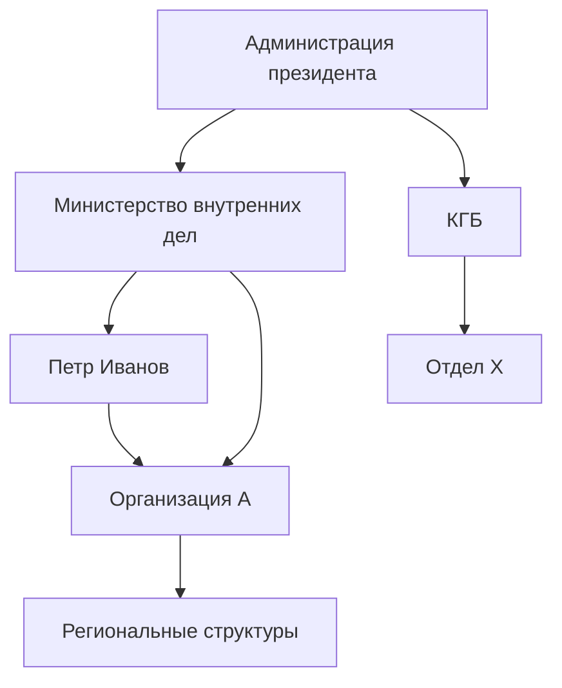

---
hide:
  - navigation
---

# Расследование 1: Структура управления силовыми структурами

*Опубликовано: май 2026 | Авторы: редакция Belarus Transparency*

## Краткое содержание

Lorem ipsum dolor sit amet, consectetur adipiscing elit. Данное расследование 
посвящено структуре управления силовыми структурами Беларуси и персональным 
связям ключевых фигурантов. В ходе расследования установлены финансовые потоки, 
схемы назначений и личные связи между фигурантами.

---

## Структура командования

Схема ниже показывает иерархию подчинения и ключевые связи между фигурантами расследования.

---

## Финансовые потоки

---

## Ключевые фигуранты

### [Петр Иванов](../persons/ivan-ivanov.md)

Lorem ipsum dolor sit amet, consectetur adipiscing elit. Занимает должность 
с 2015 года. Установлены связи с [Организацией А](../organizations/org-a.md).

### [Организация А](../organizations/org-a.md)

Ut enim ad minim veniam, quis nostrud exercitation ullamco laboris. 
Зарегистрирована в 2010 году. Аффилирована с государственными структурами.

---

## Хронология событий

| Дата | Событие |
|---|---|
| 2010 | Регистрация Организации А |
| 2015 | Назначение Петра Иванова |
| 2020 | [Событие 1](../events/event-1.md) — ключевой момент расследования |
| 2024 | Установлены офшорные связи |
| 2026 | Публикация расследования |

---

## Источники и методология

Расследование основано на:

- Официальных реестрах юридических лиц
- Данных о государственных закупках
- Открытых источниках и публичных базах данных
- Свидетельствах источников редакции

---

[← Все расследования](index.md)