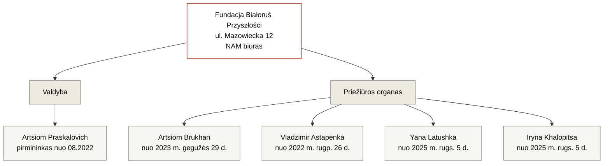

---
hide:
  - navigation
  - toc
title: Fundacja Białoruś Przyszłości
org_type: foundation
status: active
single_person:
date_founded: 2021-01-11
date_dissolved:
date_added: 2026-05-15
date_updated: 2026-05-17
charter_public: false
reports_public: false
audit_public: unknown
oversight: formal
cover_caption:
related_persons:
  - artsiom-praskalovich
  - artsiom-brukhan
  - vladzimir-astapenka
  - yana-latushka
  - iryna-khalopitsa
  - anna-panov
  - anatol-kotau
  - vadim-prokopiev
  - mikhail-kiryliuk
  - valery-matskevich
  - elena-zhilochkina
  - pavel-latushko
related_orgs:
  - fundacja-solidarnosci-miedzynarodowej
  - nau
related_events:
  - fsm-grant-competition-2023
related_docs:
  - doc-krs-bp
  - doc-fsm-2023-results
tags:
  - fondas
  - lenkija
  - baltarusių emigracija
  - FSM dotacijos gavėjas
status_note:
---

<header class="bt-org-head">
  
Organizacija · Fondas

  <h1>Fundacja Białoruś Przyszłości</h1>
  
Lenkijos fondas, įregistruotas 2021 m. sausį. Nuo 2022 m. sausio jo buveinė yra Pavlo Latuškos NAM biuro adresu. Fundacji Solidarności Międzynarodowej 980 000 zł dotacijos gavėjas 2023 m. konkurse.

  

    veikia
  

</header>

<section class="bt-org-transparency">
  
Skaidrumas

  

    
    
    
    
  

  

    įstatai
    ataskaitos
    auditas
    priežiūra
  

  

    

      
Įstatai vieši

      
Ne · fondo įstatai atviruose šaltiniuose nerasti. Įvedami keturis kartus: 20.11.2020 (su pataisa 09.12.2020), 01.03.2023, 07.04.2025, 27.10.2025. Turinys nepaskelbtas.

    

    

      
Finansinė atskaitomybė

      
Ne · 2023 ir 2024 m. ataskaitų registre nėra, nors fondas į verslininkų registrą įrašytas nuo 2023 m. birželio 6 d. ir privalo jas pateikti

    

    

      
Išorinis auditas

      
Duomenų nėra · viešuose šaltiniuose paminėjimų apie išorinį auditą nerasta

    

    

      
Priežiūros organas

      
Egzistuoja formaliai · priežiūros organas yra KRS, tačiau dabartinė tiek priežiūros organo, tiek valdybos sudėtis yra visiškai priklausoma nuo trečiojo asmens.

    

  

</section>

<section class="bt-org-meta">
  

    

      
Tipas

      
Fondas

    

    

      
Jurisdikcija

      
Lenkija

    

    

      
KRS / NIP / REGON

      
0000877364 / 5213917050 / 387913350

    

    

      
Įregistruotas

      
2021 m. sausio 11 d.

    

    

      
Adresas

      
ul. Mazowiecka 12, 00-033 Warszawa <em>Pavlo Latuškos NAM biuras</em>

    

    

      
Verslininkų registras

      
nuo 2023 m. birželio 6 d.

    

    

      
Valdybos pirmininkas

      
<a href="../persons/artsiom-praskalovich/">Artsiom Praskalovich</a> (nuo 2022 m. rugpjūčio 26 d.)

    

    

      
Pagrindinė veiklos rūšis

      
PKD 68.20.Z — nekilnojamojo turto nuoma ir valdymas (nuo 2025 m. rugsėjo 5 d.)

    

  

</section>

Fondas Lenkijoje įregistruotas 2021 m. sausio 11 d. keturių steigėjų. Valdybos pirmininku buvo Anatol Kotau, valdybos nariu — Elena Zhilochkina, priežiūros organe — Vadim Prokopiev ir Mikhail Kiryliuk.

2022 m. sausio 12 d. Anatol Kotau išbrauktas iš valdybos pirmininko pareigų, Vadim Prokopiev — iš priežiūros organo. Tą pačią dieną fondas persikelia iš ul. Wincentego Rzymowskiego 28 (Mokotów rajonas) į <strong>ul. Mazowiecka 12 Varšuvos centre — Pavlo Latuškos Nacionalinio antikrizinio valdymo (NAM) biuro adresu</strong>. Elena Zhilochkina laikinai užima valdybos pirmininkės postą.

2023 m. birželį fondas įrašytas į verslininkų registrą, kas pagal Lenkijos teisę sukelia pareigą teikti metines finansines ataskaitas atviram registrui. 2023 ir 2024 m. ataskaitų registre nėra.

2023 metais fondas gavo Fundacji Solidarności Międzynarodowej 980 000 zł dotaciją — didžiausią individualią dotaciją Baltarusijos temos konkurse.

2025 m. rugsėjo 5 d. fondas pakeitė pagrindinę ekonominės veiklos rūšį į „Nekilnojamojo turto nuoma ir valdymas" (PKD 68.20.Z); tą pačią dieną į priežiūros organą įrašyti du nauji nariai — Yana Latushka ir Iryna Khalopitsa. 2026 m. sausio 26 d. iš priežiūros organo išbraukta Anna Panov.

<section class="bt-org-structure">
  
Struktūra (pagal KRS duomenis)

</section>

<section class="bt-org-timeline">
  
Registro įvykių chronologija

  <ul class="bt-org-timeline-list">
    <li>2021 m. sausio 11 d. · Fondo registracija Lenkijoje. Valdybos pirmininkas — <a href="../persons/anatol-kotau/">Anatol Kotau</a>, valdybos narė — <a href="../persons/elena-zhilochkina/">Elena Zhilochkina</a>. Priežiūros organas: <a href="../persons/vadim-prokopiev/">Vadim Prokopiev</a>, <a href="../persons/mikhail-kiryliuk/">Mikhail Kiryliuk</a>. Adresas: ul. Wincentego Rzymowskiego 28.</li>
    <li>2021 · Nustatytas fondo išlaidų dokumentacijos trūkumas; prasideda teisminis konfliktas tarp Pavlo Latuškos ir valdybos pirmininko Anatol Kotau.</li>
    <li>2022 m. sausio 12 d. · Anatol Kotau išbrauktas kaip valdybos pirmininkas, Vadim Prokopiev — iš priežiūros organo. Elena Zhilochkina tampa valdybos pirmininke. <strong>Fondas persikelia iš ul. Wincentego Rzymowskiego 28 į ul. Mazowiecka 12 — Pavlo Latuškos Nacionalinio antikrizinio valdymo (NAM) biuro adresu.</strong></li>
    <li>2022 m. rugpjūčio 26 d. · Pilnas valdybos ir priežiūros organo pakeitimas. Valdybos pirmininku tampa <a href="../persons/artsiom-praskalovich/">Artsiom Praskalovich</a>; į valdybą įrašytas <a href="../persons/valery-matskevich/">Valery Matskevich</a>. Į priežiūros organą įrašyti <a href="../persons/vladzimir-astapenka/">Vladzimir Astapenka</a> ir <a href="../persons/anna-panov/">Anna Panov</a>. Elena Zhilochkina ir Mikhail Kiryliuk išbraukti.</li>
    <li>2023 m. kovo 1 d. · Įvesti fondo įstatų pakeitimai (§ 9 p. 13–19, § 21 ir § 23). Pakeitimų turinys nepaskelbtas.</li>
    <li>2023 m. gegužės 29 d. · Valery Matskevich išbrauktas iš valdybos. Į priežiūros organą įrašytas <a href="../persons/artsiom-brukhan/">Artsiom Brukhan</a>.</li>
    <li>2023 m. birželio 6 d. · Fondas įrašytas į verslininkų registrą.</li>
    <li>2023 · Gauta Fundacji Solidarności Międzynarodowej 980 000 zł dotacija pagal <a href="../events/fsm-grant-competition-2023/">FSM 2023 m. konkurso</a> rezultatus.</li>
    <li>2025 m. balandžio 7 d. · Priimtas visiškai naujas fondo įstatų tekstas. Turinys nepaskelbtas.</li>
    <li>2025 m. rugsėjo 5 d. · Į priežiūros organą įrašytos <a href="../persons/yana-latushka/">Yana Latushka</a> ir <a href="../persons/iryna-khalopitsa/">Iryna Khalopitsa</a>. Į fondo PKD kodus pridėtas 68.20.Z — „nekilnojamojo turto nuoma ir valdymas" — kaip pagrindinė veiklos rūšis.</li>
    <li>2025 m. spalio 27 d. · Pakeistas fondo įstatų § 12 p. 1. Turinys nepaskelbtas.</li>
    <li>2026 m. sausio 26 d. · Anna Panov išbraukta iš priežiūros organo.</li>
  </ul>
</section>

<section class="bt-org-money bt-org-money-fragments">
  
Finansai

  
Sisteminės fondo finansinės atskaitomybės atvirame registre nėra — 2023 ir 2024 m. ataskaitos nebuvo pateiktos nepaisant pareigos, atsiradusios įrašius fondą į verslininkų registrą. Žemiau — dotacijos, žinomos tik iš dotaciją skyrusių organizacijų dokumentų.

  <ul class="bt-money-fragments-list">
    <li>
      2023
      980 000 zł
      <a href="../events/fsm-grant-competition-2023/">Fundacja Solidarności Międzynarodowej (FSM)</a>
      doc-fsm-2023-results
      — projektas „Opracowanie mapy drogowej dla ochrony praw podstawowych ofiar zbrodni przeciwko ludzkości na Białorusi od 2020 roku". 47% FSM 2023 m. konkurso Baltarusijos kryptimi biudžeto. Dokumentas su rezultatais pašalintas iš veikiančios FSM svetainės, gautas iš interneto archyvo.
    </li>
  </ul>

  
Paskutinė metinės atskaitomybės registro patikra: 2026 m. gegužės 17 d.

</section>

<section class="bt-org-people">
  
Dabartinė sudėtis

  <ul class="bt-org-people-list">
    <li><a href="../persons/artsiom-praskalovich/">Artsiom Praskalovich</a> — valdybos pirmininkas nuo 2022 m. rugpjūčio 26 d.</li>
    <li><a href="../persons/artsiom-brukhan/">Artsiom Brukhan</a> — priežiūros organo narys nuo 2023 m. gegužės 29 d.</li>
    <li><a href="../persons/vladzimir-astapenka/">Vladzimir Astapenka</a> — priežiūros organo narys nuo 2022 m. rugpjūčio 26 d.</li>
    <li><a href="../persons/yana-latushka/">Yana Latushka</a> — priežiūros organo narė nuo 2025 m. rugsėjo 5 d.</li>
    <li><a href="../persons/iryna-khalopitsa/">Iryna Khalopitsa</a> — priežiūros organo narė nuo 2025 m. rugsėjo 5 d.</li>
  </ul>
</section>

<section class="bt-org-people">
  
Išbraukti iš fondo organų

  <ul class="bt-org-people-list">
    <li><a href="../persons/anatol-kotau/">Anatol Kotau</a> — steigėjas; valdybos pirmininkas 11.01.2021 — 12.01.2022</li>
    <li><a href="../persons/elena-zhilochkina/">Elena Zhilochkina</a> — steigėja; valdybos narė, vėliau valdybos pirmininkė 12.01.2022 — 26.08.2022</li>
    <li><a href="../persons/vadim-prokopiev/">Vadim Prokopiev</a> — steigėjas; priežiūros organo narys 11.01.2021 — 12.01.2022</li>
    <li><a href="../persons/mikhail-kiryliuk/">Mikhail Kiryliuk</a> — steigėjas; priežiūros organo narys 11.01.2021 — 29.05.2023</li>
    <li><a href="../persons/valery-matskevich/">Valery Matskevich</a> — valdybos narys 26.08.2022 — 29.05.2023</li>
    <li><a href="../persons/anna-panov/">Anna Panov</a> — priežiūros organo narė 26.08.2022 — 26.01.2026</li>
  </ul>
</section>

<section class="bt-org-events">
  
Susiję įvykiai

  <ul class="bt-org-events-list">
    <li><a href="../events/fsm-grant-competition-2023/">FSM dotacijų konkursas Baltarusijos kryptimi, 2023</a> — fondas gavo 980 000 zł</li>
  </ul>
</section>

<section class="bt-org-cases">
  
Minima tyrimuose

  <ul class="bt-org-cases-list">
    <li><a href="../investigations/bialorus-przyszlosci-fsm/">Białoruś Przyszłości ir Lenkijos viešieji pinigai</a> · inv-0001</li>
  </ul>
</section>

<section class="bt-org-sources">
  
Pirminiai dokumentai

  <ul class="bt-sources-list">
    <li><a href="../archive/doc-krs-bp/">doc-krs-bp</a> · Odpis Pełny z KRS, numer 0000877364, stan na 27.01.2026</li>
    <li><a href="../archive/doc-fsm-2023-results/">doc-fsm-2023-results</a> · Wyniki Konkursu Grantowego na rzecz Białorusi 2023 (iš interneto archyvo)</li>
  </ul>
</section>

<footer class="bt-tags">
  
Žymos

  

    fondas
    lenkija
    baltarusių emigracija
    FSM dotacijos gavėjas
  

</footer>

