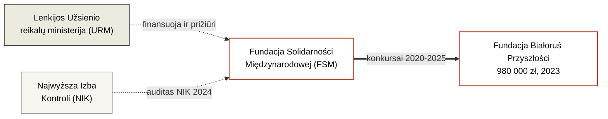

---
hide:
  - navigation
  - toc
title: Fundacja Solidarności Międzynarodowej
org_type: foundation
status: active
single_person:
date_founded: 2001-07-12
date_dissolved:
date_added: 2026-05-16
date_updated: 2026-05-16
charter_public: true
reports_public: true
audit_public: true
oversight: formal
cover_caption:
related_persons:
related_orgs:
  - bialorus-przyszlosci
related_events:
  - fsm-grant-competition-2023
related_docs:
  - doc-fsm-2023-results
  - doc-fsm-2024-results
  - doc-fsm-2025-results
  - doc-nik-kap-430-7-2024
tags:
  - fondas
  - lenkija
  - valstybinis fondas
  - URM
status_note:
---

<header class="bt-org-head">
  
Organizacija · Valstybinis fondas

  <h1>Fundacja Solidarności Międzynarodowej</h1>
  
Lenkijos valstybinis fondas (Skarbu Państwa), prižiūrimas Lenkijos užsienio reikalų ministro. Pagrindinis Lenkijos paramos plėtrai operatorius pagal programą „Wsparcie Demokracji" — taip pat ir Baltarusijos kryptimi.

  

    veikia
  

</header>

<section class="bt-org-transparency">
  
Skaidrumas

  

    
    
    
    
  

  

    įstatai
    ataskaitos
    auditas
    priežiūra
  

  

    

      
Įstatai vieši

      
Taip · įstatai ir Ustawa o współpracy rozwojowej paskelbti <a href="https://solidarityfund.pl/statut-i-ustawa/">solidarityfund.pl/statut-i-ustawa</a>

    

    

      
Finansinė atskaitomybė

      
Taip · 2012–2024 m. metinės ataskaitos skelbiamos <a href="https://solidarityfund.pl/raporty-roczne/">solidarityfund.pl/raporty-roczne</a>

    

    

      
Išorinis auditas

      
Taip · NIK KAP.430.7.2024 ataskaita, paskelbta 2025 m. balandžio 28 d.

    

    

      
Priežiūros organas

      
Egzistuoja formaliai · Rada FSM veikia nuolat, jos sudėtis skelbiama. Valdybos pirmininką ir Tarybos narius skiria Lenkijos užsienio reikalų ministras — t. y. tas pats organas, kuris yra FSM programų donoras. Tai suteikia formalią, bet ne nepriklausomą priežiūrą.

    

  

</section>

<section class="bt-org-meta">
  

    

      
Tipas

      
Valstybinis fondas (Skarbu Państwa)

    

    

      
Jurisdikcija

      
Lenkija

    

    

      
Įregistruotas

      
2001 m. liepos 12 d. <em>(įstatai nuo 07.01.1997)</em>

    

    

      
KRS / NIP / REGON

      
0000024453 / 5262264292 / 012345095

    

    

      
Adresas

      
ul. Tadeusza Czackiego 7/9/11, 00-043 Warszawa

    

    

      
Valdybos pirmininkė

      
Justyna Janiszewska (nuo 2024 m. lapkričio 21 d.)

    

  

</section>

FSM yra Lenkijos valstybės iždo fondas, prižiūrimas Užsienio reikalų ministro ir veikiantis URM užsakymu. Įsteigtas 1997 m. sausio 7 d. pavadinimu Polska Fundacja Transformacji Rynkowej „Wiedzieć Jak" ir įregistruotas KRS 2001 m. liepos 12 d. 2002 m. rugpjūtį pervadintas į Polską Fundację Międzynarodowej Współpracy na rzecz Rozwoju „Wiedzieć Jak". 2013 m. vasarį gavo dabartinį pavadinimą — Fundacja Solidarności Międzynarodowej. Iki 2002 m. priežiūros organas buvo Iždo ministras (Minister Skarbu Państwa), nuo 2002 m. — Užsienio reikalų ministras.

Pagrindinės kryptys — Ukraina, Baltarusija, Gruzija, Moldova. Tarp programų — „Wsparcie Demokracji" (paramos demokratijai), „Polska pomoc rozwojowa" (Lenkijos parama plėtrai). Baltarusijos kryptis vykdoma per kasmetinį „Konkurs Grantowy na rzecz społeczeństwa białoruskiego" konkursą (iki 2024 m. — „na rzecz Białorusi").

Pagal formalius skaidrumo rodiklius FSM yra institucija, atitinkanti atvirumo standartus: įstatai paskelbti, 2012–2024 m. metinės ataskaitos prieinamos, 2024 m. NIK išorinis auditas atliktas ir paskelbtas. Žemiau pateikiama **sisteminė anomalija Baltarusijos kryptimi**.

Dabartinė valdybos pirmininkė Justyna Janiszewska, paskirta 2024 m. lapkričio 21 d., prieš ateidama į FSM 2010–2016 m. vadovavo Fundacji Edukacja dla Demokracji (FED). FED buvo tarp FSM 2023 m. konkurso Baltarusijos kryptimi paraišką pateikusių organizacijų su represuotų mokytojų paramos projektu (14 balų, finansavimo negavo) ir tarp tų, kurių tematika nesutampa su tuo, kaip FSM faktiškai paskirstė dotacijas pagal III prioritetą.

<section class="bt-org-money bt-org-money-fragments">
  
Finansai — Baltarusijos kryptis

  
Bendra FSM atskaitomybė yra <a href="https://solidarityfund.pl/raporty-roczne/">solidarityfund.pl/raporty-roczne</a>. Žemiau tik paskirstymas Baltarusijos kryptimi — mūsų projekto dėmesio centre. Nuo 2024 m. didžioji konkursinio biudžeto šia kryptimi dalis nuo skelbimo paslėpta.

  <table class="bt-mf-table">
    <thead>
      <tr><th>Metai</th><th>Suma</th><th>Skaidrumas</th><th>Pastaba</th><th>Dokumentas</th></tr>
    </thead>
    <tbody>
      <tr>
        <td class="bt-mf-year">2020</td>
        <td class="bt-mf-amount bt-mf-amount--na">suma nenurodyta</td>
        <td class="bt-mf-transp">

0%</td>
        <td class="bt-mf-note">7 dotacijos, gavėjų pavadinimai paskelbti, sumos nenurodytos.</td>
        <td class="bt-mf-doc">doc-fsm-2020-results</td>
      </tr>
      <tr>
        <td class="bt-mf-year">2021</td>
        <td class="bt-mf-amount bt-mf-amount--na">suma nenurodyta</td>
        <td class="bt-mf-transp">

0%</td>
        <td class="bt-mf-note">5 dotacijos, gavėjų pavadinimai paskelbti, sumos nenurodytos.</td>
        <td class="bt-mf-doc">doc-fsm-2021-results</td>
      </tr>
      <tr>
        <td class="bt-mf-year">2022</td>
        <td class="bt-mf-amount bt-mf-amount--na">nepaskelbta</td>
        <td class="bt-mf-transp">

0%</td>
        <td class="bt-mf-note">konkurso rezultatai FSM svetainės archyve nerasti.</td>
        <td class="bt-mf-doc">—</td>
      </tr>
      <tr>
        <td class="bt-mf-year">2023</td>
        <td class="bt-mf-amount">2 073 460 zł</td>
        <td class="bt-mf-transp">

100%</td>
        <td class="bt-mf-note">5 dotacijos, skaidrumas 100%. Didžiausią individualią dotaciją (980 000 zł, 47% konkurso biudžeto) gavo Fundacja Białoruś Przyszłości.</td>
        <td class="bt-mf-doc">doc-fsm-2023-results</td>
      </tr>
      <tr>
        <td class="bt-mf-year">2024</td>
        <td class="bt-mf-amount">4 700 000 zł</td>
        <td class="bt-mf-transp">

18,7%</td>
        <td class="bt-mf-note">11 dotacijų; atskleisti 4 pavadinimai už 880 000 zł, paslėpti 7 pavadinimai už 3 820 000 zł. Skaidrumas 18,7%.</td>
        <td class="bt-mf-doc">doc-fsm-2024-results</td>
      </tr>
      <tr>
        <td class="bt-mf-year">2025</td>
        <td class="bt-mf-amount">8 000 000 zł</td>
        <td class="bt-mf-transp">

11,25%</td>
        <td class="bt-mf-note">11 dotacijų; atskleisti 2 pavadinimai už 900 000 zł, paslėpti 9 pavadinimai už 7 100 000 zł. Skaidrumas 11,25%. Įvestas formalus kriterijus dėl trijų ankstesnių projektų po 200+ tūkst. zł, uždarantis konkursą naujiems pareiškėjams.</td>
        <td class="bt-mf-doc">doc-fsm-2025-results</td>
      </tr>
    </tbody>
  </table>

  

    
Sisteminė vienos krypties anomalija

    
2023–2025 m. Baltarusijos kryptimi per FSM perėjo <strong>ne mažiau kaip 14,77 milijono zł</strong>. Konkurso biudžetas šiuo laikotarpiu išaugo beveik keturis kartus (nuo 2,07 iki 8 milijonų zł); paskirstymo skaidrumas krito nuo 100% iki 11,25%. Iš viso 2024–2025 m. nuo skelbimo paslėpta 10,92 milijono zł — du trečdaliai viso Baltarusijos krypties apimties per trejus metus.

    
Formalus slėpimo pagrindas — reglamento norma, leidžianti pareiškėjų prašymu neskelbti duomenų apie atrinktus projektus dėl ypatingų projekto šalies politinių sąlygų. Kitomis kryptimis (Ukraina, Gruzija, Moldova) tokia praktika neužfiksuota. Formaliai veikiančių institucijos skaidrumo rodiklių fone — tai struktūrinė vienos krypties anomalija, reikalaujanti paaiškinimo.

  

  
Paskutinė konkursų skelbimų patikra: 2026 m. gegužės 16 d.

</section>

<section class="bt-org-structure">
  
Ryšiai

</section>

<section class="bt-org-people">
  
Vadovybė pagrindiniais Baltarusijos krypties laikotarpiais

  <ul class="bt-org-people-list">
    <li><strong>2023 m. konkursas (BP dotacija — 980 tūkst. zł, 100% atvirumas)</strong> · valdybos pirmininkas — Rafał Dzięciołowski (nuo 2019 m. rugsėjo 19 d.)</li>
    <li><strong>2024 m. konkursas (81% biudžeto uždarymas)</strong> · valdybos pirmininkas — Rafał Dzięciołowski. Konkurso rezultatų skelbimas — 2024 m. rugpjūtis, kelios savaitės po Dzięciołowskio pasitraukimo 2024 m. liepos 30 d.</li>
    <li><strong>2025 m. konkursas (89% biudžeto uždarymas, įvestas gavėjų rato uždarymo kriterijus)</strong> · valdybos pirmininkė — Justyna Janiszewska (nuo 2024 m. lapkričio 21 d.)</li>
  </ul>
</section>

<section class="bt-org-people">
  
Dabartinė vadovybė (valdyba)

  <ul class="bt-org-people-list">
    <li>Justyna Janiszewska — valdybos pirmininkė, nuo 2024 m. lapkričio 21 d.</li>
    <li>Teresa Zagrodzka — valdybos narė, nuo 2025 m. gegužės 13 d.</li>
  </ul>
  
<em>Dabartinė Rady Fundacji sudėtis nurodyta pilname KRS išraše — <a href="../archive/doc-krs-fsm/">doc-krs-fsm</a>.</em>

</section>

<section class="bt-org-people">
  
Buvę valdybos pirmininkai (pagal KRS)

  <ul class="bt-org-people-list">
    <li>Jacek Kluczkowski — 2001–2004</li>
    <li>Waldemar Dubaniowski — 2004–2011</li>
    <li>Klaudia Wojciechowska — 2011–2012</li>
    <li>Krzysztof Stanowski — 2012–2017</li>
    <li>Maciej Falkowski — 2017–2019</li>
    <li>Rafał Dzięciołowski — 2019 m. rugsėjo 19 d. — 2024 m. liepos 30 d. (pasitraukė 2024 m. NIK audito metu, prieš ataskaitos paskelbimą)</li>
    <li>Henryk Litwin — 2024 m. liepos 30 d. — lapkričio 14 d. (3,5 mėnesio)</li>
  </ul>
</section>

<section class="bt-org-events">
  
Susiję įvykiai

  <ul class="bt-org-events-list">
    <li><a href="../events/fsm-grant-competition-2023/">FSM dotacijų konkursas Baltarusijos kryptimi, 2023</a></li>
  </ul>
</section>

<section class="bt-org-cases">
  
Minima tyrimuose

  <ul class="bt-org-cases-list">
    <li><a href="../investigations/bialorus-przyszlosci-fsm/">Białoruś Przyszłości ir Lenkijos viešieji pinigai</a> · inv-0001</li>
  </ul>
</section>

<section class="bt-org-sources">
  
Pirminiai dokumentai

  <ul class="bt-sources-list">
    <li><a href="../archive/doc-fsm-2023-results/">doc-fsm-2023-results</a> · Wyniki Konkursu Grantowego na rzecz Białorusi 2023</li>
    <li><a href="../archive/doc-fsm-2024-results/">doc-fsm-2024-results</a> · Wyniki Konkursu Grantowego na rzecz społeczeństwa białoruskiego 2024</li>
    <li><a href="../archive/doc-fsm-2025-results/">doc-fsm-2025-results</a> · Wyniki Konkursu Grantowego na rzecz społeczeństwa białoruskiego 2025</li>
    <li><a href="../archive/doc-nik-kap-430-7-2024/">doc-nik-kap-430-7-2024</a> · NIK ataskaita apie programos „Współpraca rozwojowa" 2021–2024 įgyvendinimo patikrinimą</li>
  </ul>
</section>

<footer class="bt-tags">
  
Žymos

  

    fondas
    lenkija
    valstybinis fondas
    URM
  

</footer>

