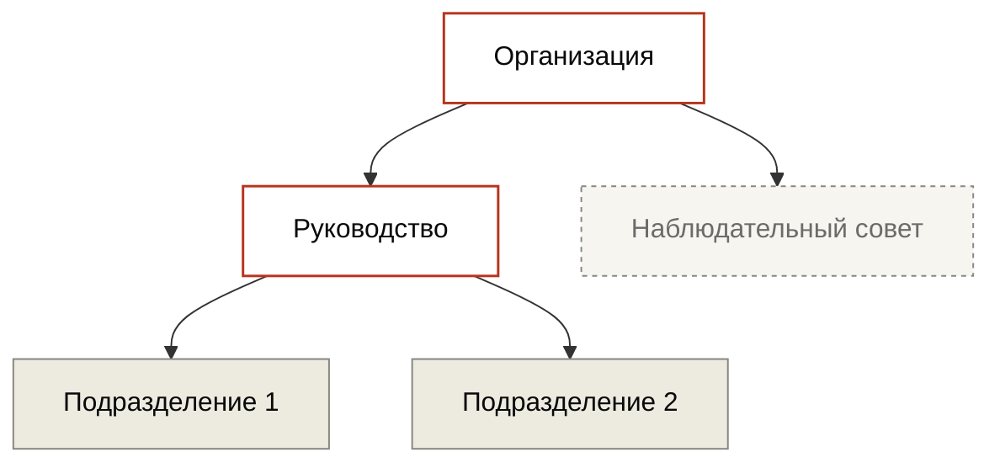
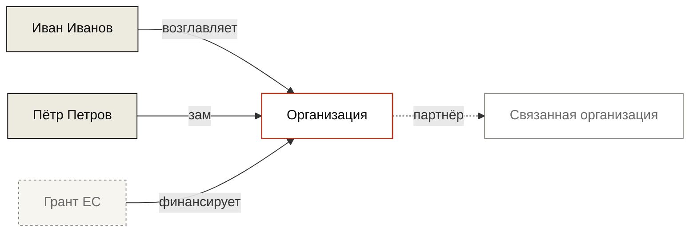

---
hide:
  - navigation
  - toc
title: Название организации
org_type: political-structure
status: active
single_person:
date_founded: 2020-08-19
date_dissolved:
date_added: 2026-05-15
date_updated: 2026-05-15
charter_public: false
reports_public: false
audit_public: false
oversight: unknown
cover: https://placehold.co/1200x500/3a3530/ffffff?text=Org
cover_caption: Место, дата · Источник
related_persons:
  - ivan-ivanov
related_orgs:
related_events:
  - novaja-belarus-2024
related_docs:
  - doc-0001
tags:
  - организация
  - политическая
status_note:
---

  

  
Место, дата · Источник

<header class="bt-org-head">
  
Организация · Политическая структура

  <h1>Название организации</h1>
  
Одно предложение про функцию и значение организации.

  

    действует
  

</header>

<!-- ============================================================
     БЛОК ИНДИКАТОРОВ ПРОЗРАЧНОСТИ
     Полоска из 4 сегментов + подписи + детализация
     Значения сегментов берутся из frontmatter:
       charter_public, reports_public, audit_public, oversight
     ============================================================ -->

<section class="bt-org-transparency">
  
Прозрачность

  

    
    
    
    
  

  

    устав
    отчёты
    аудит
    контроль
  

  

    

      
Устав публичен

      
Да · опубликован на сайте организации

    

    

      
Финансовая отчётность

      
Нет · годовые отчёты не публикуются

    

    

      
Внешний аудит

      
Нет данных · в публичных источниках не упоминается

    

    

      
Контрольный орган

      
Формальный · совет аффилирован с руководством

    

  

</section>

<!-- ============================================================
     МЕТАДАННЫЕ ОРГАНИЗАЦИИ
     ============================================================ -->

<section class="bt-org-meta">
  

    

      
Тип

      
Политическая структура

    

    

      
Основана

      
19 августа 2020

    

    

      
Юрисдикция

      
Литва

    

    

      
Руководитель

      
<a href="../persons/ivan-ivanov/">Иван Иванов</a>

    

    

      
Сотрудников

      
~25 (по открытым данным)

    

    

      
Веб-сайт

      
<a href="https://example.com">example.com</a>

    

  

</section>

<!-- ============================================================
     ПРОЗА — основной описательный блок
     ============================================================ -->

Первый абзац — суть организации, контекст создания, заявленная функция.

Второй абзац — фактическая роль, кто реально влияет, какие центры принятия решений.

Третий абзац — расхождения между заявленным и фактическим. Открытые вопросы.

<!-- ============================================================
     БЛОК "ПЕРСОНАЛЬНАЯ ОРГАНИЗАЦИЯ"
     Показывается ТОЛЬКО если в frontmatter указан single_person.
     В остальных случаях — удалить эту секцию целиком.
     ============================================================ -->

<section class="bt-org-single">
  
Персональная организация

  

    
Учредитель, директор и единственный публично известный сотрудник — <a href="../persons/ivan-ivanov/">Иван Иванов</a>. Коллегиальные органы отсутствуют. Все решения и расходы — на одной персоне.

  

</section>

<!-- ============================================================
     СТРУКТУРА — Mermaid-граф
     ОПЦИОНАЛЬНЫЙ блок. Удалять если:
     - организация = одна персона (использовать вместо этого блок выше)
     - структура тривиальна (1-2 человека)
     ============================================================ -->

<section class="bt-org-structure">
  
Структура

</section>

<!-- ============================================================
     ФИНАНСОВЫЙ БЛОК — ТРИ РЕЖИМА
     Оставить ОДИН блок из трёх ниже, остальные удалить.

     РЕЖИМ А — "Полная отчётность"
       Условие: организация публикует годовые отчёты,
       известны бюджет, источники, расходы.

     РЕЖИМ Б — "Засветившиеся гранты"
       Условие: системной отчётности нет, но отдельные
       транши выплыли через документы или утечки.

     РЕЖИМ В — "Полная непрозрачность"
       Условие: ничего не известно о бюджете и источниках.
     ============================================================ -->

<!-- ============== РЕЖИМ А — ПОЛНАЯ ОТЧЁТНОСТЬ ============== -->

<section class="bt-org-money bt-org-money-full">
  
Финансы 2020–2025 · полная отчётность

  <table class="bt-money-table">
    <thead>
      <tr>
        <th>Год</th>
        <th>Бюджет</th>
        <th>Источники</th>
        <th>Отчёт</th>
        <th>Документ</th>
      </tr>
    </thead>
    <tbody>
      <tr>
        <td>2020</td>
        <td>€80 000</td>
        <td>EED, частные доноры</td>
        <td>Опубликован</td>
        <td><a href="../archive/doc-0011/">doc-0011</a></td>
      </tr>
      <tr>
        <td>2021</td>
        <td>€150 000</td>
        <td>EED, NED</td>
        <td>Опубликован</td>
        <td><a href="../archive/doc-0012/">doc-0012</a></td>
      </tr>
      <tr>
        <td>2022</td>
        <td>€220 000</td>
        <td>EED, NED, Sida</td>
        <td>Опубликован</td>
        <td><a href="../archive/doc-0013/">doc-0013</a></td>
      </tr>
      <tr>
        <td>2023</td>
        <td>€310 000</td>
        <td>EED, NED, Sida, частные доноры</td>
        <td>Опубликован</td>
        <td><a href="../archive/doc-0014/">doc-0014</a></td>
      </tr>
      <tr>
        <td>2024</td>
        <td>€280 000</td>
        <td>EED, NED, Sida</td>
        <td>Опубликован</td>
        <td><a href="../archive/doc-0015/">doc-0015</a></td>
      </tr>
      <tr>
        <td>2025</td>
        <td>€240 000 (план)</td>
        <td>EED, NED</td>
        <td>Не опубликован</td>
        <td>—</td>
      </tr>
    </tbody>
    <tfoot>
      <tr>
        <td>Итого 2020–2024</td>
        <td>~€1 040 000</td>
        <td colspan="3"></td>
      </tr>
    </tfoot>
  </table>
</section>

<!-- ============== РЕЖИМ Б — ЗАСВЕТИВШИЕСЯ ГРАНТЫ ============== -->

<section class="bt-org-money bt-org-money-fragments">
  
Финансы 2020–2025 · засветившиеся гранты

  
Системной финансовой отчётности нет. Ниже — гранты и поступления, ставшие известными через утечки, отчёты грантодателей или косвенные документы. Список не претендует на полноту.

  <ul class="bt-money-fragments-list">
    <li>
      2021
      €40 000
      National Endowment for Democracy
      <a href="../archive/doc-0017/">doc-0017</a>
      — упомянуто в годовом отчёте NED
    </li>
    <li>
      2023
      €120 000
      European Endowment for Democracy
      <a href="../archive/doc-0021/">doc-0021</a>
      — проектная заявка из утечки
    </li>
    <li>
      2024
      сумма не раскрыта
      Sida (Швеция)
      <a href="../archive/doc-0028/">doc-0028</a>
      — скриншот пресс-релиза Sida
    </li>
  </ul>
</section>

<!-- ============== РЕЖИМ В — ПОЛНАЯ НЕПРОЗРАЧНОСТЬ ============== -->

<section class="bt-org-money bt-org-money-opaque">
  
Финансы 2020–2025 · непрозрачность

  

    
Финансовая отчётность организации в открытых источниках не обнаружена. Грантодатели публично не объявлены. Самостоятельных финансовых раскрытий организация не делала.

    
Последняя проверка открытых источников: 15 мая 2026.

  

</section>

<!-- ============================================================
     СВЯЗИ — Mermaid-граф (как у персоналий и событий)
     ============================================================ -->

<section class="bt-ties">

Связи

</section>

<!-- ============================================================
     КЛЮЧЕВЫЕ ЛЮДИ — список с ролями
     ============================================================ -->

<section class="bt-org-people">
  
Ключевые люди

  <ul class="bt-org-people-list">
    <li><a href="../persons/ivan-ivanov/">Иван Иванов</a> — руководитель с 2020</li>
    <li><a href="../persons/petr-petrov/">Пётр Петров</a> — заместитель с 2021</li>
  </ul>
</section>

<!-- ============================================================
     СВЯЗАННЫЕ СОБЫТИЯ
     ============================================================ -->

<section class="bt-org-events">
  
Связанные события

  <ul class="bt-org-events-list">
    <li><a href="../events/novaja-belarus-2024/">«Новая Беларусь 2024»</a> · 15–17 августа 2024</li>
  </ul>
</section>

<!-- ============================================================
     ПЕРВИЧНЫЕ ДОКУМЕНТЫ — ссылки на архив
     ============================================================ -->

<section class="bt-org-sources">
  
Первичные документы

  <ul class="bt-sources-list">
    <li><a href="../archive/doc-0001/">doc-0001</a> · Устав организации (PDF)</li>
    <li><a href="../archive/doc-0011/">doc-0011</a> · Финотчёт 2020</li>
  </ul>
</section>

<footer class="bt-tags">
  
Теги

  

    политическая структура
    эмиграция
    литва
  

</footer>

