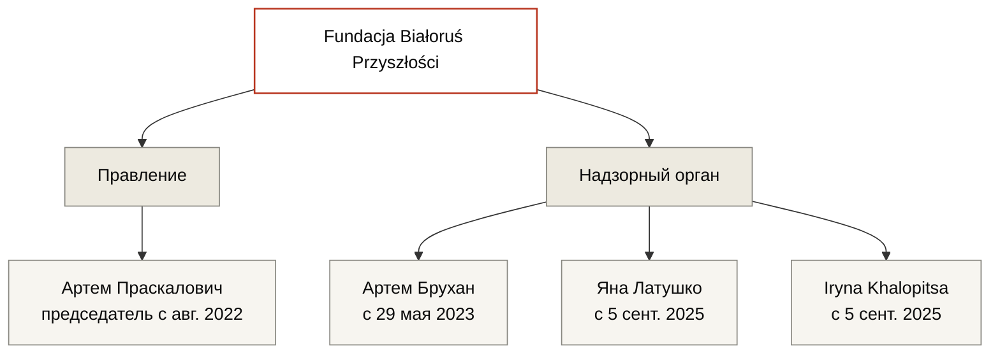

---
hide:
  - navigation
  - toc
title: Fundacja Białoruś Przyszłości
org_type: foundation
status: active
single_person:
date_founded: 2021-01-11
date_dissolved:
date_added: 2026-05-15
date_updated: 2026-05-15
charter_public: false
reports_public: false
audit_public: unknown
oversight: formal
cover_caption:
related_persons:
  - artem-praskalovich
  - artem-bruchan
  - jana-latushko
  - iryna-khalopitsa
  - anatoly-kotov
  - vadim-prokopiev
  - mikhail-kirilyuk
  - elena-zhilochkina
  - pavel-latushko
related_orgs:
  - fsm
  - nau
related_events:
  - fsm-grant-competition-2023
related_docs:
  - doc-krs-bp
  - doc-fsm-2023-results
tags:
  - фонд
  - польша
  - белорусская эмиграция
  - грантополучатель fsm
status_note:
---

<header class="bt-org-head">
  
Организация · Фонд

  <h1>Fundacja Białoruś Przyszłości</h1>
  
Польский фонд, зарегистрирован в январе 2021 года. Грантополучатель Fundacji Solidarności Międzynarodowej на сумму 980 000 zł в конкурсе 2023 года.

  

    действует
  

</header>

<section class="bt-org-transparency">
  
Прозрачность

  

    
    
    
    
  

  

    устав
    отчёты
    аудит
    контроль
  

  

    

      
Устав публичен

      
Нет · устав фонда не обнаружен в открытых источниках

    

    

      
Финансовая отчётность

      
Нет · отчёты за 2023 и 2024 годы в реестре отсутствуют, при том что фонд внесён в реестр предпринимателей с 6 июня 2023 года и обязан их подавать

    

    

      
Внешний аудит

      
Нет данных · упоминаний внешнего аудита в публичных источниках не обнаружено

    

    

      
Контрольный орган

      
Существует формально · надзорный орган присутствует в KRS, но действующий состав как надзорного органа, так и правления находится в полной зависимости от третьего лица.

    

  

</section>

<section class="bt-org-meta">
  

    

      
Тип

      
Фонд

    

    

      
Юрисдикция

      
Польша

    

    

      
Зарегистрирован

      
11 января 2021

    

    

      
Реестр предпринимателей

      
с 6 июня 2023

    

    

      
Председатель правления

      
<a href="../persons/artem-praskalovich/">Артем Праскалович</a> (с августа 2022)

    

    

      
Основной вид деятельности

      
PKD 68.20.Z — аренда и управление недвижимостью (с 5 сентября 2025)

    

  

</section>

Фонд зарегистрирован в Польше 11 января 2021 года четырьмя учредителями. К 2022 году все четверо вышли из органов фонда. С августа 2022 года правление возглавляет Артем Праскалович.

В июне 2023 года фонд внесён в реестр предпринимателей, что по польскому законодательству влечёт обязанность подавать годовую финансовую отчётность в открытый реестр. Отчёты за 2023 и 2024 годы в реестре отсутствуют.

В 2023 году фонд получил грант Fundacji Solidarności Międzynarodowej в размере 980 000 zł — крупнейший индивидуальный грант конкурса того года. 5 сентября 2025 года фонд изменил основной вид экономической деятельности на «аренду и управление недвижимостью» (PKD 68.20.Z), в тот же день в надзорный орган вписаны два новых члена.

<section class="bt-org-structure">
  
Структура (по данным KRS)

</section>

<section class="bt-org-timeline">
  
Хронология реестровых событий

  <ul class="bt-org-timeline-list">
    <li>11 января 2021 · Регистрация фонда в Польше. Учредители: <a href="../persons/anatoly-kotov/">Анатолий Котов</a>, <a href="../persons/vadim-prokopiev/">Вадим Прокопьев</a>, <a href="../persons/mikhail-kirilyuk/">Михаил Кирилюк</a>, <a href="../persons/elena-zhilochkina/">Елена Жилочкина</a>.</li>
    <li>К началу 2022 · Котов и Прокопьев вычеркнуты из органов фонда.</li>
    <li>Август 2022 · <a href="../persons/artem-praskalovich/">Артем Праскалович</a> вступает в должность председателя правления.</li>
    <li>2022 · Жилочкина и Кирилюк вычеркнуты из органов фонда.</li>
    <li>29 мая 2023 · <a href="../persons/artem-bruchan/">Артем Брухан</a> вписан в надзорный орган.</li>
    <li>6 июня 2023 · Фонд внесён в реестр предпринимателей.</li>
    <li>2023 · Получен грант Fundacji Solidarności Międzynarodowej в размере 980 000 zł по результатам <a href="../events/fsm-grant-competition-2023/">конкурса FSM 2023 года</a>.</li>
    <li>5 сентября 2025 · В надзорный орган вписаны <a href="../persons/jana-latushko/">Яна Латушко</a> и <a href="../persons/iryna-khalopitsa/">Iryna Khalopitsa</a>. В тот же день основной вид экономической деятельности изменён на PKD 68.20.Z «аренда и управление недвижимостью».</li>
    <li>26 января 2026 · Анна Панов вычеркнута из надзорного органа.</li>
  </ul>
</section>

<section class="bt-org-money bt-org-money-fragments">
  
Финансы

  
Системная финансовая отчётность фонда в открытом реестре отсутствует — отчёты за 2023 и 2024 годы не поданы вопреки обязанности, возникшей с внесением в реестр предпринимателей. Ниже — гранты, ставшие известными только через документы грантодателей.

  <ul class="bt-money-fragments-list">
    <li>
      2023
      980 000 zł ≈ €218 000
      <a href="../events/fsm-grant-competition-2023/">Fundacja Solidarności Międzynarodowej (FSM)</a>
      doc-fsm-2023-results
      — проект «Opracowanie mapy drogowej dla ochrony praw podstawowych ofiar zbrodni przeciwko ludzkości na Białorusi od 2020 roku». 47% бюджета конкурса FSM 2023 по белорусскому направлению. Документ с результатами удалён с действующего сайта FSM, получен из веб-архива.
    </li>
  </ul>

  
Последняя проверка реестра годовой отчётности: 15 мая 2026.

</section>

<section class="bt-org-people">
  
Действующий состав

  <ul class="bt-org-people-list">
    <li><a href="../persons/artem-praskalovich/">Артем Праскалович</a> — председатель правления с августа 2022</li>
    <li><a href="../persons/artem-bruchan/">Артем Брухан</a> — член надзорного органа с 29 мая 2023</li>
    <li><a href="../persons/jana-latushko/">Яна Латушко</a> — член надзорного органа с 5 сентября 2025</li>
    <li><a href="../persons/iryna-khalopitsa/">Iryna Khalopitsa</a> — член надзорного органа с 5 сентября 2025</li>
  </ul>
</section>

<section class="bt-org-people">
  
Учредители 2021 года (вышли из органов фонда)

  <ul class="bt-org-people-list">
    <li><a href="../persons/anatoly-kotov/">Анатолий Котов</a> — вычеркнут к началу 2022</li>
    <li><a href="../persons/vadim-prokopiev/">Вадим Прокопьев</a> — вычеркнут к началу 2022</li>
    <li><a href="../persons/mikhail-kirilyuk/">Михаил Кирилюк</a> — вычеркнут в 2022</li>
    <li><a href="../persons/elena-zhilochkina/">Елена Жилочкина</a> — вычеркнута в 2022</li>
  </ul>
</section>

<section class="bt-org-events">
  
Связанные события

  <ul class="bt-org-events-list">
    <li><a href="../events/fsm-grant-competition-2023/">Конкурс грантов FSM на белорусское направление, 2023</a> — фонд получил 980 000 zł</li>
  </ul>
</section>

<section class="bt-org-cases">
  
Упоминается в кейсах

  <ul class="bt-org-cases-list">
    <li><em>placeholder · карточка кейса по расследованию ещё не создана</em></li>
  </ul>
</section>

<section class="bt-org-sources">
  
Первичные документы

  <ul class="bt-sources-list">
    <li><a href="../archive/doc-krs-bp/">doc-krs-bp</a> · Выписка KRS Fundacji Białoruś Przyszłości</li>
    <li><a href="../archive/doc-fsm-2023-results/">doc-fsm-2023-results</a> · Wyniki Konkursu Grantowego na rzecz Białorusi 2023 (из веб-архива)</li>
  </ul>
</section>

<footer class="bt-tags">
  
Теги

  

    фонд
    польша
    белорусская эмиграция
    грантополучатель fsm
  

</footer>

