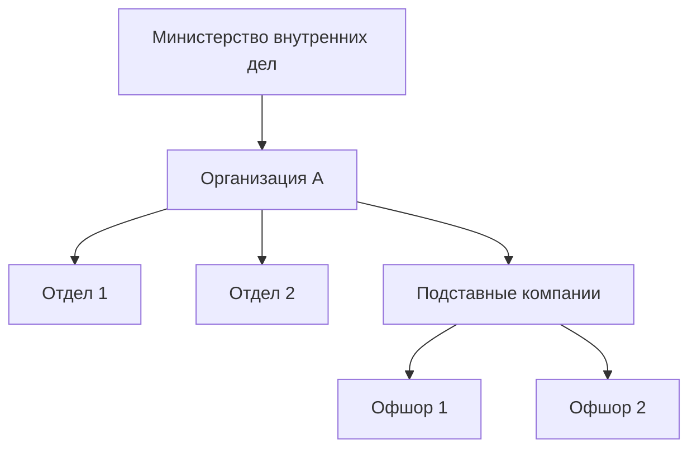

---
hide:
  - navigation
  - toc
---

# Организация А

*Последнее обновление: май 2026*

---

## Основные данные

| | |
|---|---|
| **Полное название** | Государственное унитарное предприятие "Организация А" |
| **Тип** | Государственное предприятие |
| **Дата регистрации** | 2010 |
| **Регистрационный номер** | 000000000 |
| **Юридический адрес** | Минск, ул. Примерная, 1 |
| **Руководитель** | [Петр Иванов](../persons/ivan-ivanov.md) |

---

## Описание

Lorem ipsum dolor sit amet, consectetur adipiscing elit. Ut enim ad minim 
veniam, quis nostrud exercitation ullamco laboris nisi ut aliquip ex ea 
commodo consequat.

Duis aute irure dolor in reprehenderit in voluptate velit esse cillum dolore 
eu fugiat nulla pariatur.

---

## Структура организации

---

## Финансирование

| Год | Источник | Сумма |
|---|---|---|
| 2022 | Государственный бюджет | $10 млн |
| 2023 | Государственный бюджет | $12 млн |
| 2024 | Государственный бюджет | $15 млн |

---

## Аффилированные лица

- [Петр Иванов](../persons/ivan-ivanov.md) — руководитель с 2015 года

---

## Упоминается в расследованиях

- [Расследование 1](../investigations/investigation-1.md)

---

## Связанные события

- [Событие 1](../events/event-1.md)

---

[← Все организации](index.md)