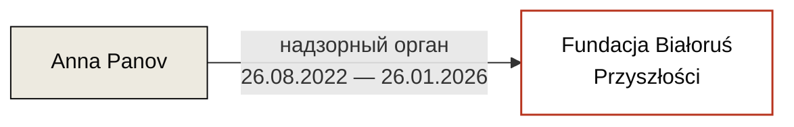

---
hide:
  - navigation
  - toc
title: Anna Panov / Анна Панов
role: Бывший член надзорного органа Fundacji Białoruś Przyszłości
date_added: 2026-05-16
date_updated: 2026-05-17
thumbnail: https://placehold.co/400x400/3a3530/ffffff?text=AP
cover: https://placehold.co/1200x500/3a3530/ffffff?text=Anna+Panov
cover_caption:
related_persons:
related_orgs:
  - bialorus-przyszlosci
related_events:
related_docs:
  - doc-krs-bp
tags:
  - персоналия
  - беларуская эмиграция
status: active
---

  

  

<header class="bt-person-head">
  <h1>Anna Panov / Анна Панов</h1>
  
Член надзорного органа Fundacji Białoruś Przyszłości с 26 августа 2022 года, вычеркнута 26 января 2026 года.

</header>

<section class="bt-block">

Должностные позиции

* **Член надзорного органа Fundacji Białoruś Przyszłości** · с 26 августа 2022 года по 26 января 2026 года

</section>

<section class="bt-block">

Связь с Fundacją Białoruś Przyszłości

Anna Panov вписана в надзорный орган BP 26 августа 2022 года — в составе полного обновления управляющих органов фонда после ухода учредителей. На момент получения BP гранта Fundacji Solidarności Międzynarodowej на 980 000 zł в мае 2023 года Panov находилась в надзорном органе.

26 января 2026 года Anna Panov вычеркнута из надзорного органа. Это произошло после пакета изменений 5 сентября 2025 года, которым в надзорный орган были введены Yana Latushka и Iryna Khalopitsa, а в коды PKD деятельности фонда добавлен 68.20.Z — «аренда и управление недвижимостью». То есть с 5 сентября 2025 по 26 января 2026 в надзорном органе одновременно присутствовали Panov, Astapenka, Brukhan, Latushka и Khalopitsa.

</section>

<section class="bt-ties">

Связи

</section>

<section class="bt-block">

Упоминается в кейсах

<ul>
  <li><a href="../../investigations/bialorus-przyszlosci-fsm/">Беларусь Будущего и польские публичные деньги</a> · inv-0001</li>
</ul>
</section>

<section class="bt-block">

Источники

<ul>
  <li>KRS 0000877364 — выписка по Fundacji Białoruś Przyszłości · doc-krs-bp</li>
</ul>
</section>

<footer class="bt-tags">
  
Теги

  

    персоналия
    беларуская эмиграция
  

</footer>

