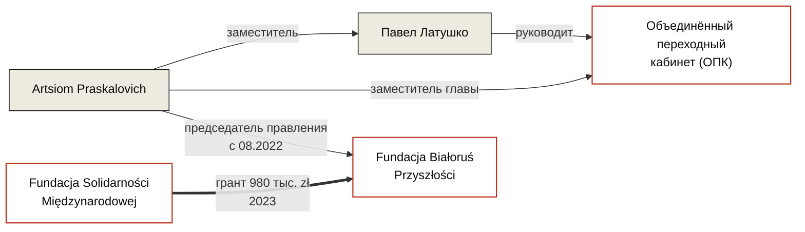

---
hide:
  - navigation
  - toc
title: Artsiom Praskalovich / Артём Праскалович
role: Председатель правления Fundacji Białoruś Przyszłości
date_added: 2026-05-16
date_updated: 2026-05-16
thumbnail: https://placehold.co/400x400/3a3530/ffffff?text=AP
cover: https://placehold.co/1200x500/3a3530/ffffff?text=Artsiom+Praskalovich
cover_caption:
related_persons:
related_orgs:
  - bialorus-przyszlosci
  - fundacja-solidarnosci-miedzynarodowej
related_events:
  - fsm-grant-competition-2023
related_docs:
  - doc-krs-bp
  - doc-fsm-2023-results
tags:
  - персоналия
  - беларуская эмиграция
  - опк
status: active
---

  

  

<header class="bt-person-head">
  <h1>Artsiom Praskalovich / Артём Праскалович</h1>
  
Председатель правления Fundacji Białoruś Przyszłości с 26 августа 2022 года. Заместитель Павла Латушко в Объединённом переходном кабинете.

</header>

<section class="bt-block">

Должностные позиции

* **Председатель правления Fundacji Białoruś Przyszłości** · с 26 августа 2022 года
* **Заместитель главы Объединённого переходного кабинета** Павла Латушко · действующая позиция

</section>

<section class="bt-block">

Связь с Fundacją Białoruś Przyszłości

Artsiom Praskalovich вступил в должность председателя правления BP 26 августа 2022 года в составе полной замены управления фонда. До него правление возглавляла Elena Zhilochkina (с 12 января 2022 по 26 августа 2022), а до неё — учредитель фонда Anatol Kotau (с 11 января 2021 по 12 января 2022). Котов покинул фонд на фоне выявленного партнёрами фонда документального дефицита по расходам — см. секцию 5 расследования inv-0001.

Praskalovich — подписант грантового договора 2023 года между BP и Fundacją Solidarności Międzynarodowej на 980 000 zł по проекту разработки дорожной карты защиты прав жертв преступлений против человечности. Финансовая отчётность фонда за 2023 и 2024 годы в Krajowym Rejestrze Sądowym отсутствует, дорожная карта публично не представлена.

С 12 января 2022 года BP размещён по адресу офиса НАУ Павла Латушко (ul. Mazowiecka 12, Варшава). 5 сентября 2025 года, в день добавления в коды PKD деятельности фонда позиции 68.20.Z «аренда и управление недвижимостью» в качестве основного вида деятельности, Praskalovich сохраняет должность председателя правления.

</section>

<section class="bt-ties">

Связи

</section>

<section class="bt-block">

Упоминается в кейсах

<ul>
  <li><a href="../../investigations/bialorus-przyszlosci-fsm/">Беларусь Будущего и польские публичные деньги</a> · inv-0001</li>
</ul>
</section>

<section class="bt-block">

Источники

<ul>
  <li>KRS 0000877364 — выписка по Fundacji Białoruś Przyszłości · doc-krs-bp</li>
  <li>Wyniki Konkursu Grantowego na rzecz Białorusi 2023 · doc-fsm-2023-results</li>
</ul>
</section>

<footer class="bt-tags">
  
Теги

  

    персоналия
    беларуская эмиграция
    опк
  

</footer>

