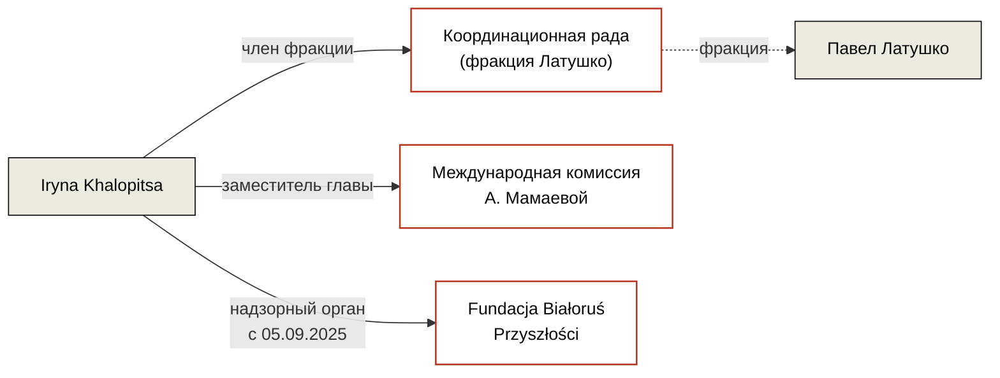

---
hide:
  - navigation
  - toc
title: Iryna Khalopitsa / Ирина Халопица
role: Член надзорного органа Fundacji Białoruś Przyszłości
date_added: 2026-05-16
date_updated: 2026-05-16
thumbnail: https://placehold.co/400x400/3a3530/ffffff?text=IK
cover: https://placehold.co/1200x500/3a3530/ffffff?text=Iryna+Khalopitsa
cover_caption:
related_persons:
related_orgs:
  - bialorus-przyszlosci
related_events:
related_docs:
  - doc-krs-bp
tags:
  - персоналия
  - беларуская эмиграция
  - координационная рада
status: active
---

  

  

<header class="bt-person-head">
  <h1>Iryna Khalopitsa / Ирина Халопица</h1>
  
Член надзорного органа Fundacji Białoruś Przyszłości с 5 сентября 2025 года. Представляет в Координационной раде фракцию Латушко. Заместитель главы Международной комиссии А. Мамаевой.

</header>

<section class="bt-block">

Должностные позиции

* **Член надзорного органа Fundacji Białoruś Przyszłości** · с 5 сентября 2025 года
* **Член Координационной рады** (фракция Латушко) · действующая позиция
* **Заместитель главы Международной комиссии** А. Мамаевой · действующая позиция

</section>

<section class="bt-block">

Связь с Fundacją Białoruś Przyszłości

Iryna Khalopitsa вписана в надзорный орган BP 5 сентября 2025 года в составе единого пакета изменений: в тот же день в надзорный орган вошла Yana Latushka (дочь Павла Латушко), а в коды PKD деятельности фонда добавлен 68.20.Z — «аренда и управление недвижимостью» — как основной вид деятельности.

</section>

<section class="bt-ties">

Связи

</section>

<section class="bt-block">

Упоминается в кейсах

<ul>
  <li><a href="../../investigations/bialorus-przyszlosci-fsm/">Беларусь Будущего и польские публичные деньги</a> · inv-0001</li>
</ul>
</section>

<section class="bt-block">

Источники

<ul>
  <li>KRS 0000877364 — выписка по Fundacji Białoruś Przyszłości · doc-krs-bp</li>
</ul>
</section>

<footer class="bt-tags">
  
Теги

  

    персоналия
    беларуская эмиграция
    координационная рада
  

</footer>

