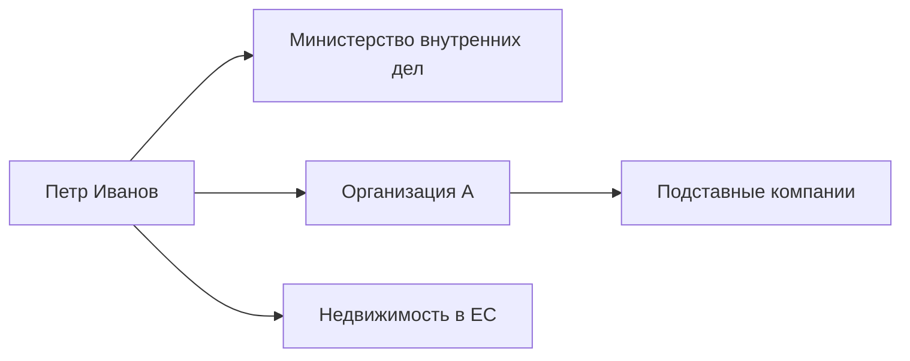

---
hide:
  - navigation
  - toc
title: Иван Иванов
role: Глава Объединённого переходного кабинета
date_added: 2026-05-13
date_updated: 2026-05-13
thumbnail: https://placehold.co/400x400/3a3530/ffffff?text=ST
cover: https://placehold.co/1200x500/3a3530/ffffff?text=Photo+placeholder
cover_caption: Брюссель, март 2024 · Sebastien Bozon / AFP
tags:
  - номинал
  - политик
  - беглец
status: active
---

# Петр Иванов

*Последнее обновление: май 2026*

---

## Основные данные

| | |
|---|---|
| **Должность** | Заместитель министра внутренних дел |
| **Год рождения** | 1967 |
| **Место рождения** | Минск, БССР |
| **Гражданство** | Беларусь |
| **В должности с** | 2015 |

---

## Биография

Lorem ipsum dolor sit amet, consectetur adipiscing elit. Ut enim ad minim 
veniam, quis nostrud exercitation ullamco laboris nisi ut aliquip ex ea 
commodo consequat.

Duis aute irure dolor in reprehenderit in voluptate velit esse cillum dolore 
eu fugiat nulla pariatur. Excepteur sint occaecat cupidatat non proident.

---

## Связи и аффилиации

---

## Аффилированные структуры

- [Организация А](../organizations/org-a.md) — учредитель с 2015 года
- Министерство внутренних дел — заместитель министра

---

## Упоминается в расследованиях

- [Расследование 1](../investigations/investigation-1.md)

---

## Связанные события

- [Событие 1](../events/event-1.md)

---

[← Все персоналии](index.md)