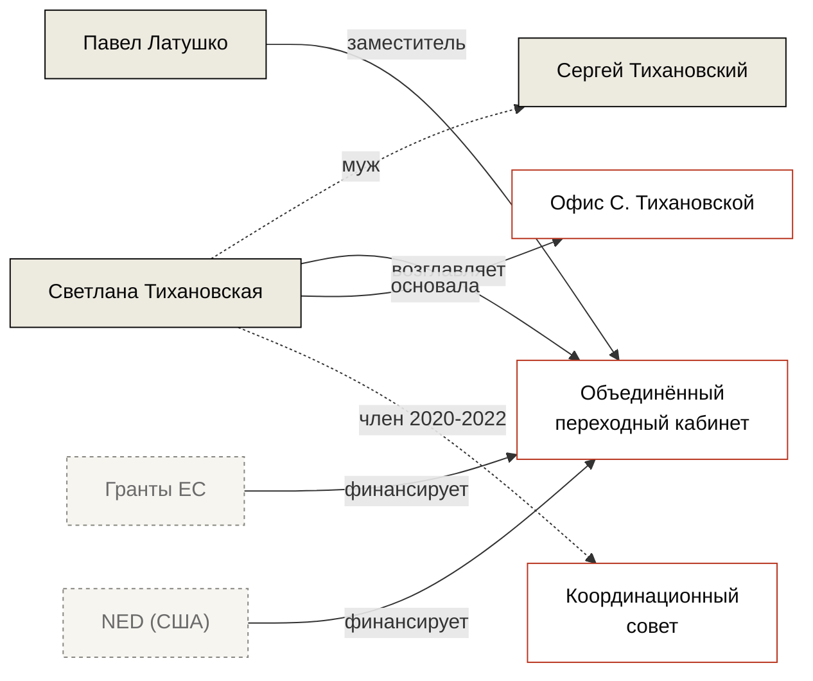

---
hide:
  - navigation
  - toc
title: Светлана Тихановская
---

<figure class="bt-cover">
  

  <figcaption>Брюссель, март 2024 · Sebastien Bozon / AFP</figcaption>
</figure>

<header class="bt-person-head">
  
Персоналия

  <h1>Светлана Тихановская</h1>
  
Лидер беларуской оппозиции в эмиграции. Глава Объединённого переходного кабинета с 2022 года.

</header>

<aside class="bt-pull">
«Я не политик. Я просто жена, которая хочет, чтобы её муж вернулся домой.»
<cite>Из интервью Deutsche Welle, август 2020</cite>
</aside>

В 2020 году Светлана Тихановская выдвинула свою кандидатуру на президентских выборах после ареста мужа Сергея Тихановского. По официальным данным ЦИК заняла второе место с 10,1% голосов; независимые наблюдатели зафиксировали массовые нарушения. С августа 2020 года находится в эмиграции в Литве.

С 2022 года возглавляет Объединённый переходный кабинет — структуру, заявляющую о себе как о легитимном представительстве беларусов за рубежом. Деятельность кабинета финансируется грантами ЕС и американских фондов; общий объём ежегодных поступлений по открытой отчётности достигает нескольких миллионов евро.

<section class="bt-structures">
  
Контролируемые структуры

  

    

      
Объединённый переходный кабинет

      
Руководитель · с 2022

      

        

Годовой оборот

€4,2 млн

        

Сотрудники

~40

      

    

    

      
Офис Светланы Тихановской

      
Основатель · с 2020

      

        

Годовой оборот

€1,8 млн

        

Сотрудники

~20

      

    

  

</section>

<section class="bt-ties">

Связи

</section>

