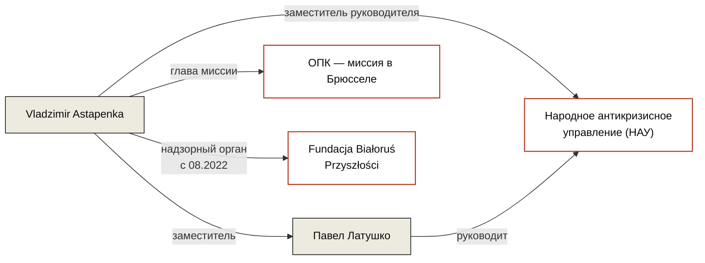

---
hide:
  - navigation
  - toc
title: Vladzimir Astapenka / Владимир Астапенко
role: Член надзорного органа Fundacji Białoruś Przyszłości
date_added: 2026-05-16
date_updated: 2026-05-16
thumbnail: https://placehold.co/400x400/3a3530/ffffff?text=VA
cover: https://placehold.co/1200x500/3a3530/ffffff?text=Vladzimir+Astapenka
cover_caption:
related_persons:
related_orgs:
  - bialorus-przyszlosci
related_events:
related_docs:
  - doc-krs-bp
tags:
  - персоналия
  - беларуская эмиграция
  - опк
  - нау
status: active
---

  

  

<header class="bt-person-head">
  <h1>Vladzimir Astapenka / Владимир Астапенко</h1>
  
Член надзорного органа Fundacji Białoruś Przyszłości с 26 августа 2022 года. Заместитель Павла Латушко в НАУ, глава демократической миссии Объединённого переходного кабинета в Брюсселе.

</header>

<section class="bt-block">

Должностные позиции

* **Член надзорного органа Fundacji Białoruś Przyszłości** · с 26 августа 2022 года
* **Заместитель руководителя Народного антикризисного управления** (НАУ) Павла Латушко · действующая позиция
* **Глава демократической миссии Объединённого переходного кабинета (ОПК) в Брюсселе** · действующая позиция

</section>

<section class="bt-block">

Связь с Fundacją Białoruś Przyszłości

Vladzimir Astapenka вписан в надзорный орган BP 26 августа 2022 года — в составе полного обновления управляющих органов фонда после ухода учредителей. На момент получения BP гранта Fundacji Solidarności Międzynarodowej на 980 000 zł в мае 2023 года Astapenka находился в надзорном органе.

</section>

<section class="bt-ties">

Связи

</section>

<section class="bt-block">

Упоминается в кейсах

<ul>
  <li><a href="../../investigations/bialorus-przyszlosci-fsm/">Беларусь Будущего и польские публичные деньги</a> · inv-0001</li>
</ul>
</section>

<section class="bt-block">

Источники

<ul>
  <li>KRS 0000877364 — выписка по Fundacji Białoruś Przyszłości · doc-krs-bp</li>
</ul>
</section>

<footer class="bt-tags">
  
Теги

  

    персоналия
    беларуская эмиграция
    опк
    нау
  

</footer>

