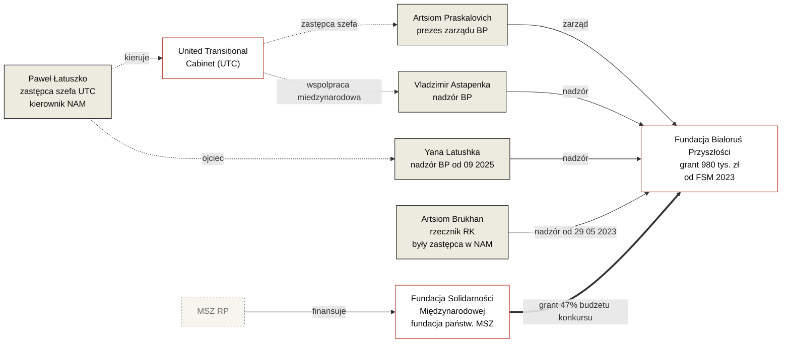

---
hide:
  - navigation
title: "Białoruś Przyszłości i pieniądze polskich podatników"
investigation_id: inv-0001
date_published: 2026-05-16
date_updated: 2026-05-16
lede: "Tylko jeden niewielki grant z 2023 roku i system, w którym stał się możliwy"
authors: "Redakcja Belarus Transparency"
related_orgs:
  - bialorus-przyszlosci
  - fundacja-solidarnosci-miedzynarodowej
related_persons:
  - artsiom-praskalovich
  - artsiom-brukhan
  - vladzimir-astapenka
  - yana-latushka
  - iryna-khalopitsa
  - anna-panov
related_docs:
  - doc-fsm-2023-results
  - doc-fsm-2024-results
  - doc-fsm-2025-results
  - doc-nik-kap-430-7-2024
  - doc-krs-bp
  - doc-krs-fsm
status: active
tags:
  - sledztwo
  - fsm
  - bialorus-przyszlosci
  - latuszko
  - polskie-pieniadze-publiczne
---

<header class="bt-investigation-hero">
  
Śledztwo · inv-0001 · opublikowano 16 maja 2026

  # Białoruś Przyszłości i polskie pieniądze publiczne

  
Jeden grant z 2023 roku i system, w którym stał się możliwy

</header>

## Wprowadzenie

Jawność dysponowania pieniędzmi publicznymi jest warunkiem, w którym instytucje demokratyczne działają tak, jak zostały pomyślane. Gdy informacja o wydatkach podatników i zagranicznych darczyńców jest niedostępna — a tym bardziej, gdy jest świadomie ukrywana — tworzy się środowisko sprzyjające w najlepszym razie nieprofesjonalizmowi i nieefektywnemu wykorzystaniu środków, w najgorszym — korupcji. To samo środowisko uzbraja populistów i przeciwników wartości demokratycznych: tych, którzy mogą wskazać na brak rozliczalności jako dowód, że demokracja jest tylko dekoracją.

Zwłaszcza w przypadkach, gdy środki te miały służyć przeciwstawianiu się dyktaturze.

W odniesieniu do białoruskiej emigracji politycznej kwestia ta zaostrzyła się do 2025 roku. Po pięciu latach, w trakcie których przez struktury w Polsce, Litwie i Czechach przepłynęło setki milionów euro z UE, USA i od krajowych darczyńców, w diasporze narasta zapotrzebowanie: dokąd idą te pieniądze, kto je rozdziela, komu trafiają i jak deklarowane priorytety mają się do faktycznego rozdziału.

Z biegu zdarzeń wynika, że trend zamykania konkursów polskiego darczyńcy figurującego w niniejszym śledztwie narasta synchronicznie z tym zapotrzebowaniem: od 2024 roku ukryte pozostaje od 81% do 89% budżetu programu — to około **10,9 mln zł (~2,5 mln euro) za dwa lata**, rozdzielonych w trybie wykluczającym niezależną weryfikację. I to tylko w ramach jednego programu jednego darczyńcy.

To śledztwo — pierwsze z serii. Zbudowane jest na zasadzie wyznaczającej ramę wszystkich publikacji projektu Belarus Transparency: **ciężar dowodu przeciwnego spoczywa na stronie, która dysponuje pieniędzmi publicznymi**. Jeżeli organizacja otrzymuje grant i nie publikuje sprawozdania — to wprost sygnał, że menedżerowie tej struktury nie są gotowi podzielić się swoimi sukcesami z Białorusinami. Jeżeli fundacja operuje pieniędzmi publicznymi i nie ma publicznych kontaktów — to nie jest detal techniczny. Jeżeli 88,75% grantów ukrytych jest na stronie darczyńcy — to już nie „względy bezpieczeństwa", lecz bezpośrednie zagrożenie powstania środowiska korupcjogennego.

Tutaj dokumentowana jest jedna konkretna historia — jeden grant, jedna organizacja, jeden darczyńca. Wszystkie fakty potwierdzone są źródłami pierwotnymi i odnoszą się do jednego z czterech poziomów udowodnienia przyjętych przez projekt. Pytania otwarte sformułowane są pod adresem każdej ze stron.

Co dalej zrobić z tymi pytaniami — decydują obywatelscy aktywiści, dziennikarze, demokratyczni politycy, darczyńcy.

---

## Streszczenie faktów

* **Maj 2023.** Polska [Fundacja Solidarności Międzynarodowej](../organizations/fundacja-solidarnosci-miedzynarodowej.md) (FSM) — fundacja państwowa działająca na zlecenie MSZ RP — przyznaje [Fundacji Białoruś Przyszłości](../organizations/bialorus-przyszlosci.md) (BP) grant w wysokości 980 000 zł — **47,3% całego widocznego budżetu konkursu**. Kwota 6,9 razy większa od grantu organizacji z najlepszą oceną punktową.
* **Zarządzanie BP.** Prezesem zarządu jest [Artsiom Praskalovich](../persons/artsiom-praskalovich.md), urzędujący zastępca szefa United Transitional Cabinet (UTC) Pawła Łatuszki. Organ nadzorczy w różnych okresach — [Brukhan](../persons/artsiom-brukhan.md), [Astapenka](../persons/vladzimir-astapenka.md), [Yana Latushka](../persons/yana-latushka.md), [Khalopitsa](../persons/iryna-khalopitsa.md), [Panov](../persons/anna-panov.md) — wszyscy powiązani z Łatuszką relacją służbową lub rodzinną.
* **Sprawozdawczość.** Sprawozdania finansowe BP za lata 2023–2025 w KRS są nieobecne. Mapa drogowa, na którą otrzymano grant, nie została publicznie zaprezentowana.
* **5 września 2025.** Do KRS wpisano pakiet zmian: wprowadzono Yanę Latushkę i Irynę Khalopitsę, dodano kod PKD 68.20.Z — „wynajem i zarządzanie nieruchomościami" — jako podstawowy rodzaj działalności. 26 stycznia 2026 roku z organu nadzorczego wyprowadzono Annę Panov.
* **Dynamika jawności FSM.** Od 2023 do 2025 roku budżet konkursu wzrósł 4-krotnie (z 2,07 do 8 mln zł); jawność rozdziału spadła ze 100% do 11,25%. W 2024 roku ukryto 81,3% budżetu, w 2025 — 88,75%.

---

## 1. Grant z 2023 roku: chronologia

### Złożenie wniosku

31 marca 2023 roku FSM ogłosiła otwarty [„Konkurs Grantowy na rzecz Białorusi 2023"](https://old.solidarityfund.pl/2023/03/31/konkurs-grantowy-na-rzecz-bialorusi-2/) — w ramach programu „Wsparcie Demokracji 2023", który wchodzi w skład programu polskiej współpracy rozwojowej (Polska współpraca rozwojowa) MSZ RP.

Parametry konkursu 2023 roku:

* trzy priorytety: prawa człowieka i instytucje demokratyczne; wolne media; organizacje społeczne i diaspora;
* dwa formaty grantu: mały — od 50 do 250 tys. zł; duży — od 251 tys. do 1,5 mln zł.

BP złożyła wniosek na projekt „Opracowanie mapy drogowej dla ochrony praw podstawowych ofiar zbrodni przeciwko ludzkości na Białorusi od 2020 roku, a także zbrodni agresji wobec Ukrainy". Wniosek przypisany do priorytetu I — prawa człowieka i instytucje demokratyczne.

W momencie złożenia wniosku zarządowi BP przewodniczył Artsiom Praskalovich (pełni tę funkcję od 26 sierpnia 2022 roku); drugim członkiem zarządu był Valery Matskevich. Do organu nadzorczego wchodzili Mikhail Kiryliuk (od chwili założenia fundacji), Vladimir Astapenko i Anna Panov (oboje — od 26 sierpnia 2022 roku).

### Decyzja i podział kwot

18 maja 2023 roku FSM [opublikowała wyniki konkursu](https://old.solidarityfund.pl/2023/05/18/wyniki-konkursu-grantowego-na-rzecz-bialorusi-2/) ([pełna lista rankingowa](https://old.solidarityfund.pl/wp-content/uploads/2023/05/Wyniki-Konkursu-Grantowego-na-rzecz-Bialorusi-2023.pdf)):

| Miejsce | Organizacja | Projekt | Priorytet | Pkt | Kwota (zł) |
|---|---|---|---|---|---|
| 1 | Kolegium Europy Wschodniej im. J. Nowaka-Jeziorańskiego | Wspieramy Białoruskie Przebudzenie | II, III | **19,5** | 142 000 |
| 2 | Fundacja Strefa Solidarności (TV Biełsat) | Wsparcie platformy TV Biełsat | II, III | 16,5 | 300 000 |
| 2 | **Fundacja Białoruś Przyszłości** | **Mapa drogowa ochrony praw ofiar zbrodni** | **I** | **16,5** | **980 000** |
| 4 | Fundacja Informacyjne Biuro Białoruś w Fokusie | Rozwój dziennikarstwa na emigracji | II | 16,0 | 400 000 |
| 5 | Fundacja BYPOL | Rozwój demokracji na Białorusi | II | 15,5 | 251 460 |

BP z 16,5 pkt (dzielone 2.–3. miejsce) otrzymała 980 000 zł — **47,3% całego widocznego budżetu konkursu**. Pozostałych czterech zwycięzców podzieliło między siebie pozostałe 52,7%. Metodyka rozdziału kwot pomiędzy wnioskodawcami z równymi lub zbliżonymi ocenami nie jest opisana w materiałach publicznych — regulamin określa kryteria oceny wniosków, lecz nie zasadę podziału ogólnego budżetu.

### Profil zwycięzców i przegranych

Konkurs miał trzy priorytety: **I — prawa człowieka i instytucje demokratyczne**, **II — wolne media**, **III — organizacje społeczne i diaspora białoruska**.

BP zadeklarowała jedyny priorytet — I. Wszyscy pozostali zwycięzcy to media (priorytet II). Kolegium i Strefa Solidarności formalnie wskazali priorytety II+III, lecz merytorycznie — „mapa drogowa przebudzenia" Kolegium i platforma TV Biełsat — to projekty strategiczne i medialne, a nie praca z konkretną diasporą. **Żaden projekt specjalnie ukierunkowany na pracę z diasporą w jej istocie nie otrzymał finansowania.**

Wśród odrzuconych wniosków 2023 roku — wsparcie represjonowanych nauczycieli, kultura na emigracji, wsparcie już istniejących wspólnot białoruskich, opieka zawodowa i bezpośrednia pomoc represjonowanym, zatrudnienie i przekwalifikowanie uchodźców. Rozbieżność między deklarowanym priorytetem III a faktycznym rozdziałem nie jest wyjaśniona.

### Realizacja i wynik publiczny

Termin realizacji projektu według regulaminu — do 30 listopada 2023 roku.

Publicznie „mapa drogowa ochrony praw ofiar zbrodni przeciwko ludzkości na Białorusi" w postaci samodzielnego dokumentu nie została zaprezentowana.

BP nie ma publicznej strony internetowej; we wpisach KRS nie podano ani adresu internetowego, ani adresu poczty elektronicznej. Prezentacji projektu na żadnym publicznym forum ani w jakiejkolwiek międzynarodowej organizacji praw człowieka nie odnotowano. Wyszukiwanie po nazwie projektu w otwartych źródłach nie daje wyniku odmiennego od samego ogłoszenia o grancie.

Wśród siedmiu jurysdykcji, w których zgodnie z wnioskiem miały być prowadzone działania — Polska, Litwa, Niemcy, Czechy, Norwegia, Szwajcaria, Ukraina — publicznych śladów pracy nad tematem w 2023 roku nie znaleziono.

Sprawozdanie finansowe BP za 2023 rok w KRS jest nieobecne. Oznacza to, że roczne sprawozdanie fundacji (przewidziane polskim prawem o fundacjach) albo nie zostało złożone, albo zostało złożone z opóźnieniem przekraczającym dwa lata.

</section>

---

## 2. Aktorzy fundacji w okresie badanym

### Działające osoby fundacji

[**Artsiom Praskalovich**](../persons/artsiom-praskalovich.md) — prezes zarządu BP od 26 sierpnia 2022 roku. Jednocześnie — zastępca Pawła Łatuszki w United Transitional Cabinet (UTC). Sygnatariusz umowy grantowej z 2023 roku z FSM na 980 000 zł.

[**Artsiom Brukhan**](../persons/artsiom-brukhan.md) — członek organu nadzorczego BP od 29 maja 2023 roku. Zastępca Łatuszki w Narodowym Zarządzie Antykryzysowym (NAM). Rzecznik Rady Koordynacyjnej; reprezentuje w RK frakcję Łatuszki.

[**Vladzimir Astapenka**](../persons/vladzimir-astapenka.md) — członek organu nadzorczego BP od 26 sierpnia 2022 roku. Zastępca Łatuszki w NAM. Szef misji demokratycznej UTC w Brukseli.

[**Yana Latushka**](../persons/yana-latushka.md) — członkini organu nadzorczego BP od 5 września 2025 roku. Córka Pawła Łatuszki. Reprezentuje w Radzie Koordynacyjnej frakcję Łatuszki.

[**Iryna Khalopitsa**](../persons/iryna-khalopitsa.md) — członkini organu nadzorczego BP od 5 września 2025 roku. Od 2023 roku — pracownica NAM Łatuszki, odpowiedzialna za jego media społecznościowe (wg oficjalnego pisma UTC z 29 maja 2023 roku, opublikowanego przez kanał Telegram SOTA). Członkini Rady Koordynacyjnej, frakcja Łatuszki.

[**Anna Panov**](../persons/anna-panov.md) — członkini organu nadzorczego BP od 26 sierpnia 2022 roku, wykluczona 26 stycznia 2026 roku.

### Świadkowie

Założyciele BP, którzy nie weszli w skład obecnego zarządu lub wystąpili z niego przed otrzymaniem grantu FSM 2023:

* **Anatol Kotau** — założyciel i pierwszy prezes zarządu BP, odszedł 12 stycznia 2022 roku. W NAM Łatuszki odpowiadał za politykę zagraniczną i handel. Od 2021 roku między Łatuszką a Kotau toczy się publiczny proces cywilny w sprawie pieniędzy BP — zob. sekcja 5;
* **Vadim Prokopiev** — założyciel; członek organu nadzorczego od chwili założenia, wykreślony 12 stycznia 2022 roku;
* **Mikhail Kiryliuk** — założyciel; członek organu nadzorczego od chwili założenia, wykreślony 29 maja 2023 roku. Znany w przestrzeni publicznej jako doradca Łatuszki w NAM;
* **Valery Matskevich** — członek zarządu BP od 26 sierpnia 2022 roku, wykreślony 29 maja 2023 roku; od końca 2023 roku — szef aparatu United Transitional Cabinet (struktury, w której Cichanouska jest szefem, Łatuszko — zastępcą);
* **Elena Zhilochkina (Żywaglod)** — założycielka; członkini zarządu od chwili założenia, następnie prezeska zarządu od 12 stycznia 2022 do 26 sierpnia 2022 roku. Powiązana z NGO „Honest People".

Zbieżność maja 2023 roku w kilku trajektoriach — publikacja wyników konkursu FSM 18 maja, w jednym wpisie z 29 maja 2023 roku z organów zarządczych BP jednocześnie wykreśleni są Valery Matskevich (zarząd) i Mikhail Kiryliuk (nadzór), a do organu nadzorczego wpisany Artsiom Brukhan, zastępca Łatuszki w NAM. Merytoryczny związek między tymi zdarzeniami nie jest wyjaśniony.

### Adres fundacji

Od 12 stycznia 2022 roku BP mieści się pod adresem **ul. Mazowiecka 12 w Warszawie — pod adresem biura Narodowego Zarządu Antykryzysowego Pawła Łatuszki**. Adres zmieniono tego samego dnia, w którym z funkcji prezesa zarządu wykreślono Anatola Kotau, a z organu nadzorczego — Vadima Prokopieva. Do 12 stycznia 2022 roku adresem fundacji była ul. Wincentego Rzymowskiego 28 na Mokotowie.

To znaczy: od momentu, gdy ze składu założycieli odszedł faktyczny inicjator fundacji, fizyczna lokalizacja organizacji pokrywa się z biurem politycznej struktury Łatuszki.

### Powiązania aktorów

---

## 3. Kontekst systemowy: FSM 2020–2025

Załóżmy, że grant BP z 2023 roku jest jedynym udokumentowanym przypadkiem w publikacjach FSM po kierunku białoruskim wymagającym wyjaśnienia merytorycznego. Aby zrozumieć, na ile przypadek ten jest wyjątkowy, prześledziliśmy wszystkie sześć konkursów z lat 2020–2025.

### Dynamika jawności

| Rok | Budżet widoczny | Grantów łącznie | Beneficjenci jawni | Jawność budżetu |
|---|---|---|---|---|
| 2020 | nie podano | 7 | 7 (bez kwot) | nazwy są, kwot nie ma |
| 2021 | nie podano | 5 | 5 (bez kwot) | nazwy są, kwot nie ma |
| 2022 | wyniki konkursu nie opublikowane | — | — | strona nieobecna |
| 2023 | ≈ 2,07 mln zł | 5 | **5 (z kwotami i punktami)** | **100% jawne** |
| 2024 | 4,7 mln zł | 11 | 4 (z kwotami i punktami) | **18,7% jawne** |
| 2025 | 8 mln zł | 11 | 2 (z kwotami i punktami) | **11,25% jawne** |

Od 2023 do 2025 roku budżet konkursu wzrósł prawie 4-krotnie — z 2,07 do 8 mln zł. Jednocześnie jawność rozdziału spadła ze 100% do 11,25%. Dwa przeciwnie skierowane trendy.

Ponieważ za lata 2020–2022 FSM nie publikował ani kwot, ani łącznego budżetu, dokładnej pełnej sumy przepływów przez FSM po kierunku białoruskim w latach 2020–2025 ustalić się nie da. Z publicznie potwierdzonego można stwierdzić: w latach 2023–2025 przyznano **nie mniej niż 14,77 mln zł**, a na BP samego w 2023 roku przypadło **prawie 7% tej kwoty** — więcej niż niektóre roczne budżety konkursu jako całości.

W 2024 roku ukryto 7 z 11 grantów na 3,82 mln zł (81,3% budżetu). Średnia kwota grantu ukrytego — 546 tys. zł, jawnego — 220 tys. zł; ukryte są średnio 2,48 razy większe. Na publicznej liście trafiają drobne granty, główna masa dużych podziałów — poza publiczną kontrolą. W 2025 roku ukryto 9 z 11 grantów; jawnie wymieniono jedynie Karta '97 (Charter97, 550 tys. zł) oraz Informacyjne Biuro Białoruś w Fokusie (350 tys. zł) — obie działają w publicznej przestrzeni medialnej.

Formalną podstawą utajniania są przepisy regulaminu pozwalające na prośbę wnioskodawców nie publikować danych o wybranych projektach w związku ze szczególnymi warunkami politycznymi kraju projektu. Norma uzasadniona jest względami bezpieczeństwa. Pytanie dotyczy jej stosowania: w 2023 roku wszyscy pięciu beneficjentów uznało publikację za zgodną z bezpieczeństwem, w 2025 roku — tylko dwóch z jedenastu. Co się zmieniło — sytuacja bezpieczeństwa czy reżim publikacji — nie zostało wyjaśnione.

### Domykanie kręgu beneficjentów

Do regulaminu konkursu 2025 wprowadzono kryterium formalnej oceny wniosków: wnioskodawca musi udokumentować realizację co najmniej trzech projektów po kierunku białoruskim na kwotę powyżej 200 tys. zł każdy, w łącznej kwocie powyżej 600 tys. zł. Organizacja składająca wniosek po raz pierwszy formalnie nie może otrzymać grantu. Aby spełnić kryterium, trzeba już od kilku lat otrzymywać duże polskie granty — w pierwszej kolejności od tej samej FSM. W istocie — strukturalny mechanizm samoodtwarzania się kręgu beneficjentów: aby się w nim znaleźć, trzeba w nim już być.

Kryterium wprowadzono pod kierownictwem nowej prezeski zarządu FSM — Justyny Janiszewskiej, powołanej 21 listopada 2024 roku. Przed objęciem stanowiska w FSM Janiszewska w latach 2010–2016 kierowała Fundacją Edukacja dla Demokracji (FED) — tą samą organizacją, która w konkursie FSM 2023 złożyła wniosek na wsparcie represjonowanych nauczycieli wedle priorytetów I i III, uzyskała 14 punktów i nie otrzymała finansowania. To znaczy: prezeska FSM wprowadzająca w 2025 roku kryterium zamykające konkurs dla nowych wnioskodawców z projektami w obszarze wspierania diaspory jest osobiście powiązana z organizacją, która dwa lata wcześniej znalazła się wśród odrzuconych wnioskodawców z projektem dokładnie tego typu. Fakt ten nie wyjaśnia merytorycznej natury kryterium, lecz utrwala strukturalną prawidłowość: nowe kierownictwo FSM zabezpiecza logikę rozdziału, która w 2023 roku wykluczyła jej własną dawną organizację.

Równolegle gwałtownie spadają punkty historycznych zwycięzców, którzy rozeszli się z biurem i kabinetem. Kolegium Europy Wschodniej — zwycięzca konkursu 2023 z 19,5 pkt — w 2024 roku uzyskało 18 punktów i grant na 230 tys. zł, w 2025 roku — 11 punktów i 0 zł. Fundacja BYPOL — zwycięzca 2023 (15,5 pkt, 251 460 zł) — w 2025 roku uzyskała 4,5 punktu i 0 zł. Do 2025 roku BYPOL utracił protekcję UTC i biura Cichanouskiej: powiązany z organizacją koordynator planu „Peramoga" Alaksandr Azarau [został zwolniony z Gabinetu Przejściowego w 2024 roku](https://ru.belsat.eu/80847271/azarova-uvolili-iz-perehodnogo-kabineta-no-on-prodolzhit-rabotat-s-podpolem).

[Szczegółowa mapa konkursów FSM 2020–2025 z rozszyfrowaniem każdego roku](../organizations/fundacja-solidarnosci-miedzynarodowej.md#konkursy) — na stronie karty organizacji.

---

## 4. Zewnętrzny audyt NIK 2024 roku

W 2024 roku Najwyższa Izba Kontroli (NIK) przeprowadziła audyt realizacji wieloletniego programu współpracy rozwojowej MSZ za lata 2021–2024. Audyt objął MSZ, FSM, MNiSW oraz 15 organizacji-wykonawców według 10 priorytetowych krajów, włącznie z Białorusią. Sprawozdanie [KAP.430.7.2024](../archive/doc-nik-kap-430-7-2024.md) odnotowało szereg istotnych nieprawidłowości na poziomie całego systemu polskiej pomocy rozwojowej. Osobno NIK skierowała do prokuratury zawiadomienie o możliwym przekroczeniu uprawnień na kwotę ponad 7 mln zł — chodzi o decyzję wiceministra spraw zagranicznych w konkursie „Polska pomoc rozwojowa 2023" o finansowaniu projektów w Palestynie, Kamerunie, Kenii i Tanzanii z pominięciem rekomendacji komisji konkursowej. Do FSM i kierunku białoruskiego zawiadomienie to się nie odnosi.

### Systemowe zarzuty wobec dyscypliny finansowej FSM

W ramach programu Wsparcie Demokracji 2022 (łączna dotacja 40,55 mln zł obejmująca Białoruś, Ukrainę, Mołdawię, Gruzję oraz działania humanitarne) NIK przeprowadziła szczegółową kontrolę próby 30 umów; w 7 z nich odnotowano nieprawidłowości, w dwóch przypadkach skutkowało to niegospodarnym wydatkowaniem środków dotacji na kwotę 187,6 tys. zł, z czego 129,9 tys. zł — wypłata za projekt „Gra dla demokracji – Etap II" przy nieosiągnięciu celów i wskaźników umowy. Wszystkie konkretne nieprawidłowości w skontrolowanej próbie, w których w raporcie wymieniono partnerów, dotyczą medialnych umów na zakup czasu antenowego (Radio Wnet Sp. z o.o. — umowa na 2,6 mln zł z nieprecyzyjnie określonym przedmiotem; Białoruskie Centrum Informacyjne Sp. z o.o. — retroaktywne podniesienie stawki dziennej produkcji i emisji audycji radiowych) oraz jednego projektu ukraińskiego (na temat pomocy medycznej w zaburzeniach traumatycznych — wypłata środków powyżej sumy umowy i przed zatwierdzeniem sprawozdania końcowego). Nazw białoruskich beneficjentów na liście nieprawidłowości w sprawdzonej próbie nie wymieniono.

Równolegle NIK odnotowała nieprawidłowości w dyscyplinie operacji finansowych samej FSM. Z próby 21 faktur wydatków administracyjnych centrali w Warszawie (łączna wartość próby — 432,7 tys. zł, 15,1% wydatków administracyjnych): 7 faktur opłaconych z opóźnieniem od 3 do 55 dni, na 3 fakturach opis merytoryczny przygotowała osoba wystawiająca fakturę (czyli wykonująca pracę dla FSM na podstawie umowy zlecenia), na wszystkich 21 fakturach brakuje potwierdzenia, kto przeprowadził kontrolę formalno-rachunkową. NIK odnotowała również, że FSM w siedmiu przypadkach wypłaciła ostatnie transze partnerom niewywiązującym się z obowiązku złożenia sprawozdania końcowego w wyznaczonym terminie lub przed zatwierdzeniem sprawozdania przez Fundację; w jednym projekcie środki wypłacono w kwocie wyższej niż przewidziano w umowie dotacji (per saldo o 28,8 tys. zł).

Ogólna ocena NIK wobec FSM: „Skala i istotność nieprawidłowości stwierdzonych w ramach objętej badaniem umowy na realizację programu Wsparcie demokracji w 2022 r. świadczy o niedochowaniu przez Fundację należytej dbałości o prawidłowe gospodarowanie środkami publicznymi oraz właściwe ich wykorzystanie, a także o niewystarczającym nadzorze Prezesa tej Fundacji nad wykonywanymi zadaniami".

### Białorusko-ukraiński konkurs grantowy 2022

W osobnym rozdziale aktu (punkt 4.5) NIK wprost stwierdza: „Fundacja prawidłowo przeprowadziła Konkurs grantowy na rzecz Białorusi i Ukrainy oraz dopełniła obowiązków związanych z przekazaniem grantów podmiotom wybranym w konkursie" — czyli konkurs grantów na Białoruś i Ukrainę 2022 roku przeprowadzono prawidłowo. To stwierdzenie należy odczytać uwzględniając jego faktyczną podstawę. Konkurs 2022 zarekomendował do finansowania 17 projektów — 11 białoruskich na łączną kwotę 7 026,3 tys. zł i 6 ukraińskich na 1 000,0 tys. zł. Spośród tych 17 projektów NIK szczegółowo skontrolowała **trzy**, czyli mniej niż 18% pod względem liczby projektów; nazwy wybranych trzech projektów w jawnej części raportu nie zostały podane. W tych trzech projektach nie stwierdzono nieprawidłowości w wydatkowaniu środków grantowych. Tym samym sformułowanie „konkurs przeprowadzono prawidłowo" w akcie opiera się na kontroli procedury samej komisji i trzech losowo wybranych umów grantowych, a nie na pełnym badaniu wszystkich 17 sfinansowanych projektów.

Jednocześnie jedyna uwaga NIK odnosząca się bezpośrednio do konkursu białorusko-ukraińskiego: ówczesny Prezes Zarządu FSM nie złożył deklaracji o braku konfliktu interesów, zatwierdzając wyniki konkursu, co narusza pkt 7 części II Zasad konkursu. Fakt ten jest szczególnie istotny w kontekście niniejszego śledztwa. W momencie zatwierdzania wyników konkursu 2023, w którym BP otrzymała 980 000 zł, Prezesem Zarządu FSM był ten sam Rafał Dzięciołowski (na stanowisku od 19 września 2019 do 30 lipca 2024 roku). Formalno-proceduralny niedostatek odnotowany przez NIK dla konkursu 2022 — brak deklaracji o konflikcie interesów ze strony osoby zatwierdzającej wyniki — ma charakter strukturalny, a nie przypadkowy: pytanie, czy Prezes złożył analogiczną deklarację po konkursie 2023, pozostaje otwarte.

### Chronologia odejścia Prezesa FSM

11 czerwca 2024 roku minister spraw zagranicznych Polski Radosław Sikorski powołał Henryka Litwina na nowego Prezesa Zarządu FSM; w oficjalnym komunikacie Rafał Dzięciołowski został opisany jako „kończący swoją misję", a jego wkład — pozytywnie, oznak dymisji w związku z kontrolą publiczna komunikacja nie zawiera. Formalna rejestracja zmiany w KRS nastąpiła 30 lipca 2024 roku.

Chronologicznie odejście Dzięciołowskiego miało miejsce na tle trwającej kontroli NIK: kontrola obejmowała okres od 1 stycznia 2021 do 30 września 2024 roku, ostatnie formalne wystąpienie pokontrolne w audycie P/24/003 NIK podpisała 18 października 2024 roku, sprawozdanie końcowe opublikowano w kwietniu 2025 roku. W chwili powołania następcy uwagi NIK nie były jeszcze sformułowane w postaci formalnego dokumentu. Henryk Litwin, który pozostawał Prezesem mniej niż pięć miesięcy — do 21 listopada 2024 roku, gdy minister Sikorski powołał na to stanowisko Justynę Janiszewską — formalnie przyjmował wystąpienie pokontrolne NIK z ramienia FSM. Odejście Dzięciołowskiego w czasie zbiegło się z generalną zmianą kierownictwa fundacji państwowych po zmianie rządu w Polsce w grudniu 2023 roku — standardową rotacją polityczną. Ustalenie, czy Dzięciołowskiemu znane były wstępne uwagi NIK przed złożeniem rezygnacji, na podstawie otwartych dokumentów nie jest możliwe: czynności kontrolne NIK na miejscu prowadzone były równolegle do procesu zmiany kierownictwa, lecz formalna komunikacja z obiektem kontroli odbywa się przez wystąpienie pokontrolne, które w tym przypadku podpisano później.

Konkretny grant BP na 980 000 zł nie został w audycie wyodrębniony — szczegółowa kontrola dotyczyła próby umów z 2022 roku. Systemowe uwagi NIK do dyscypliny zarządczej FSM i do procedury konkursu (brak deklaracji o konflikcie interesów ze strony Prezesa) sprawiają, że pytanie o metodykę rozdziału kwot w konkursie 2023 staje się uprawnione — tym bardziej że Prezes zatwierdzający wyniki konkursu 2023 był tą samą osobą, w stosunku do której NIK rok wcześniej zafiksowała ten sam niedostatek proceduralny.

---

## 5. Wątek równoległy: spór sądowy Łatuszki z pierwszym prezesem zarządu fundacji

W maju 2025 roku w wywiadzie dla „Euroradia" Paweł Łatuszko publicznie przyznał, że od 2021 roku trwa proces cywilny z Anatolem Kotau — pierwszym prezesem zarządu BP ([Nasza Niwa, 14 maja 2025](https://nashaniva.com/ru/367893)). Według słów Łatuszki, w 2021 roku u partnerów BP pojawiło się pytanie o niewystarczającą liczbę dokumentów potwierdzających wydatki. Kotau odszedł, BP złożyła zawiadomienie na policję; policja i sąd odmówiły wszczęcia postępowania karnego, rekomendując proces cywilny, który toczy się do dziś.

Co z tego wynika:

**Po pierwsze.** BP, prowadząca proces ze swoim byłym prezesem zarządu w sprawie zaginionych dokumentów o wydatkach, jednocześnie nie publikuje własnego sprawozdania finansowego za lata 2023–2025. Strony procesują się między sobą; opinia publiczna nie ma możliwości oceny przepływu środków fundacji u źródła.

**Po drugie.** Łatuszko w wywiadzie prowadzi paralelę ze sprawą Anżeliki Mielnikowej i Fundacji Białoruś Liberty, przedstawiając sytuację z Kotau jako wzorzec prawidłowej prawnej reakcji. Pytanie wzajemne pozostaje: jeśli wewnątrz BP zaszedł przypadek deficytu dokumentacji wymagający zawiadomienia policji, to dlaczego sprawozdanie finansowe fundacji za kolejne lata nie jest publicznie dostępne?

**Po trzecie.** Prawna natura procesu nie jest jasna. Łatuszko formalnie nie jest powiązany z BP stanowiskiem służbowym — nie jest założycielem, członkiem zarządu ani członkiem organu nadzorczego. W wywiadzie używa naprzemiennie sformułowań „fundacja złożyła", „zaskarżyliśmy", „idziemy drogą prawną". Kto jest formalnie powodem — osoba prawna BP czy Paweł Łatuszko jako osoba fizyczna — z publicznych materiałów ustalić się nie da. To pytanie określa, czyje pieniądze strony uważają za przedmiot sporu.

---

<aside class="bt-level-4" markdown>

## 6. Rekonstrukcja · poziom 4

Hipotezy zgłoszone przez źródła, nie potwierdzone przez otwarte dokumenty, lecz posiadające moc wyjaśniającą. Oddzielone od dokumentalnej części śledztwa.

### Hipoteza: fundacja jako aktywo infrastrukturalne

Wedle źródeł w białoruskiej diasporze, BP może występować jako infrastrukturalny dysponent nieruchomości nabywanych lub wynajmowanych na potrzeby politycznej struktury Łatuszki lub osobiście rodziny Łatuszki. Wskaźniki pośrednie:

* **od 12 stycznia 2022 roku BP mieści się pod adresem biura NAM Pawła Łatuszki** (ul. Mazowiecka 12, centrum Warszawy) — przeniesienie nastąpiło tego samego dnia, w którym wykreślono pierwszego prezesa zarządu Anatola Kotau;
* 5 września 2025 roku w KRS jednocześnie dodano kod PKD 68.20.Z (zarządzanie nieruchomościami) jako **podstawowy rodzaj działalności** i do organu nadzorczego wprowadzono Yanę Latushkę;
* sprawozdanie finansowe BP za lata 2023–2024 jest nieobecne;
* na co wydano 980 000 zł grantu z 2023 roku, publicznie nie pokazano.

Sam w sobie rodzaj działalności 68.20.Z wpisuje się do rejestru organizacji z reguły wówczas, gdy posiada ona w swojej dyspozycji nieruchomość przychodową. Grant FSM z 2023 roku na 980 000 zł w kontekście całej działalności BP — to tylko epizod; z wszystkiego powyższego wynika, że BP jest w istocie fundacją politycznej struktury (NAM, UTC, osobiście Łatuszki), a skala jej operacji może istotnie przewyższać jedyny publicznie znany grant.

Podstaw dokumentalnych do twierdzenia, że grant 2023 został bezpośrednio lub pośrednio wykorzystany na nieruchomość, nie ma. Publicznych wyjaśnień ze strony BP również nie ma.

</aside>

---

## 7. Pytania otwarte

### Do Fundacji Białoruś Przyszłości

1. Gdzie opublikowana jest „mapa drogowa ochrony praw podstawowych ofiar zbrodni przeciwko ludzkości na Białorusi", na której opracowanie otrzymano 980 000 zł?
2. Gdzie opublikowane jest sprawozdanie finansowe BP za lata 2023, 2024 i 2025?
3. Czy BP składała wniosek do FSM w konkursach 2024 i 2025; jeśli tak — z jakim wynikiem?
4. Jaki jest merytoryczny związek między wpisaniem kodu PKD 68.20.Z a wprowadzeniem Yany Latushki do organu nadzorczego jednego dnia 5 września 2025 roku?
5. Dlaczego BP, operująca pieniędzmi publicznymi, nie ma publicznych danych kontaktowych — we wpisach KRS nie podano ani strony internetowej, ani adresu poczty elektronicznej?

### Do Fundacji Solidarności Międzynarodowej

1. Czy istnieje opisana metodyka rozdziału ogólnego budżetu konkursu pomiędzy sfinansowane wnioski przy równych lub zbliżonych ocenach?
2. Na jakiej podstawie w konkursie 2023 roku żaden projekt po priorytecie III (wsparcie diaspory) nie otrzymał finansowania, mimo że wśród odrzuconych były organizacje z potwierdzoną historią pracy z diasporą (HumanDoc, Willa Decjusza)?
3. Czym uzasadnione jest wprowadzenie w regulaminie 2025 roku formalnego kryterium trzech wcześniejszych projektów po 200+ tys. zł każdy — wymogu, który wyklucza z udziału każdego nowego wnioskodawcę i utrwala finansowanie w już ukształtowanym wąskim kręgu beneficjentów?
4. Dlaczego wyniki komponentu białoruskiego połączonego konkursu 2022 roku („Białoruś i Ukraina") nie są opublikowane na stronie FSM tak, jak opublikowano wyniki wszystkich innych lat?
5. Czym wyjaśnia się spadek punktacji Kolegium Europy Wschodniej z 18 (2024) do 11 (2025) przy porównywalnych projektach tego samego wnioskodawcy?

### Do Ministerstwa Spraw Zagranicznych RP

1. Na jakim etapie MSZ uzgadnia parametry regulaminu konkursowego FSM po kierunku białoruskim, włącznie z kryteriami formalnymi i przedziałami kwot?
2. Czy MSZ uzgodniło wprowadzenie w regulaminie 2025 roku kryterium trzech wcześniejszych projektów po 200+ tys. zł, które faktycznie zamyka konkurs dla nowych uczestników i utrwala finansowanie w wąskim ukształtowanym kręgu beneficjentów?
3. Czy MSZ uznaje za prawidłową praktykę publikacji wyników z ujawnieniem 11,25% budżetu (konkurs 2025 roku)?
4. Jakie kroki podjęło MSZ po publikacji raportu NIK KAP.430.7.2024 w odniesieniu do jawności mechanizmu konkursowego FSM?

---

## 8. Źródła i dokumenty archiwalne

### Źródła pierwotne dotyczące grantu 2023

* [Ogłoszenie konkursu na stronie FSM](https://old.solidarityfund.pl/2023/03/31/konkurs-grantowy-na-rzecz-bialorusi-2/) (31 marca 2023)
* [Przesunięcie terminu ogłoszenia wyników](https://old.solidarityfund.pl/2023/05/17/zmiana-terminu-ogloszenia-wynikow-konkursu-grantowego-na-rzecz-bialorusi/) (17 maja 2023)
* [Ogłoszenie wyników konkursu](https://old.solidarityfund.pl/2023/05/18/wyniki-konkursu-grantowego-na-rzecz-bialorusi-2/) (18 maja 2023)
* [Pełna lista rankingowa konkursu 2023 (PDF na stronie FSM)](https://old.solidarityfund.pl/wp-content/uploads/2023/05/Wyniki-Konkursu-Grantowego-na-rzecz-Bialorusi-2023.pdf) → [kopia archiwalna](../archive/doc-fsm-2023-results.md)

### Wyniki konkursów 2024 i 2025

* Konkurs 2024: [ogłoszenie wyników na stronie FSM](https://old.solidarityfund.pl/2024/08/07/wyniki-konkursu-grantowego-na-rzecz-spoleczenstwa-bialoruskiego/), [pełna lista (DOCX)](https://old.solidarityfund.pl/wp-content/uploads/2024/08/Wyniki-Konkursu-na-rzecz-spoleczenstwa-bialoruskiego-2024.docx) → [kopia archiwalna](../archive/doc-fsm-2024-results.md)
* Konkurs 2025: [ogłoszenie wyników na stronie FSM](https://old.solidarityfund.pl/2025/07/29/wyniki-konkursu-grantowego-na-rzecz-spoleczenstwa-bialoruskiego-2/), [pełna lista (PDF)](https://old.solidarityfund.pl/wp-content/uploads/2025/07/Wyniki-Konkursu-na-rzecz-spoleczenstwa-bialoruskiego-2025.pdf) → [kopia archiwalna](../archive/doc-fsm-2025-results.md)

### Jawność FSM jako instytucji

* [Sprawozdania roczne FSM 2012–2024](https://solidarityfund.pl/raporty-roczne/)
* [Statut i ustawa o fundacji](https://solidarityfund.pl/statut-i-ustawa/)
* [Skład władz fundacji](https://solidarityfund.pl/wladze-fsm/)
* [Kanał sygnalisci (whistleblower) na stronie FSM](https://solidarityfund.pl/sygnalisci/)

### Dane rejestracyjne

* KRS Fundacji Białoruś Przyszłości: 0000877364 → [kopia archiwalna odpisu](../archive/doc-krs-bp.md)
* KRS Fundacji Solidarności Międzynarodowej: 0000024453 → [kopia archiwalna odpisu](../archive/doc-krs-fsm.md)

### Audyt i kontrola

* Raport NIK KAP.430.7.2024 o realizacji programu polskiej pomocy rozwojowej → [kopia archiwalna](../archive/doc-nik-kap-430-7-2024.md)

### Wątek równoległy: proces z Kotau

* [„Łatuszko przyznał, że już od kilku lat procesuje się ze swoim byłym współpracownikiem Anatolem Kotau" — Nasza Niwa, 14 maja 2025](https://nashaniva.com/ru/367893)
* [Wywiad Pawła Łatuszki dla „Euroradia" na YouTube (źródło cytatów)](https://youtu.be/fhM8FrQHzKc?t=2881)

---

