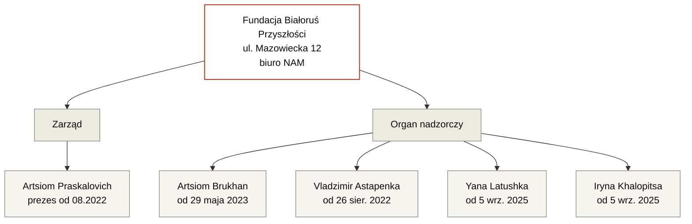

---
hide:
  - navigation
  - toc
title: Fundacja Białoruś Przyszłości
org_type: foundation
status: active
single_person:
date_founded: 2021-01-11
date_dissolved:
date_added: 2026-05-15
date_updated: 2026-05-17
charter_public: false
reports_public: false
audit_public: unknown
oversight: formal
cover_caption:
related_persons:
  - artsiom-praskalovich
  - artsiom-brukhan
  - vladzimir-astapenka
  - yana-latushka
  - iryna-khalopitsa
  - anna-panov
  - anatol-kotau
  - vadim-prokopiev
  - mikhail-kiryliuk
  - valery-matskevich
  - elena-zhilochkina
  - pavel-latushko
related_orgs:
  - fundacja-solidarnosci-miedzynarodowej
  - nau
related_events:
  - fsm-grant-competition-2023
related_docs:
  - doc-krs-bp
  - doc-fsm-2023-results
tags:
  - fundacja
  - polska
  - białoruska emigracja
  - beneficjent FSM
status_note:
---

<header class="bt-org-head">
  
Organizacja · Fundacja

  <h1>Fundacja Białoruś Przyszłości</h1>
  
Polska fundacja zarejestrowana w styczniu 2021 roku. Od stycznia 2022 roku ma siedzibę pod adresem biura NAM Pawła Łatuszki. Beneficjent grantu Fundacji Solidarności Międzynarodowej w wysokości 980 000 zł w konkursie 2023 roku.

  

    aktywna
  

</header>

<section class="bt-org-transparency">
  
Przejrzystość

  

    
    
    
    
  

  

    statut
    sprawozdania
    audyt
    kontrola
  

  

    

      
Statut publiczny

      
Nie · statut fundacji nie został odnaleziony w otwartych źródłach. Wprowadzany czterokrotnie: 20.11.2020 (z poprawką 09.12.2020), 01.03.2023, 07.04.2025, 27.10.2025. Treść nieopublikowana.

    

    

      
Sprawozdawczość finansowa

      
Nie · sprawozdań za lata 2023 i 2024 brak w rejestrze, mimo że fundacja jest wpisana do rejestru przedsiębiorców od 6 czerwca 2023 roku i ma obowiązek ich składania

    

    

      
Audyt zewnętrzny

      
Brak danych · w źródłach publicznych nie znaleziono wzmianek o audycie zewnętrznym

    

    

      
Organ kontrolny

      
Istnieje formalnie · organ nadzorczy figuruje w KRS, lecz obecny skład zarówno organu nadzorczego, jak i zarządu pozostaje w pełnej zależności od osoby trzeciej.

    

  

</section>

<section class="bt-org-meta">
  

    

      
Typ

      
Fundacja

    

    

      
Jurysdykcja

      
Polska

    

    

      
KRS / NIP / REGON

      
0000877364 / 5213917050 / 387913350

    

    

      
Zarejestrowana

      
11 stycznia 2021

    

    

      
Adres

      
ul. Mazowiecka 12, 00-033 Warszawa <em>biuro NAM Pawła Łatuszki</em>

    

    

      
Rejestr przedsiębiorców

      
od 6 czerwca 2023

    

    

      
Prezes zarządu

      
<a href="../persons/artsiom-praskalovich/">Artsiom Praskalovich</a> (od 26 sierpnia 2022)

    

    

      
Główny przedmiot działalności

      
PKD 68.20.Z — wynajem i zarządzanie nieruchomościami (od 5 września 2025)

    

  

</section>

Fundacja zarejestrowana w Polsce 11 stycznia 2021 roku przez czterech założycieli. Prezesem zarządu był Anatol Kotau, członkiem zarządu — Elena Zhilochkina, w organie nadzorczym — Vadim Prokopiev i Mikhail Kiryliuk.

12 stycznia 2022 roku Anatol Kotau został wykreślony ze stanowiska prezesa zarządu, Vadim Prokopiev — z organu nadzorczego. Tego samego dnia fundacja przeniosła się z ul. Wincentego Rzymowskiego 28 (dzielnica Mokotów) na <strong>ul. Mazowiecką 12 w centrum Warszawy — pod adres biura Narodowego Zarządu Antykryzysowego (NAM) Pawła Łatuszki</strong>. Elena Zhilochkina tymczasowo objęła funkcję prezesa zarządu.

W czerwcu 2023 roku fundacja została wpisana do rejestru przedsiębiorców, co zgodnie z polskim prawem rodzi obowiązek składania rocznych sprawozdań finansowych do otwartego rejestru. Sprawozdania za lata 2023 i 2024 nie znajdują się w rejestrze.

W 2023 roku fundacja otrzymała grant Fundacji Solidarności Międzynarodowej w wysokości 980 000 zł — największy indywidualny grant konkursu dotyczącego tematyki białoruskiej.

5 września 2025 roku fundacja zmieniła główny przedmiot działalności gospodarczej na „Wynajem i zarządzanie nieruchomościami" (PKD 68.20.Z); tego samego dnia do organu nadzorczego wpisano dwóch nowych członków — Yanę Latushkę i Irynę Khalopitsę. 26 stycznia 2026 roku z organu nadzorczego została wykreślona Anna Panov.

<section class="bt-org-structure">
  
Struktura (na podstawie KRS)

</section>

<section class="bt-org-timeline">
  
Chronologia zdarzeń rejestrowych

  <ul class="bt-org-timeline-list">
    <li>11 stycznia 2021 · Rejestracja fundacji w Polsce. Prezes zarządu — <a href="../persons/anatol-kotau/">Anatol Kotau</a>, członek zarządu — <a href="../persons/elena-zhilochkina/">Elena Zhilochkina</a>. Organ nadzorczy: <a href="../persons/vadim-prokopiev/">Vadim Prokopiev</a>, <a href="../persons/mikhail-kiryliuk/">Mikhail Kiryliuk</a>. Adres: ul. Wincentego Rzymowskiego 28.</li>
    <li>2021 · Stwierdzono deficyt dokumentacji wydatków fundacji; rozpoczyna się konflikt sądowy między Pawłem Łatuszko a prezesem zarządu Anatolem Kotau.</li>
    <li>12 stycznia 2022 · Anatol Kotau wykreślony jako prezes zarządu, Vadim Prokopiev — z organu nadzorczego. Elena Zhilochkina obejmuje funkcję prezesa zarządu. <strong>Fundacja przenosi się z ul. Wincentego Rzymowskiego 28 na ul. Mazowiecką 12 — pod adres biura Narodowego Zarządu Antykryzysowego (NAM) Pawła Łatuszki.</strong></li>
    <li>26 sierpnia 2022 · Pełna wymiana zarządu i nadzoru. Prezesem zarządu zostaje <a href="../persons/artsiom-praskalovich/">Artsiom Praskalovich</a>; do zarządu wpisany <a href="../persons/valery-matskevich/">Valery Matskevich</a>. Do organu nadzorczego wpisani <a href="../persons/vladzimir-astapenka/">Vladzimir Astapenka</a> i <a href="../persons/anna-panov/">Anna Panov</a>. Elena Zhilochkina i Mikhail Kiryliuk wykreśleni.</li>
    <li>1 marca 2023 · Wprowadzono zmiany w statucie fundacji (§ 9 ust. 13–19, § 21 i § 23). Treść zmian nieopublikowana.</li>
    <li>29 maja 2023 · Valery Matskevich wykreślony z zarządu. Do organu nadzorczego wpisany <a href="../persons/artsiom-brukhan/">Artsiom Brukhan</a>.</li>
    <li>6 czerwca 2023 · Fundacja wpisana do rejestru przedsiębiorców.</li>
    <li>2023 · Otrzymano grant Fundacji Solidarności Międzynarodowej w wysokości 980 000 zł w wyniku <a href="../events/fsm-grant-competition-2023/">konkursu FSM 2023 roku</a>.</li>
    <li>7 kwietnia 2025 · Przyjęto całkowicie nowy tekst statutu fundacji. Treść nieopublikowana.</li>
    <li>5 września 2025 · Do organu nadzorczego wpisani <a href="../persons/yana-latushka/">Yana Latushka</a> i <a href="../persons/iryna-khalopitsa/">Iryna Khalopitsa</a>. Do kodów PKD fundacji dodano 68.20.Z — „wynajem i zarządzanie nieruchomościami" — jako główny przedmiot działalności.</li>
    <li>27 października 2025 · Zmieniono § 12 ust. 1 statutu fundacji. Treść nieopublikowana.</li>
    <li>26 stycznia 2026 · Anna Panov wykreślona z organu nadzorczego.</li>
  </ul>
</section>

<section class="bt-org-money bt-org-money-fragments">
  
Finanse

  
W otwartym rejestrze brak systemowej sprawozdawczości finansowej fundacji — sprawozdania za lata 2023 i 2024 nie zostały złożone wbrew obowiązkowi powstałemu wraz z wpisem do rejestru przedsiębiorców. Poniżej — granty znane wyłącznie z dokumentów grantodawców.

  <ul class="bt-money-fragments-list">
    <li>
      2023
      980 000 zł
      <a href="../events/fsm-grant-competition-2023/">Fundacja Solidarności Międzynarodowej (FSM)</a>
      doc-fsm-2023-results
      — projekt „Opracowanie mapy drogowej dla ochrony praw podstawowych ofiar zbrodni przeciwko ludzkości na Białorusi od 2020 roku". 47% budżetu konkursu FSM 2023 dotyczącego Białorusi. Dokument z wynikami usunięto z aktualnej strony FSM, odzyskano z archiwum internetowego.
    </li>
  </ul>

  
Ostatnia weryfikacja rejestru sprawozdań rocznych: 17 maja 2026.

</section>

<section class="bt-org-people">
  
Aktualny skład

  <ul class="bt-org-people-list">
    <li><a href="../persons/artsiom-praskalovich/">Artsiom Praskalovich</a> — prezes zarządu od 26 sierpnia 2022</li>
    <li><a href="../persons/artsiom-brukhan/">Artsiom Brukhan</a> — członek organu nadzorczego od 29 maja 2023</li>
    <li><a href="../persons/vladzimir-astapenka/">Vladzimir Astapenka</a> — członek organu nadzorczego od 26 sierpnia 2022</li>
    <li><a href="../persons/yana-latushka/">Yana Latushka</a> — członkini organu nadzorczego od 5 września 2025</li>
    <li><a href="../persons/iryna-khalopitsa/">Iryna Khalopitsa</a> — członkini organu nadzorczego od 5 września 2025</li>
  </ul>
</section>

<section class="bt-org-people">
  
Wykreśleni z organów fundacji

  <ul class="bt-org-people-list">
    <li><a href="../persons/anatol-kotau/">Anatol Kotau</a> — założyciel; prezes zarządu 11.01.2021 — 12.01.2022</li>
    <li><a href="../persons/elena-zhilochkina/">Elena Zhilochkina</a> — założycielka; członkini zarządu, następnie prezeska zarządu 12.01.2022 — 26.08.2022</li>
    <li><a href="../persons/vadim-prokopiev/">Vadim Prokopiev</a> — założyciel; członek organu nadzorczego 11.01.2021 — 12.01.2022</li>
    <li><a href="../persons/mikhail-kiryliuk/">Mikhail Kiryliuk</a> — założyciel; członek organu nadzorczego 11.01.2021 — 29.05.2023</li>
    <li><a href="../persons/valery-matskevich/">Valery Matskevich</a> — członek zarządu 26.08.2022 — 29.05.2023</li>
    <li><a href="../persons/anna-panov/">Anna Panov</a> — członkini organu nadzorczego 26.08.2022 — 26.01.2026</li>
  </ul>
</section>

<section class="bt-org-events">
  
Powiązane wydarzenia

  <ul class="bt-org-events-list">
    <li><a href="../events/fsm-grant-competition-2023/">Konkurs grantowy FSM na rzecz Białorusi, 2023</a> — fundacja otrzymała 980 000 zł</li>
  </ul>
</section>

<section class="bt-org-cases">
  
Wzmiankowana w śledztwach

  <ul class="bt-org-cases-list">
    <li><a href="../investigations/bialorus-przyszlosci-fsm/">Białoruś Przyszłości i polskie pieniądze publiczne</a> · inv-0001</li>
  </ul>
</section>

<section class="bt-org-sources">
  
Dokumenty źródłowe

  <ul class="bt-sources-list">
    <li><a href="../archive/doc-krs-bp/">doc-krs-bp</a> · Odpis Pełny z KRS, numer 0000877364, stan na 27.01.2026</li>
    <li><a href="../archive/doc-fsm-2023-results/">doc-fsm-2023-results</a> · Wyniki Konkursu Grantowego na rzecz Białorusi 2023 (z archiwum internetowego)</li>
  </ul>
</section>

<footer class="bt-tags">
  
Tagi

  

    fundacja
    polska
    białoruska emigracja
    beneficjent FSM
  

</footer>

